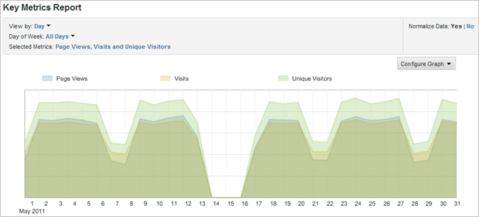
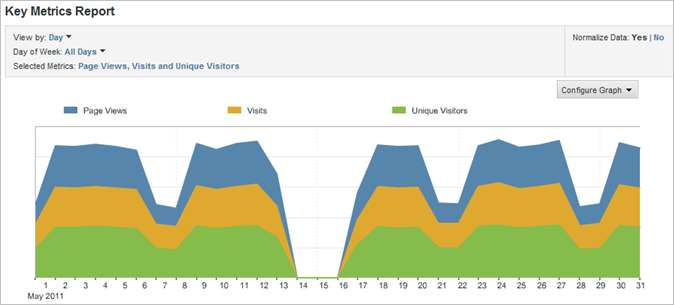

# Modification des graphiques des rapports

{{ra-eol}}

Vous pouvez personnaliser le graphique afin qu’il soit le plus utile pour l’audience prévue.

Le type de graphiques disponible dépend du type de rapport exécuté. Par exemple, les graphiques linéaires de tendances sont utiles aux rapports de tendances, mais vous pouvez également utiliser un graphique en barres verticales avec lignes de tendances pour illustrer clairement les tendances au fil des jours, semaines, mois et ainsi de suite. Vous pouvez également choisir un graphique circulaire pour illustrer les pourcentages des pages consultées.

Pour modifier le graphique d’un rapport :

1. Exécutez un rapport.
1. Cliquez sur **[!UICONTROL Configuration d’un graphique]**.
1. Sélectionnez un type de graphique.

   **[!UICONTROL Ligne de tendance]** : les lignes de tendances indiquent les tendances quotidiennes des mesures des rapports ; ils sont utiles à l’établissement des tendances d’une mesure par ligne au fil du temps.

   

   **[!UICONTROL Courbes lissées]** : utilisez ce type de graphique avec le [!UICONTROL rapport Détails de la vidéo]. Il indique le nombre ou le pourcentage d’affichages des segments spécifiques d’une vidéo. L’augmentation du nombre d’affichages d’un segment spécifique de la vidéo indique que les visiteurs sont revenus en arrière et ont regardé à plusieurs reprises cette même section de la vidéo. Si les pourcentages sont sélectionnés, le pourcentage affiché sur le graphique correspond à tous les segments affichés et non aux visiteurs qui ont regardé le segment. Dans le graphique en exemple, la somme de tous les segments du rapport est égale à 39. Le nombre d’affichages du segment 0-10 secondes est de 10. En conséquence, le pourcentage d’affichages de ce segment est de 26 % environ.

   

   **[!UICONTROL Zone]** : ce graphique est similaire aux lignes de tendances, mais il remplit la surface se trouvant sous les lignes. Pour accéder au diagramme de surface, un rapport de tendances doit être affiché.

   

   **[!UICONTROL Zone empilée]** : les graphiques à aires empilées sont très utiles lorsque vous définissez les tendances d’un certain nombre de produits ou de campagnes au fil du temps. Si, par exemple, vous définissez la tendance des cinq premiers produits qui génèrent des recettes, vous pouvez rapidement visualiser le total de ces recettes sur une période donnée. Vous pouvez affiner la vue en appliquant un filtre de recherche afin d’inclure ou d’exclure des produits spécifiques.

   

   **[!UICONTROL Barre verticale]** : le graphique à barres verticales indique les pourcentages relatifs pour les mesures des rapports.

   

   **[!UICONTROL Barre verticale empilée]** : en empilant des articles similaires, vous pouvez plus rapidement connaître l’influence totale de l’un d’eux. Dans le [!UICONTROL rapport Campagnes], par exemple, vous pouvez empiler des mesures de succès similaires et savoir quelle campagne génère le plus de succès. L’empilement facilite l’identification des campagnes dont les résultats d’une mesure sont médiocres, mais dont les résultats pour une combinaison de mesures sont les meilleurs.

   

   **[!UICONTROL Barre horizontale]** : ce graphique est similaire au graphique à barres verticales, mais ses colonnes sont horizontales.

   

   **[!UICONTROL Barre horizontale empilée]** : le graphique à barres horizontales empilées est similaire au graphique à barres verticales empilées, mais ses colonnes sont horizontales.

   

   **[!UICONTROL Graphique circulaire]** : ce graphique présente les uns par rapport aux autres les pourcentages des principales valeurs des mesures, ainsi que le pourcentage des mesures sélectionnées par rapport à la totalité. Utilisez-le pour les rapports de classement.

   

   **[!UICONTROL Diagramme de dispersion]** : ce diagramme affiche les mesures sélectionnées en nuage de points les unes par rapport aux autres. Il vous permet de visualiser les données en deux dimensions, afin que vous puissiez identifier les articles qui renvoient des valeurs aberrantes.

   

   **[!UICONTROL Graphique à bulles]** : ce graphique affiche les mesures sélectionnées les unes par rapport aux autres. L’emplacement des bulles correspond aux relations entre les mesures sur les axes horizontal et vertical, tandis que leur taille désigne la mesure principale du rapport. Ces diagrammes vous permettent de visualiser les données en deux dimensions, afin que vous puissiez identifier les articles qui renvoient des valeurs aberrantes.

   
