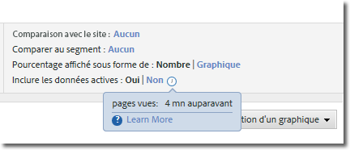
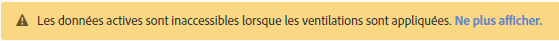

# Données actives

Grâce à l’option Inclure les données actives des Reports &amp; Analytics, vous pouvez afficher les données d’analyse les plus récentes, souvent avant même qu’elles ne soient entièrement traitées et finalisées. Les données actives présentent la plupart des mesures en quelques minutes, ce qui vous permet de disposer d’informations exploitables pour une prise de décisions rapide.

Elles sont visibles en tant qu’option dans le cadre des paramètres d’un rapport :

Les données actives sont activées par défaut sur tous les rapports qui les prennent en charge. Si vous préférez afficher toutes les mesures lorsque la totalité des données est traitée, vous avez plusieurs options à votre disposition :

* Utilisez Analysis Workspace qui utilise les données entièrement traitées.
* Cliquez sur « Non » dans le paramètre du rapport des données actives pour n’utiliser que les données entièrement traitées.
* Supprimez l’élément d’autorisation « Données actives » d’un profil produit dans la Admin Console pour empêcher les utilisateurs non administrateurs de voir cette option. Pour plus d’informations, consultez la section [Éléments d’autorisation des outils d’analyse](/help/admin/admin-console/permissions/analytics-tools.md) dans le guide d’utilisation destiné à l’administrateur.

En raison de la priorisation de la disponibilité des données, les données actives ne peuvent pas être utilisées pour le moment avec les segments, les classifications, les ventilations, les cheminements et certaines mesures. Si vous utilisez l’une de ces fonctionnalités, les données actives sont forcées sur « Non » dans le rapport et un avertissement en jaune s’affiche pour vous expliquer la raison pour laquelle les données actives ne sont pas disponibles.

## Latence type des données actives

Les mesures apparaissent dans l’une des trois périodes suivantes. Cliquez sur l’icône de l’horloge en regard du commutateur « Inclure les données actives » pour afficher la valeur de latence réelle de chaque mesure sur un rapport.

| Période | Mesures |
| --- | --- |
| Moins de 10 minutes | Instances et pages vues sur les variables de trafic |
| Entre 10 et 35 minutes | Événements de conversion, instances et pages vues sur les variables de conversion |
| Entre 45 et 120 minutes | Toutes les autres données, comme les visites, les visiteurs uniques et la participation |

Étant donné que certaines des valeurs affichées dans la vue des données actives n’ont pas été entièrement traitées, il existe une différence entre les valeurs figurant dans cette vue et la vue finalisée. Dans les rapports de tendance, la différence de données est généralement inférieure à 1 %.

## Mesures calculées

Les mesures calculées peuvent être créées à l’aide de mesures ayant une valeur de latence différente. Il se peut donc que certaines valeurs récentes soient calculées à l’aide de données incomplètes dans la vue des données actives.

Par exemple, vous créez la mesure calculée Pages vues par visite en utilisant la formule `Page Views divided by Visits`. Les pages vues s’affichent généralement sous 10 minutes, et les visites sous 2 heures, les mesures calculées situées dans cette fenêtre de latence sont donc calculées à l’aide de mesures incomplètes. Si vous publiez une nouvelle page qui enregistre 4 000 accès de 4 000 visites différentes sur une plage de 2 heures, la différence de latence entre ces mesures peut entraîner des calculs incomplets.

Cette différence entre les données est surtout visible lors de la création de rapports sur de nouvelles valeurs ou si vous utilisez des périodes très courtes. Lorsqu’un rapport utilise une période plus longue, il y a peu de chances que les différences de latence qui se produisent au cours des dernières heures de l’opération aient un impact perceptible sur les mesures calculées.

Si vous disposez de mesures calculées qui pourraient subir les conséquences de ces différences, vous pouvez désactiver les données actives ou utiliser les mesures avec la même fenêtre de latence attendue.

## Rapports téléchargés

Lorsque vous téléchargez un rapport dont la vue des données actives est activée, il est mis en file d’attente, généré, puis renvoyé au navigateur. Si des données sont collectées pendant la génération du rapport, ces données apparaissent dans le rapport. Le rapport téléchargé peut contenir légèrement plus de données à cause de cette fenêtre de temps.
