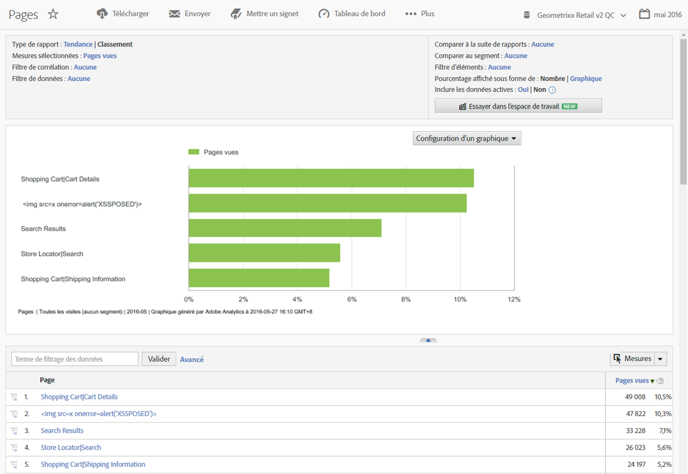

# Prise en main de Reports &amp; Analytics

Avant d’utiliser Reports &amp; Analytics, vous devez en comprendre les tâches de connexion et de configuration de base, ainsi que la manière d’accéder aux informations du compte.

## Prise en main de Reports &amp; Analytics

Avant d’utiliser Reports &amp; Analytics, vous devez en comprendre les tâches de connexion et de configuration de base, ainsi que la manière d’accéder aux informations du compte.

Les rapports fournissent des informations sur vos canaux web classiques, ainsi que sur l’évolution des canaux tels que les réseaux mobiles, vidéo et sociaux. Voici quelques exemples de rapports marketing :

* Nombre de visiteurs sur votre site
* Nombre de ces visiteurs qui sont uniques (comptabilisés une seule fois)
* Leur acheminement vers le site (s’ils ont suivi un lien ou se sont rendus directement dessus)
* Mots-clés utilisés par les visiteurs pour rechercher le contenu du site
* Leur durée passée sur une page donnée ou sur le site entier
* Liens sur lesquels les visiteurs ont cliqué et le moment où ils ont quitté le site
* Les canaux marketing les plus efficaces pour générer des recettes ou des événements de conversion
* Le temps passé à regarder une vidéo
* Les navigateurs et périphériques utilisés pour consulter votre site

## Configuration requise du navigateur et du système

Configuration requise du navigateur et du système pour se connecter à l’interface de Reports &amp; Analytics.

* Navigateurs :

   * Privilégiés : dernières versions de Firefox, Chrome, Safari ou Edge.
   * Dernière version de Microsoft Internet Explorer 11

      >[!NOTE]
      >
      >Le 13 novembre 2018, Adobe a arrêté la prise en charge d’Internet Explorer 11 dans Adobe Analytics. Veuillez utiliser Microsoft Edge ou un autre navigateur pris en charge dès que possible.

* Les cookies et JavaScript doivent être activés.
* Résolution d’écran 1024 x 768 avec codage des couleurs 16 bits (ou supérieure).

## Connexion à Reports &amp; Analytics

Avant d’accéder à l’interface, demandez à votre gestionnaire de compte ou à l’assistance clientèle d’Adobe de configurer le compte de votre société.

## Connexion avec Experience Cloud

Procédure décrivant comment se connecter avec Adobe Experience Cloud.

1. Ouvrez un navigateur sur un ordinateur connecté à Internet.
1. Accédez à [!DNL https://login.experiencecloud.adobe.com/].
1. Sur la page [!UICONTROL Se connecter], cliquez sur **[!UICONTROL Connexion unique]**.
1. Renseignez les informations suivantes, puis cliquez sur **[!UICONTROL Se connecter]**.

   **[!UICONTROL Société]** : précisez le nom de l’entreprise.

   **[!UICONTROL Nom d’utilisateur]** : précisez votre identifiant de compte. 

   **[!UICONTROL Mot de passe]** : précisez le mot de passe de votre compte. 
1. Depuis la page d’accueil Experience Cloud, allez dans **Analytics > Rapports**.

   Experience Cloud vous déconnecte automatiquement après 30 minutes d’inactivité.

## Exécution d’un rapport

Cette section décrit la procédure à suivre pour générer un rapport.

1. Ouvrez une session dans [!UICONTROL Reports &amp; Analytics].

   Le menu Rapports s’affiche ou un [tableau de bord](/help/analyze/reports-analytics/dashboard.md) s’affiche si vous en avez configuré un.

1. Cliquez sur **[!UICONTROL Contenu du site]** > **[!UICONTROL Pages]** (par exemple).

   

   Reportez-vous à la section [Fonctionnalités d’un rapport](/help/analyze/reports-analytics/overview/report-overview.md) pour en savoir plus sur les fonctionnalités de l’interface d’un rapport.

## Modification des paramètres du compte d’utilisateur

Informations concernant la modification des comptes utilisateur, la réinitialisation des mots de passe utilisateur et la modification des coordonnées.

Vous pouvez afficher et modifier les coordonnées, définir un mot de passe, afficher les informations sur les services web et exclure cet ordinateur de la collecte de données.

Cliquez sur l’icône Compte en haut à droite, puis cliquez sur l’icône **[!UICONTROL Paramètres du compte]** (en forme de rouage) près de votre nom d’utilisateur.

Tous les utilisateurs ont accès à la page [!UICONTROL Informations du compte]. Les informations suivantes peuvent être modifiées ou affichées :

<table id="table_58F5D292485F45F9902B372E4E1E3103"> 
 <thead> 
  <tr> 
   <th colname="col1" class="entry"> Type d’informations </th> 
   <th colname="col2" class="entry"> Définition </th> 
  </tr> 
 </thead>
 <tbody> 
  <tr> 
   <td> 
Contact 
 </td> 
   <td> 
Précisez les informations personnelles suivantes pour votre compte : 
 
    <ul id="ul_7925E35904EB47E3AC648FA80A09EF91"> 
     <li id="li_CDD8D7B73A1D4C78A41FF02BD0E5E788">Prénom (requis) </li> 
     <li id="li_7255F50ABFFA4EE8A0A9D04F92BE432D">Nom (requis) </li> 
     <li id="li_3DF6107291CC4D46AAA0E4A13D59128F">Titre </li> 
     <li id="li_B5BE95E0FE594939A2D4C6680A6B8BDD">Adresse de courriel (requis) </li> 
     <li id="li_B764239241CE4F1CA74F77D796E7AB1D">Numéro de téléphone </li> 
    </ul> </td> 
  </tr> 
  <tr> 
   <td> 
 Connexion 
 </td> 
   <td> 
Affiche le nom d’utilisateur du compte et vous permet de modifier le mot de passe du compte. 
 
Voir également : <a href="https://helpx.adobe.com/fr/analytics/kb/How-to-Reset-Report-and-analytics-password.html"  >Comment réinitialiser le mot de passe du compte Reports &amp; Analytics</a>. 
 </td> 
  </tr> 
  <tr> 
   <td> 
Service web 
 </td> 
   <td> 
Affiche le nom d’utilisateur des services web et le secret partagé associé à ce compte. Utilisez ces informations d’identification lorsque vous accédez à Experience Cloud par l’intermédiaire des API de services web. Pour plus d’informations, consultez le site <a href="https://marketing.adobe.com/developer"  >Developer Connection</a>. 
 
 
Remarque : ces informations s’affichent uniquement si le compte est autorisé en tant qu’utilisateur de services web. 
 
 </td> 
  </tr> 
  <tr> 
   <td> 
 Exclure cet ordinateur 
 </td> 
   <td> 
Applique un cookie sur l’ordinateur actuel afin de l’exclure de la collecte de données. Ceci s’avère utile si vous ne souhaitez pas que vos activités en ligne affectent les décomptes de pages vues et de visiteurs dans votre domaine. 
 
 
Remarque : pour utiliser cette fonctionnalité, les cookies doivent être activés dans votre navigateur. Si vous supprimez les cookies sur votre ordinateur, vous devez réinitialiser à nouveau le cookie d’exclusion. 
 
 </td> 
  </tr> 
 </tbody> 
</table>

## Modification de la langue de l’interface

Cette section décrit la procédure à suivre pour modifier la langue de l’interface. Vous pouvez afficher l’interface de Reports &amp; Analytics dans la langue de votre choix.

1. Connectez-vous à Analytics, puis sélectionnez l’onglet **[!UICONTROL Rapports]**.
1. Dans le pied de page, cliquez sur la langue active dans le menu **[!UICONTROL Langue]**, puis sélectionnez votre langue préférée.

Vous pouvez y accéder, ainsi qu’à la page d’accueil, depuis Adobe Experience Cloud. (**[!UICONTROL Aide]** > **[!UICONTROL Page d’accueil de l’aide]**.)
