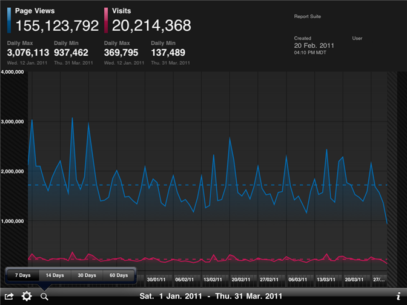

# Adobe Analytics pour iOS {#adobe-analytics-for-ios}

Cette section présente l’application iPad.

Vous pouvez utiliser Analytics pour iOS pour afficher, présenter ou envoyer par courrier électronique des données de tendances en temps réel à tout moment, où que vous soyez.

Affichez les données de tendances par jour, semaine ou mois, voire même jusqu’à 90 jours. L’interface conviviale et simple d’emploi vous permet d’accéder rapidement aux rapports sur les données de tendances et de les présenter selon trois mesures maximum. 

Téléchargez Adobe Analytics pour iOS à partir de l’App Store. Si le système d’exploitation iOS de votre iPad doit être mis à niveau, vous pouvez utiliser iTunes pour télécharger la mise à jour. Pour des résultats optimaux, utilisez toujours la dernière version d’iTunes.
