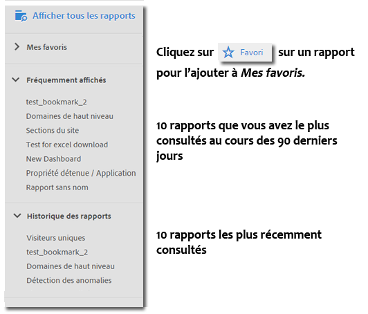
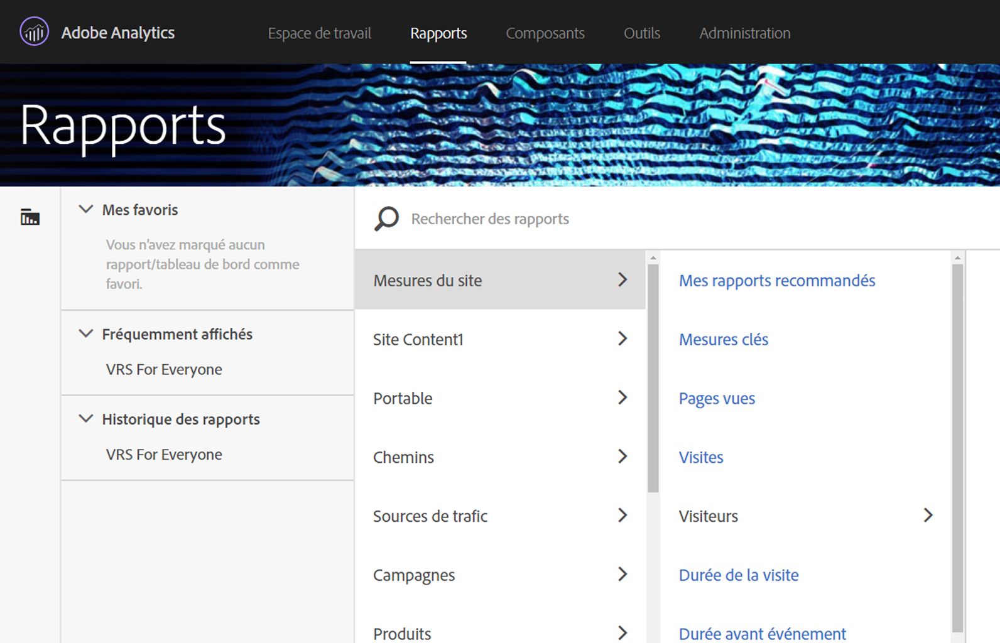
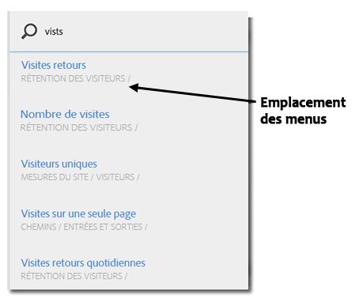

# Menu Rapports{#reports-menu}

Une présentation du menu Rapports dans Reports &amp; Analytics.

Le menu Rapports permet ce qui suit :

* Accès à un jeu complet de rapports
* Capacité de définir des rapports favoris pour y accéder rapidement
* Accès aux rapports fréquemment consultés
* Recherche optimisée

Les options Mes favoris, Fréquemment affichés et Historique des rapports sont spécifiques à une suite de rapports. Si vous changez de suite de rapports, les listes de ces trois options changent.

Vous pouvez naviguer dans les rapports en utilisant une colonne hiérarchique. Cliquez sur **[!UICONTROL Afficher tous les rapports]** ou appuyez sur la touche Barre oblique (/), puis sur la touche Flèche vers le bas (↓) pour afficher et parcourir rapidement le menu à l’aide des touches fléchées. Appuyez sur la touche Échap pour fermer le menu sans changer le rapport actif ou appuyez sur Entrée pour charger le rapport sélectionné.

{width=&quot;672px&quot;}

Pour obtenir plus de détails sur les rapports, voir [Description des rapports](https://marketing.adobe.com/resources/help/fr_FR/reference/reports_descriptions.html).

## Recherche de rapports {#section_E5EF11E36CB9451AA7B079E585CA7DB6}

Le menu Rapports permet d’effectuer des recherches de manière plus optimale. Cliquez sur **[!UICONTROL Afficher tous les rapports]** ou appuyez sur la touche Barre oblique (/), puis commencez à saisir le nom du rapport à rechercher. La recherche de rapports a été étendue afin d’inclure tous les éléments du volet de navigation de gauche d’Analytics (Administration, Composants, etc.).

Appuyez sur la touche Tabulation ou sur la touche Flèche bas (↓) pour parcourir la liste des rapports. Appuyez sur la touche Échap pour fermer la recherche sans changer le rapport actif ou appuyez sur Entrée pour charger le rapport sélectionné.

> [!NOTE] Vous pouvez également filtrer la liste de rapports par numéro de prop, d’eVar et d’événement. Dans la barre de recherche, entrez le numéro de prop, d’eVar ou d’événement.

## Aperçu de la navigation {#section_A6A0A369207149BABE504753B48A42D7}

<table id="table_3BA295966BBC4C94ABDC3718D1894698"> 
 <thead> 
  <tr> 
   <th colname="col1" class="entry"> Élément de menu </th> 
   <th colname="col2" class="entry"> Description </th> 
  </tr>
 </thead>
 <tbody> 
  <tr> 
   <td colname="col1">Menu des solutions Experience Cloud  </td> 
   <td colname="col2"> Cliquer sur cette icône vous permet d’étendre le menu Experience Cloud et d’accéder à d’autres solutions Marketing Cloud. </td> 
  </tr> 
  <tr> 
   <td colname="col1">Activer/désactiver le menu Rapports  </td> 
   <td colname="col2"> Cliquez sur ce bouton pour développer ou réduire le menu Rapports, afin d’afficher un rapport en pleine largeur de la fenêtre du navigateur. </td> 
  </tr> 
  <tr> 
   <td colname="col1">Segments  </td> 
   <td colname="col2">Permet d’afficher le rail des segments qui vous permet d’ajouter ou de gérer des segments. Vous pouvez également accéder aux interfaces du <a href="https://marketing.adobe.com/resources/help/fr_FR/analytics/segment/seg_build_ui.html"  >créateur de segments</a> et du <a href="https://marketing.adobe.com/resources/help/fr_FR/analytics/segment/seg_manage.html"  >gestionnaire de segments</a> à partir de ce rail. </td> 
  </tr> 
  <tr> 
   <td colname="col1">Mesures  </td> 
   <td colname="col2"> Permet d’afficher le rail des mesures qui vous permet d’ajouter ou de gérer des mesures, ainsi que des mesures calculées. </td> 
  </tr> 
  <tr> 
   <td colname="col1"> Afficher tous les rapports </td> 
   <td colname="col2">Tous les rapports, tableaux de bord, signets, mesures calculées et cibles spécifiques à une suite de rapports sont répertoriés dans les sections Afficher tous les rapports. Cliquez ici à tout moment pour parcourir les éléments auxquels vous avez accès. </td> 
  </tr> 
  <tr> 
   <td colname="col1">Barre de recherche dans Afficher tous les rapports </td> 
   <td colname="col2"> 
 Vous permet de rechercher la ressource dont vous avez besoin. Utilise la recherche approximative afin que vous n’ayez pas à entrer le libellé exact du terme que vous recherchez. Les résultats de la recherche s’affichent dans une liste que vous pouvez parcourir à l’aide des touches fléchées. Appuyez sur Entrée sur un résultat de la recherche pour accéder directement à ce rapport. 
 </td> 
  </tr> 
  <tr> 
   <td colname="col1">Mes favoris </td> 
   <td colname="col2">Dans cette section, vous pouvez facilement récupérer les rapports que vous avez marqués comme Favoris. Classée par utilisateur ou par suite de rapports, cette section présente dix favoris et un lien Plus... si vous avez plus de dix favoris. 
Remarque : Dans cette section, vous pouvez renommer les rapports mais pas les tableaux de bord. 
 
Les favoris sont semblables aux signets, mais ils ne sont pas stockés dans un dossier ni gérés dans le  <a href="/help/analyze/reports-analytics/bookmarks.md"  > Gestionnaire de signets</a> comme le sont les signets. 
 </td> 
  </tr> 
  <tr> 
   <td colname="col1"> Fréquemment affichés </td> 
   <td colname="col2"> Adobe Analytics effectue un suivi sur les dix rapports que vous avez le plus souvent générés durant les 90 derniers jours et les répertorie ici, triés par fréquence de génération. Si vous n’avez pas consulté cette suite de rapports depuis plus de 90 jours, les dix rapports les plus populaires sont répertoriés. </td> 
  </tr> 
  <tr> 
   <td colname="col1"> Historique des rapports </td> 
   <td colname="col2"> Ici, vous pouvez savoir quels sont les dix rapports ou tableaux de bord auxquels vous avez accédé en dernier au cours des 90 jours passés. Vous pouvez facilement retracer votre cheminement vers une étape précédente dans votre analyse ou création de rapports. </td> 
  </tr> 
  <tr> 
   <td colname="col1"> Télécharger </td> 
   <td colname="col2">Permet de télécharger le rapport au format PDF, CSV, Excel ou Word. </td> 
  </tr> 
  <tr> 
   <td colname="col1"> Envoyer </td> 
   <td colname="col2">Vous permet d’envoyer le rapport par courrier électronique immédiatement ou de programmer son envoi ponctuellement ou sur une base récurrente. Vous pouvez envoyer des rapports au format PDF, CSV, Excel, HTML, Word ou Mobile (texte uniquement).</td> 
  </tr> 
  <tr> 
   <td colname="col1"> Signet... </td> 
   <td colname="col2">Vous permet de <a href="/help/analyze/reports-analytics/bookmarks.md"  > marquer</a> le rapport. </td> 
  </tr> 
  <tr> 
   <td colname="col1"> Tableau de bord... </td> 
   <td colname="col2">Vous permet d’ajouter le rapport à un <a href="/help/analyze/reports-analytics/dashboard.md"  > tableau de bord</a>. </td> 
  </tr> 
  <tr> 
   <td colname="col1"> Plus... </td> 
   <td colname="col2"> Vous permet d’effectuer certaines ou l’intégralité des actions suivantes : imprimer le rapport, en extraire des données, ajouter une alerte au rapport, créer un rapport personnalisé, copier un graphique, créer un lien à ce rapport et ouvrir une nouvelle fenêtre. </td> 
  </tr> 
  <tr> 
   <td colname="col1">Sélecteur de Report Suites  </td> 
   <td colname="col2">Vous permet de sélectionner des <a href="https://marketing.adobe.com/resources/help/fr_FR/reference/report_suites_admin.html"  >suites de rapports de base</a> ou des <a href="https://marketing.adobe.com/resources/help/fr_FR/reference/virtual-report-suites.html"  >suites de rapports virtuelles</a>. </td> 
  </tr> 
  <tr> 
   <td colname="col1">Calendrier  </td> 
   <td colname="col2">Permet d’afficher le <a href="/help/analyze/reports-analytics/overview/report-overview.md#section_8C6C4AD84D9043E8ABD53FF8F645AAB1"  >calendrier</a> afin de vous permettre de définir la période de création du rapport. </td> 
  </tr> 
 </tbody> 
</table>

## Personnalisation du menu Tous les rapports {#section_7E47312747564FBE8A55EE5726B7DFF4}

Les administrateurs peuvent modifier les rapports contenus dans le menu Rapports. Reportez-vous à la section [Personnalisation des menus](https://docs.adobe.com/content/help/fr-FR/analytics/admin/admin-tools/customize-menus.translate.html) dans l’aide destinée aux administrateurs.
