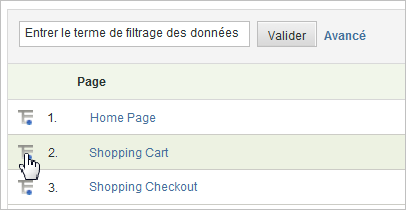

# Ventilations

Utilisez des ventilations lorsque vous souhaitez obtenir des informations sur la relation entre un segment ou un élément de rapport et d’autres rapports. On parle souvent de &quot;ventilation&quot; d’un rapport en fonction d’un autre rapport.

Vous trouverez, par exemple, la ventilation d’un rapport de trafic personnalisé appelé Groupe d’âge, dans lequel vous avez rassemblé des pages d’ du site à partir d’un  de. Ce rapport vous permet de voir quelle tranche d’âge est responsable de la majorité du trafic sur votre site. Cependant, si vous avez pris la peine de capturer une information telle que l’âge d’un visiteur, vous voudrez peut-être en savoir plus que les simples pages vues. Vous pouvez donc générer un rapport avec ventilation sur le moteur de recherche utilisé, les mots-clés utilisés ou leur situation géographique. Vous mettez en corrélation le groupe d’âge et le moteur de recherche.

Si vous ventilez un rapport par *`Referrer Type`*, un point de données peut s’afficher pour *`Inside Your Site`*. Cette valeur indique une page de référence qui figure sur la liste des filtres d’URL internes. Reportez-vous à la section [Filtres d’URL internes](/help/admin/admin/internal-url-filter-admin.md) dans la Référence d’administration.

Vous pouvez ventiler toute variable Analytics (eVar ou prop) en fonction de toute autre variable. The **[!UICONTROL Breakdown By]** menu in the report table matches the standard Analytics reporting menu, keeping selections consistent

## Exécution d’un rapport de ventilation {#task_F685624830E64C829C8BE6435A107F69}

Cette procédure décrit l’exécution d’un rapport de ventilation.

<!-- 

t_reports_breakdown.xml

 -->

1. Ouvrez le rapport, par exemple **[!UICONTROL Analytics]** > **[!UICONTROL Reports]** > **[!UICONTROL Site Content]** > **[!UICONTROL Pages]**.
1. In the report table, click the **[!UICONTROL Breakdown By]** icon.

   If the **[!UICONTROL Breakdown By]** icon is not visible, the feature is either not available or not enabled.

   

   The **[!UICONTROL Breakdown By]** menu displays all available breakdown options available for the current report.
