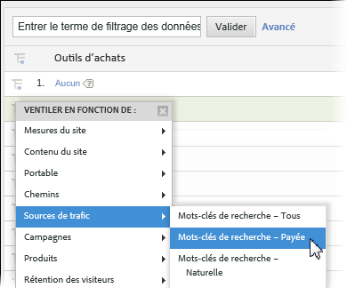
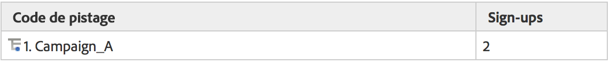
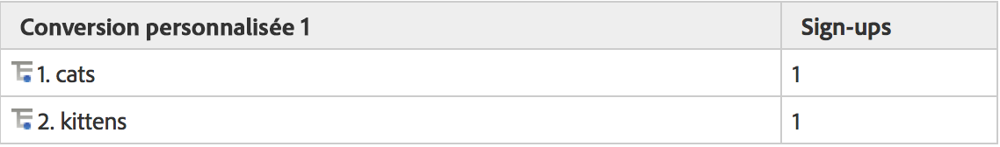
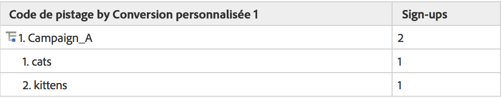
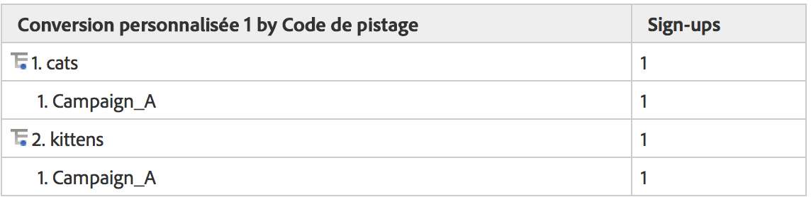

# Sous-relations

Des sous-relations complètes sont activées sur tous les rapports de conversion, ce qui vous permet de ventiler n’importe quelle eVar par une autre eVar. Le menu Ventiler en fonction de dans le tableau des rapports correspond au menu de création de rapports Analytics standard, ce qui permet de préserver la cohérence.

## Fonctionnement des sous-relations {#section_5BD862BB74FE411B96B59204520E4631}

Afin de mieux illustrer le fonctionnement des sous-relations, reportez-vous à l’exemple suivant :

1. Un utilisateur se rend sur votre site via Campaign_A et arrive sur la page d’accueil.
1. L’utilisateur fait une recherche avec le terme « chats » et voit apparaître les résultats de sa recherche. eVar1 conserve une trace des termes de recherche interne.
1. L’utilisateur s’abonne à une liste de diffusion, qui est suivie à l’aide d’event1.
1. Un autre utilisateur se rend sur votre site également via Campaign_A et arrive sur votre page d’accueil.
1. Cet utilisateur fait une recherche avec le terme « chatons », voit apparaître les résultats de sa recherche (eVar1), et s’abonne également à la liste de diffusion (event1).

Si vous générez un rapport de code de suivi, le résultat sera le suivant :

Si vous générez un rapport eVar1, le résultat serait le suivant :

Si vous liez par une relation secondaire le rapport Campagne avec eVar1, vous obtiendriez le résultat suivant :

Si vous liez par une relation secondaire le rapport Campagne avec eVar1, vous obtiendriez le résultat suivant :

En raison de la nature persistante des variables de conversion, deux colonnes de données sont utilisées pour stocker les valeurs eVar. La valeur qui est générée et la valeur qui persiste. Si nous devions étudier une exportation des données brutes pour cet exemple, le résultat serait le suivant (simplifié dans le cadre de cet exemple) :

Dans son fonctionnement, notre serveur principal permet à post_campaign et post_evar1 de conserver les valeurs définies dans la campagne et eVar1. Les rapports de sous-relation ne se concentrent spécifiquement que sur les accès contenant des événements de succès (lignes surlignées en jaune clair). Ils génèrent ensuite les rapports de sous-relation en fonction des valeurs conservées (dans le cas présent, post_campaign et post_evar1, cellules surlignées en jaune clair).

En bref, les sous-relations suivent les étapes suivantes pour générer votre rapport :

* Isoler les requêtes d’images contenant l’ou les événements de succès que vous visualisez dans le rapport.
* Renvoyer les valeurs conservées de chaque variable de conversion utilisée dans la sous-relation.
* Organiser les valeurs en fonction de l’ordre de sous-relation : Si une variable ne présente pas de valeur conservée (par exemple, si une valeur eVar n’était pas définie ou expirée), celle-ci serait répertoriée sous « Aucun ».

