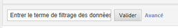
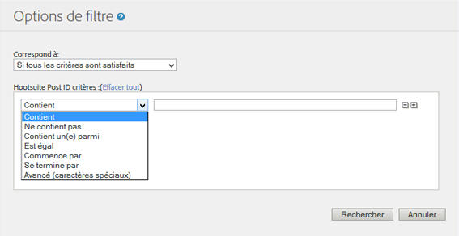

# Filtrer les données du rapport {#concept_09DC5B986A644738B12204DAC76A90E1}

Les filtres permettent de limiter le rapport en incluant ou en excluant des éléments de ligne qui correspondent à un filtre.

## Filtre simple  {#section_5C4DE873F8D5484BB77F38A4AEB57B4A}



Le filtre simple apparaît sur la plupart des rapports pour vous permettre de trouver rapidement des éléments de lignes spécifiques. Les filtres simples n’utilisent pas de caractères spéciaux. De ce fait, les caractères `-, ", ', +` ainsi que tout autre caractère spécial, correspondent à la valeur littérale dans le rapport. Vous pouvez rencontrer des éléments de lignes qui contiennent plusieurs termes séparés par un espace.

Par exemple :

```
help search
```

Correspond aux pages suivantes :

```
help:Search
help:Paid Search Detection
help:Configure paid search detection
help:Search Keywords Report
help:Internal Search Term
```

## Filtres avancés {#section_E016626C084640E8A066B2FDA5B932BF}

Les filtres avancés vous permettent de contrôler la portée de votre recherche à l’aide d’une collecte de filtres. Vous pouvez sélectionner une correspondance avec tous les filtres ou avec certains seulement.



**Contient**

Correspond si le terme se trouve dans l’élément de ligne. Opère de la même manière que le filtre simple.

> [!NOTE] Les espaces ne peuvent pas être utilisés dans les filtres, car ils jouent le rôle de délimiteurs dans les recherches.

**Ne contient pas**

Correspond si le terme ne se trouve pas dans l’élément de ligne. Vous pouvez utiliser les filtres « non spécifié », « aucun », « mot-clé indisponible » ainsi que d’autres [valeurs spéciales](https://marketing.adobe.com/resources/help/fr_FR/reference/none-unspecified-unknown-other.html) depuis les rapports utilisant « Ne contient pas ».

Ne contient pas : `none`

Pour un filtre plus exact, vous pouvez utiliser un filtre avancé (caractères spéciaux) :

* Avancé (caractères spéciaux) : `-^none$`
* Avancé (caractères spéciaux) : `-"keyword unavailable"`

Par exemple, l’élément de ligne suivant est filtré par le critère « Ne contient pas » mais n’est pas filtré par le critère « Avancé (caractères spéciaux) » :

```
help:Rename the None classification key
```

**Contient un(e) parmi**

Correspond si des termes, séparés par des espaces, se trouvent dans l’élément de ligne. Le filtre suivant affiche toutes les pages qui contiennent « mens » ou « sale » :

Contient un(e) parmi : `mens sale`

Correspond aux pages suivantes :

```
Womens
Mens
Mens:Desk & TravelJewelry & Accessories:Accessories:Hats:Mens
Sale & Values
```

**Est égal**

Correspond si l’ensemble de l’élément de ligne, y compris les espaces et autres caractères, correspondent à la phrase indiquée.

Est égal : `mens:desk & travel`

`Mens:Desk & Travel`

**Commence par**

Correspond si l’élément de ligne, y compris les espaces et autres caractères, commence par la phrase indiquée.

Commence par : `mens`

Correspond aux pages suivantes :

```
Mens
Mens:Desk & Travel
Mens:Apparel
Mens Perfume Spray
Mens Hemp/Bamboo Flip Flops
```

**Se termine par**

Correspond si l’élément de ligne, y compris les espaces et autres caractères, se termine par la phrase indiquée.

Se termine par : `jean`

Correspond aux pages suivantes :

```
Bell Bottom Jean
Velvet Dream Skinny Leg Jean
Dark Slimmer Jean
Bling Belt High Waist Jean
Ocean Blue Jean
```

## Avancé (caractères spéciaux) {#section_83DA3B6C23EB4C119DB6D74062DB501D}

Le filtre Avancé permet de réaliser des recherches avec des caractères génériques ainsi que d’autres recherches complexes.

| Avancé (caractères spéciaux) | Description |
|--- |--- |
| `" "` | Correspond à une phrase exacte. |
| `*` | Caractère générique, correspondance maximale. <br>Par exemple, `r*p` correspond à « Registration Signup ». |
| `^` | Commence par. <br>N’incluez pas d’espace entre le caractère spécial et l’expression à rechercher. |
| `$` | Se termine par. <br>N’incluez pas d’espace entre le caractère spécial et l’expression à rechercher. |
| `-` | Pas. <br>N’incluez pas d’espace entre le caractère spécial et l’expression à rechercher. |
| `|` | Ou <br>Remarque : vous devez inclure un espace de chaque côté de la barre verticale, `" | "` |

## Création de filtres spécifiques aux rapports {#task_DEBB0632411D4CA8AA0B3BA267A5B35F}

Cette section décrit la procédure à suivre pour créer des filtres pour les rapports.

<!-- 

t_reports_filter_specific.xml

 -->

Certains rapports contiennent un filtre qui leur est spécifique. Le rapport [!UICONTROL Entonnoir de conversion d’achat], par exemple, vous permet de filtrer les données par pages web. Un [!UICONTROL rapport de géosegmentation] vous permet de filtrer les données par région géographique. D’autres rapports comprennent d’autres filtres qui leur sont spécifiques.

Lorsque vous accédez à ces filtres, vous pouvez afficher les mesures des éléments spécifiés dans la liste.

**Pour créer des filtres spécifiques aux rapports**

1. Générez un rapport, tel un [!UICONTROL rapport d’achats] (**[!UICONTROL Mesures du site]** > **[!UICONTROL Achats]** > **[!UICONTROL Entonnoir de conversion d’achat]**).
1. Dans l’en-tête du rapport, cliquez sur le lien **[!UICONTROL Filtre]**.
1. Sur la page [!UICONTROL Sélecteur de filtre], cliquez sur **[!UICONTROL Appliquer un filtre]** puis spécifiez le type.
1. Pour rechercher un élément, saisissez une chaîne de caractères dans le champ **[!UICONTROL Rechercher]**.
1. Cliquez sur **[!UICONTROL OK]**.

## Ajout d’un filtre de corrélation {#task_065042E384DA4BF3864C58AF2B88D6E2}

Cette section décrit la procédure à suivre pour ajouter un filtre de corrélation.

<!-- 

t_reports_correlation_filter.xml

 -->

Certains rapports vous permettent de leur ajouter des filtres de corrélation personnalisés. Si, par exemple, vous visualisez le [!UICONTROL rapport Pages] pour une suite de rapports contenant des sections du site mises en corrélation avec une page Femmes, vous pouvez créer un filtre qui génère un rapport affichant les pages les plus populaires quand Sections du site = Femmes.

Vous pouvez filtrer les données illustrées dans le rapport de corrélation avec toutes les corrélations disponibles. L’exemple ici illustre l’ajout d’un filtre de corrélation pour moteur de recherche.

**Pour ajouter un filtre de corrélation**

1. Exécutez un rapport qui prend en charge les corrélations. (Voir [Exécution d’un rapport de ventilation](/help/analyze/reports-analytics/reports-customize/breakdowns.md#task_F685624830E64C829C8BE6435A107F69).)
1. Dans l’en-tête du rapport, cliquez sur le lien **[!UICONTROL Filtre de corrélation]**.
1. Sous [!UICONTROL Créateur de règles de filtrage], sélectionnez une catégorie à corréler avec un élément.
1. Cliquez sur **[!UICONTROL OK]**.
