# Modification des graphiques des rapports

Cette section décrit la procédure à suivre pour personnaliser un graphique afin qu’il convienne mieux à l’audience visée.

Le type de graphiques disponible dépend du type de rapport exécuté. Par exemple, les graphiques linéaires de tendances sont utiles aux rapports de tendances, mais vous pouvez également utiliser un graphique en barres verticales avec lignes de tendances pour illustrer clairement les tendances au fil des jours, semaines, mois et ainsi de suite. Vous pouvez également choisir un graphique circulaire pour illustrer les pourcentages des pages consultées.

**Pour modifier un graphique de rapport**

1. Exécutez un rapport.
1. Cliquez sur **[!UICONTROL Configure Graph]**.
1. Sélectionnez un type de graphique.

   **[!UICONTROL Trend Line]**: Les lignes de tendances indiquent les tendances quotidiennes des mesures des rapports et sont utiles pour établir les tendances d’une mesure au fil du temps par ligne.

   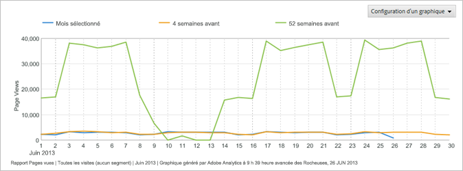

   **[!UICONTROL Smooth Line]**: Vous utilisez ce type de graphique avec le [!UICONTROL Video Detail Report]. Il indique le nombre ou le pourcentage d’affichages des segments spécifiques d’une vidéo. L’augmentation du nombre d’affichages d’un segment spécifique de la vidéo indique que les visiteurs sont revenus en arrière et ont regardé à plusieurs reprises cette même section de la vidéo. Si les pourcentages sont sélectionnés, le pourcentage affiché sur le graphique correspond à tous les segments affichés et non aux visiteurs qui ont regardé le segment. Dans le graphique en exemple, la somme de tous les segments du rapport est égale à 39. Le nombre d’affichages du segment 0-10 secondes est de 10. En conséquence, le pourcentage d’affichages de ce segment est de 26 % environ.

   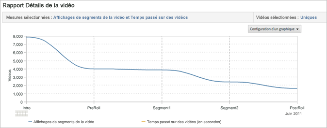

   **[!UICONTROL Area]**: Le graphique à aires est similaire au graphique de lignes de tendances, mais il remplit la zone située sous les lignes. Pour accéder au diagramme de surface, un rapport de tendances doit être affiché.

   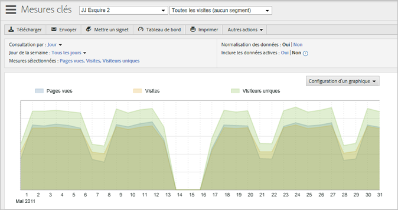

   **[!UICONTROL Stacked Area]**: Les graphiques à aires empilées sont utiles lorsque vous définissez les tendances d’un certain nombre de produits ou de campagnes au fil du temps. Si, par exemple, vous définissez la tendance des cinq premiers produits qui génèrent des recettes, vous pouvez rapidement visualiser le total de ces recettes sur une période donnée. Vous pouvez affiner la vue en appliquant un filtre de recherche afin d’inclure ou d’exclure des produits spécifiques.

   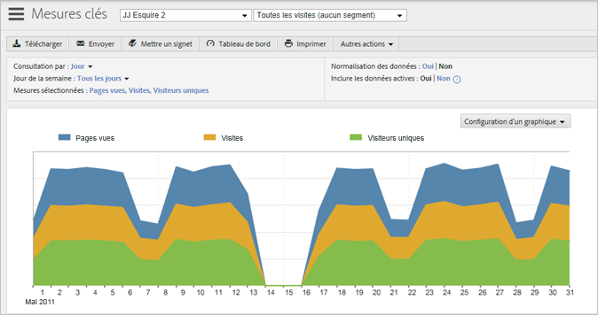

   **[!UICONTROL Vertical Bar]**: Le graphique à barres verticales montre les pourcentages relatifs pour les mesures des rapports.

   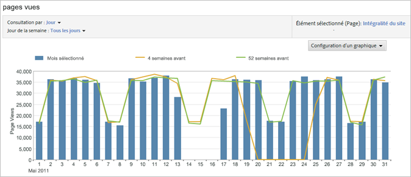

   **[!UICONTROL Stacked Vertical Bar]**: En empilant des articles similaires, vous pouvez voir plus rapidement l&#39;impact global d&#39;un article particulier. For example, in a [!UICONTROL Campaign Report], you can stack similar success metrics and see which campaign is generating the most total success. L’empilement facilite l’identification des campagnes dont les résultats d’une mesure sont médiocres, mais dont les résultats pour une combinaison de mesures sont les meilleurs.

   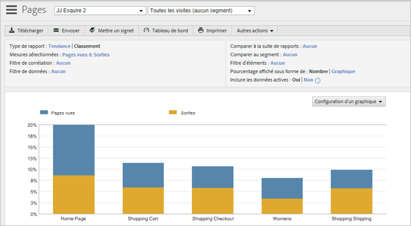

   **[!UICONTROL Horizontal Bar]**: Le graphique à barres horizontales est similaire au graphique à barres verticales, mais ses colonnes sont horizontales.

   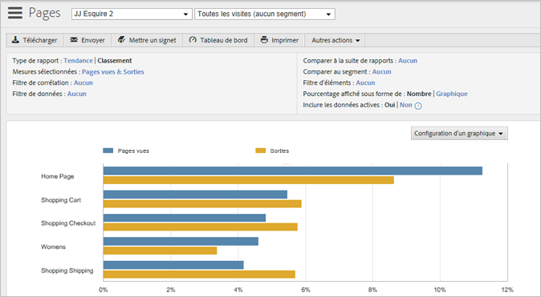

   **[!UICONTROL Stacked Horizontal Bar]**: Le graphique à barres horizontales empilées est similaire au graphique à barres verticales, mais ses colonnes sont horizontales.

   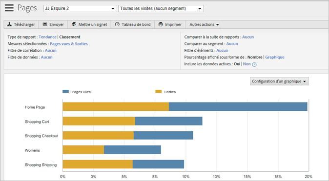

   **[!UICONTROL Pie]**: Le graphique circulaire montre les pourcentages des principales valeurs des mesures les unes par rapport aux autres et le pourcentage des mesures sélectionnées par rapport à l’ensemble. Utilisez-le pour les rapports de classement.

   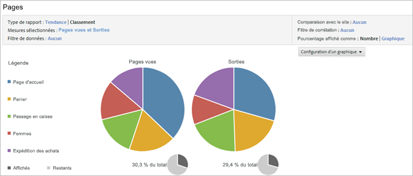

   **[!UICONTROL Scatter]**: Le graphique de dispersion affiche les mesures sélectionnées en nuage de points les unes par rapport aux autres. Il vous permet de visualiser les données en deux dimensions, afin que vous puissiez identifier les articles qui renvoient des valeurs aberrantes.

   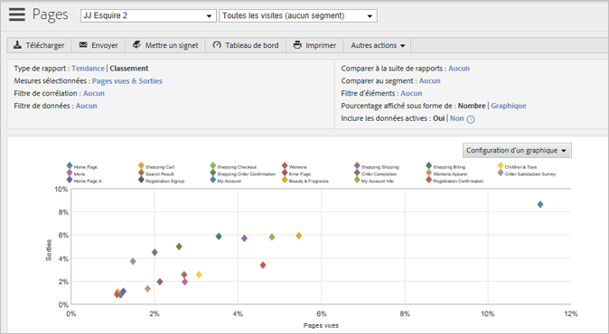

   **[!UICONTROL Bubble]**: Le graphique à bulles affiche les mesures sélectionnées les unes par rapport aux autres. L’emplacement des bulles correspond aux relations entre les mesures sur les axes horizontal et vertical, tandis que leur taille désigne la mesure principale du rapport. Ces diagrammes vous permettent de visualiser les données en deux dimensions, afin que vous puissiez identifier les articles qui renvoient des valeurs aberrantes.

   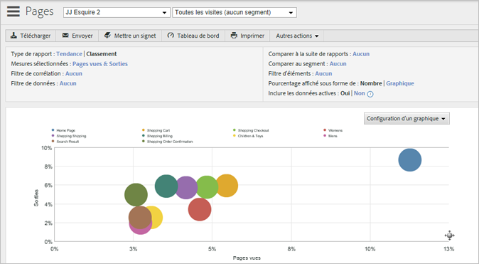

