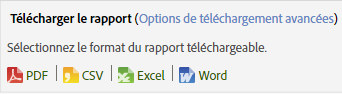

# Planification et distribution des rapports

Cette section contient des informations sur la planification, le téléchargement et la distribution des rapports.

Lorsque vous planifiez la remise d’un rapport dans une application d’Adobe Analytics, vous pouvez utiliser les outils Planification et Diffusion pour afficher les fichiers qui ont été envoyés automatiquement et modifier ou interrompre les livraisons.

En raison des différences dans les mécanismes de traitement et les plateformes, les différents types de rapports planifiés et téléchargeables dans Adobe Analytics présentent différentes limites en ce qui concerne le nombre maximum de lignes qu’ils peuvent traiter dans une même requête. Voici les limites selon chaque type :

* Word, CSV, Excel, HTML et PDF : le même nombre de lignes visibles dans le rapport. Par défaut, cette limite est de 50 lignes mais peut atteindre les 200. Les rapports de ventilation ont une limite stricte de 50 lignes.
* Extractions des données : 50 000 lignes
* Data Warehouse : illimité

Ces limitations concernent les rapports planifiés et téléchargés individuels ; les tableaux de bord sont limités à l'espace disponible dans un petit rapport.

> [!NOTE] Le "Heure de remise"/"Heure du jour" saisi par l’utilisateur indique l’heure à laquelle le rapport doit commencer à être traité, et non l’heure à laquelle il sera réellement remis. Le temps réel de remise du rapport dépend principalement du temps nécessaire au traitement (le traitement des rapports complexes et volumineux prend plus de temps que des rapports plus simples). Si, par exemple, le traitement d’un rapport prend 15 minutes, le temps de remise réel est d’au moins 15 minutes au-delà de l’heure de remise initialement spécifiée.
>En outre, un certain nombre d'autres facteurs peuvent accroître encore le délai avant la remise du rapport :
>
> * **Exécution simultanée** de plusieurs planifications différentes du même type (par exemple, de nombreux tableaux de bord, etc.) peut surcharger le système. Le système de planification ne permet l’exécution simultanée que de quelques rapports (5 à 10) de n’importe quel type. Par conséquent, lorsque plus de 5 à 10 rapports sont tous planifiés à la fois, certains doivent patienter jusqu’à ce que d’autres rapports soient terminés avant de pouvoir commencer le traitement. Ce problème peut être atténué en planifiant les rapports d’une entreprise à des heures décalées tout au long de la journée ou de l’heure, plutôt qu’à la fois.
> * Outre le type de rapport spécifique (Tableaux de bord, etc.), les rapports resteront en ligne si l'entreprise a **plus de 15 à 20 rapports planifiés à la fois (tous les types de rapports)**. Cela peut être atténué par des temps de planification ahurissants au lieu d'avoir plusieurs exécutions en même temps.
> * **Les problèmes des services** en aval sur lesquels le planificateur s’appuie peuvent également affecter la remise des rapports. Par exemple, si vous utilisez les API de manière indépendante pour exécuter des rapports et remplir la file d’attente des demandes d’API, vos rapports planifiés peuvent être distribués lentement pendant que vous êtes en concurrence pour cette ressource.
> * **La latence** des suites de rapports (un retard dans la collecte des données) peut également retarder certains rapports planifiés.

## Envoi d’un rapport {#task_27642CD33D484FD0BF59EBD159EEF52C}

Cette section décrit la procédure à suivre pour télécharger des rapports et les envoyer par courrier électronique dans divers formats et pour planifier la remise d’un rapport. 

1. Run a report, then click **[!UICONTROL More]** &gt; **[!UICONTROL Send]**.
1. Définissez les options de remise : 

   | Option | Description |
   |--- |--- |
   | Format | Sélectionnez le format PDF ou HTML.. |
   | Envoyer à | Précisez une adresse de courriel où recevoir le rapport.. |
   | Sujet | Objet du courriel.. |
   | Planification | Choisissez d’envoyer le rapport immédiatement ou à un autre intervalle.. |

1. Click **[!UICONTROL Advanced Delivery Options]** to specify a delivery schedule.

| Option | Description |
|--- |--- |
| Nom de fichier du rapport | Spécifie le nom du rapport. The default format is `<report name> for <suite> - <report date range>`. Pour définir un nom personnalisé, sélectionnez [!UICONTROL Personnalisé]. |
| Format de rapport | Vous permet de définir les formats PDF, CSV, Excel, HTML, Word ou Mobile pour la remise. Si vous sélectionnez CSV, vous pouvez également définir le codage CSV :<ul><li>Shift-JIS : codage des caractères japonais.</li><li>EUC-JP : Code Unix étendu, principalement pour le japonais, le coréen et le chinois simplifié.</li></ul> |
| Contenu du rapport | <ul><li>Nombre de lignes dans la table : définit le nombre de lignes visibles dans le tableau du rapport que vous envoyez.</li><li>Langue de l’en-tête et du pied de page : définit la langue de l’en-tête et du pied de page.</li><li>Commentaires : spécifie le texte qui apparaît au début du rapport.</li></ul> |
| Envoyer le fichier de signature numérique | Lorsque vous demandez un rapport, tel qu’un rapport mis en signet ou des requêtes Data Warehouse, vous pouvez demander une signature de données. La signature numérique d’Adobe ne limite pas l’accès aux données, mais l’objectif du fichier de signature numérique (.sig) est de vérifier la validité du fichier de rapport remis. Avec la signature numérique, les destinataires du rapport peuvent vérifier que le fichier provient bien d’Adobe et qu’il n’a pas été modifié. |
| Destination du rapport | <ul><li>Courriel : vous permet de configurer l’adresse de courriel, l’objet et les remarques.</li><li>FTP : vous permet de configurer les paramètres FTP, notamment l’hôte, le port, le répertoire, le nom d’utilisateur et le mot de passe.</li></ul> |

1. Click **[!UICONTROL Scheduling Options]**.

| Option | Description |
|--- |--- |
| Envoyer le rapport maintenant | Envoie immédiatement le rapport. |
| Le planifier pour plus tard | Affiche les options permettant de définir la période et les options de remise. |
| Période du rapport | **Fixe** : empêche la date d’avancer au fil du temps. **Variable** : permet à la date d’avancer au fur et à mesure. Quelques considérations à prendre en compte :<ul><li>Si vous sélectionnez des dates de début et de fin variables et un rapport quotidien pour le jour précédent, vous recevrez chaque jour par courriel un rapport du jour précédent.</li><li>Si vous sélectionnez Fixe pour le jour de début et variable pour le jour de fin, vous recevez le premier jour un rapport pour le jour précédent. Le deuxième jour, vous recevrez un rapport pour les deux jours précédents ; le troisième jour, un rapport pour les trois jours précédents, etc.</li><li>Si vous sélectionnez des dates de début et de fin fixes, vous recevrez chaque jour un rapport identique pour les jours que vous avez définis.</li><li>Vous ne pouvez pas sélectionner une date de début variable et une date de fin fixe.</li></ul> |
| Fréquence de remise de rapport | <ul><li>**Par heure** : envoie le courriel chaque heure, une heure sur deux ou à tout autre intervalle horaire défini.</li><li>**Quotidiennement** : envoie le courriel tous les jours, tous les deux jours, tous les trois jours ou à la fréquence définie. Vous pouvez également l’envoyer chaque jour de la semaine.</li><li>**Hebdomadairement** : envoie le courriel toutes les semaines, toutes les deux semaines, toutes les trois semaines ou à la fréquence définie. Vous pouvez également définir un jour particulier de la semaine.</li><li>**Mensuellement** : spécifie l’intervalle en nombre de mois. Vous pouvez également sélectionner un jour particulier du mois ou un jour spécifique d’une semaine du mois.</li><li>**Annuellement** : indique un jour de l’année pour l’envoi du rapport. Vous pouvez également planifier l’envoi un jour d’une semaine spécifique dans l’année.</li><li>**Heure** : s’applique au fuseau horaire associé à la suite de rapports sélectionnée.</li></ul> |
| Options de livraison | <ul><li>**Ne jamais expirer** : ne spécifie aucune fin.</li><li>**Fin après`value`les occurrences**: Indique le nombre d’occurrences avant la fin de la remise.</li><li>**Expirer le** : vous permet de définir une date spécifique. Si vous traitez les données le même jour que les données du rapport, le rapport contient uniquement les informations qui ont été ajoutées dans la base de données au moment de l’envoi du rapport. Le traitement complet d’une journée peut durer jusqu’à 24 heures. Il est par conséquent possible que l’intégralité des données ne soit pas disponible au moment de l’envoi du rapport. Pour que les données soient complètes, définissez toujours le délai de traitement pour 24 heures après l’expiration de la période de rapport.</li></ul> |

## Impression d’un rapport {#task_0F7CF6D6ED54462CAE4A793E271AF7E5}

Cette section décrit la procédure à suivre pour imprimer un rapport.

1. Exécution d’un rapport.
1. Click **[!UICONTROL More]** &gt; **[!UICONTROL Print]**.  

## Téléchargement d’un rapport à l’aide des options de base {#task_43660107A1C9485D92981CD75B562577}

Téléchargez des informations détaillées sur un rapport spécifique au format d’exportation de données PDF, CSV, Excel ou données brutes.

1. Sous **Analytics** &gt; **[!UICONTROL Rapports]**, sélectionnez un rapport à afficher.
1. Cliquez sur **[!UICONTROL Télécharger]**.

   

1. Sélectionnez le format de votre choix pour le rapport :

   * **[!UICONTROL PDF]** : le rapport sera téléchargé au format Adobe PDF. Vous pourrez ainsi le partager avec d’autres utilisateurs, quelle que soit leur plate-forme informatique.
   * **[!UICONTROL CSV]**: Indique que le rapport sera téléchargé au format [!DNL .csv] (valeurs séparées par des virgules).
   * **[!UICONTROL Excel :]** le rapport sera téléchargé au format Microsoft Excel. Vous aurez ainsi la possibilité de le partager avec d’autres utilisateurs qui pourront l’ouvrir dans un tableur.
   * **[!UICONTROL Word]** : le rapport sera téléchargé au format Microsoft Word.
   >[!NOTE]
   >
   >Si vous utilisez l’un des formats d’exportation bruts pour télécharger un rapport et que le nom de la page est vide, Adobe Analytics n’a probablement pas eu assez de temps pour traiter les données. Téléchargez le rapport ultérieurement.

## Gestion des rapports planifiés {#task_C17677C543454FF2B06D10EA5652DFBC}

Cette section contient des informations sur la gestion des rapports planifiés.

Dans le [!UICONTROL Gestionnaire de planification des rapports], vous pouvez modifier et supprimer les remises répétitives de rapports. Vous pouvez créer des calendriers de remise pour envoyer les rapports par courrier électronique ou FTP vers une adresse spécifiée. Vous pouvez configurer ces calendriers pour l’envoi automatique des rapports à des intervalles donnés pendant une période définie ou indéfiniment, ou arrêter la distribution d’un rapport récurrent.

Le [!UICONTROL Gestionnaire de planification des rapports] affiche les éléments créés par un utilisateur spécifique. Si le compte d’utilisateur est désactivé dans l’application, toutes les livraisons planifiées sont interrompues.

1. To access the manager, click **[!UICONTROL Analytics]** &gt; **[!UICONTROL Components]** &gt; **[!UICONTROL Scheduled Reports]**.

## Partage d’un lien vers un rapport {#task_9711DDE9E140451B8C914EC5513E21EC}

Cette section décrit la procédure à suivre pour partager un rapport en générant un lien (URL) vers ce rapport en vue de l’envoyer à un autre utilisateur.

Lorsque le destinataire clique sur le lien, le système demande les informations de connexion (nom de l’entreprise, nom d’utilisateur et mot de passe). Après identification, le destinataire voit s’afficher le rapport généré par l’utilisateur initial. Des restrictions d’autorisation standard s’appliquent.

**Pour partager un lien vers un rapport**

1. Exécution d’un rapport.
1. Click **[!UICONTROL More]** &gt; **[!UICONTROL Link to This Report]**.

## Se désabonner des rapports planifiés {#concept_6B48360F935740B6851BA85D32DEF637}

Vous pouvez vous désabonner des rapports planifiés. Vous ne recevrez plus le rapport même si votre nom d’utilisateur est de nouveau ajouté au rapport planifié.

>[!IMPORTANT]
>
>Pour que vous puissiez à nouveau recevoir le rapport, une nouvelle planification doit être créée.

Pour vous désabonner d’un rapport planifié :

1. Affichez l’e-mail avec le lien vers le rapport auquel vous souhaitez vous désabonner.

   

1. Cliquez sur le lien **[!UICONTROL cliquez ici]** en regard de **[!UICONTROL Pour annuler la réception automatique de ce rapport]**.

1. Confirmez que vous souhaitez annuler l’envoi de ce rapport.

   >[!NOTE]
   >
   >Ce processus est le même que vous soyez le planificateur de rapports ou le destinataire du rapport.

Le désabonnement d’un rapport n’annule pas le rapport planifié.

Pour annuler un rapport planifié, accédez au Gestionnaire de planification et cliquez sur le X rouge en regard du nom du rapport. [Plus...](/help/analyze/reports-analytics/scheduling.md#task_C17677C543454FF2B06D10EA5652DFBC)
