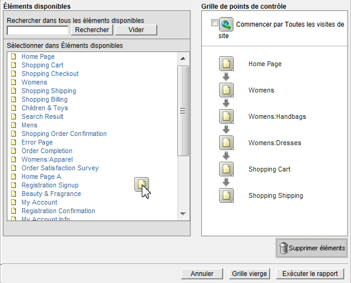
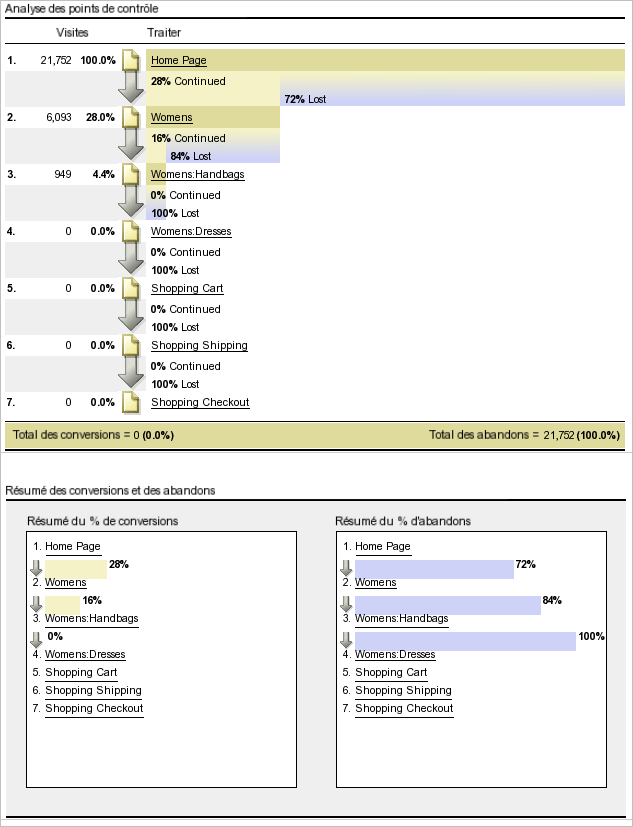
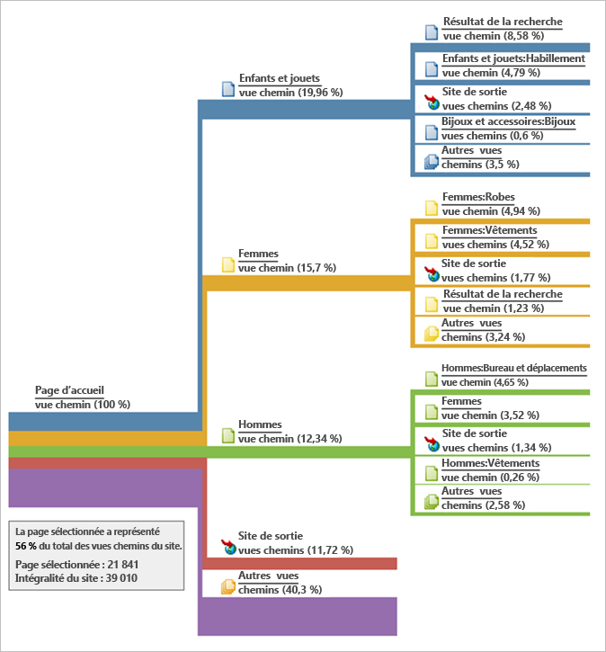
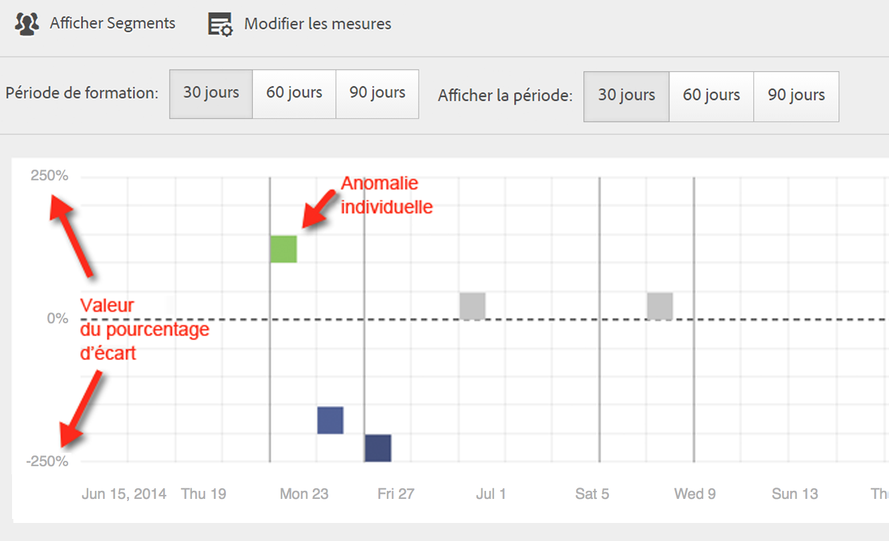
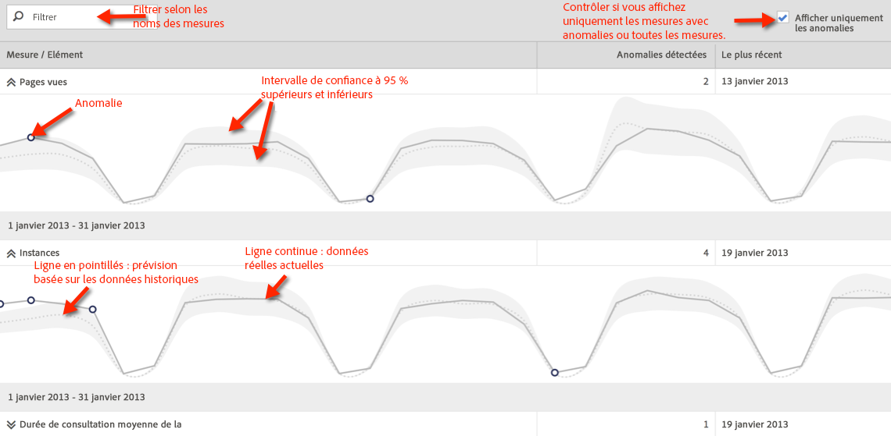
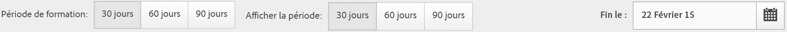
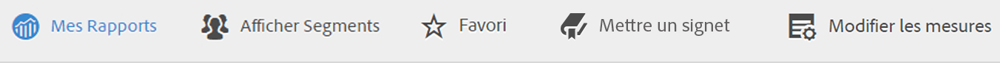
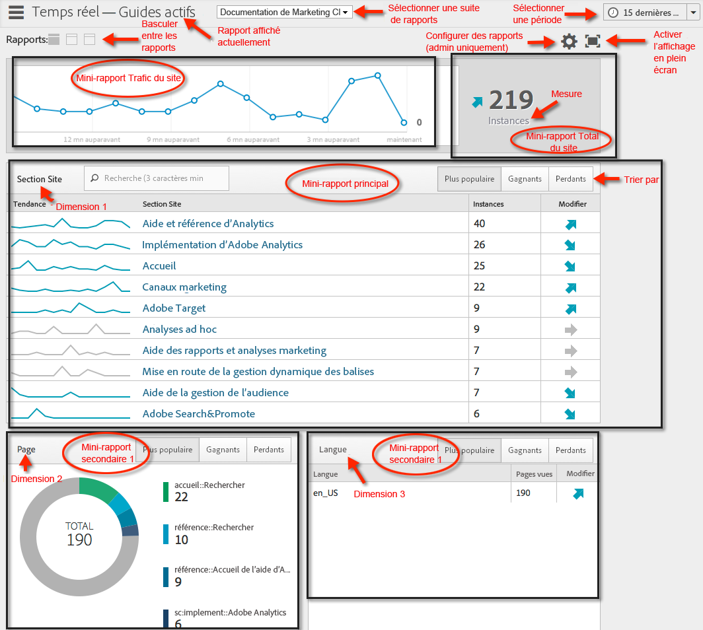
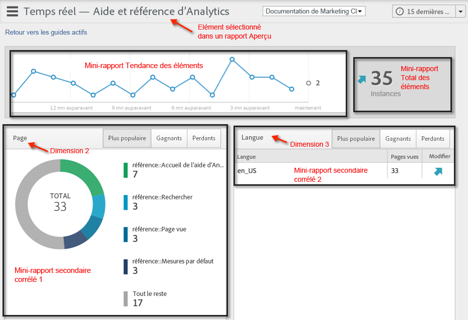

# Exécution de différents types de rapports

Procédure d’exécution de différents types de rapports

## Exécution d’un rapport de classement {#task_C570BA4A213F4F2EB7B30E012934BE7D}

Dans un rapport de classement, le tableau du rapport présente le classement des pages du rapport par rapport à la mesure, en fonction du nombre ou du pourcentage. Ces rapports peuvent afficher plusieurs mesures.

<!-- 

t_reports_ranked.xml

 -->

1. Générez un rapport, tel qu’un [!UICONTROL Rapport Pages] (**[!UICONTROL Rapports]** > **[!UICONTROL Contenu du site]** > **[!UICONTROL Pages]**).
1. Dans l’en-tête du rapport, cliquez sur **[!UICONTROL Classement]**.
1. Pour classer le rapport, cliquez sur un en-tête de colonne dans le tableau.

   Le tableau d’un rapport de classement peut comprendre jusqu’à 200 éléments (par exemple, produits, catégories, pages web, etc.) et dix mesures (recettes, commandes, vues, etc.).

## Exécution d’un rapport de tendances {#task_F03B4E760B9E4EA29FC3F654E6316887}

Les rapports de tendances affichent les mesures au fil du temps. Utilisez ce type de rapport lorsque vous souhaitez comparer la performance d’un segment d’une période par rapport à une autre.

<!-- 

t_reports_trended.xml

 -->

Pour la plupart des rapports de conversion et de trafic, une vue Tendance est disponible. L’outil [!UICONTROL Calendrier] permet d’afficher l’amélioration de la ventilation pour n’importe quelle période, y compris les jours d’un mois, les semaines de l’année, les semaines d’un trimestre, les mois de l’année, et ainsi de suite. Les rapports de tendances affichent les tendances relatives à une mesure unique (recettes, commandes, vues, etc.) de cinq éléments au maximum (par exemple, produits, catégories, pages web, etc.).

**Pour exécuter un rapport de tendances**

1. Exécutez un rapport de conversion ou de trafic, tel que **[!UICONTROL Rapports]** > **[!UICONTROL Contenu du site]** > **[!UICONTROL Pages]**.
1. Sous **[!UICONTROL Type de rapport]**, cliquez sur **[!UICONTROL Tendance]**.

## Exécution d’un rapport Entonnoir de conversion {#task_B926A74AA6A641138C2986C1635120CB}

Les rapports Entonnoir de conversion affichent le pourcentage des visiteurs qui passent par un ensemble d’événements pour effectuer l’action souhaitée. Vous pouvez, par exemple, afficher la progression des visiteurs qui passent de l’affichage de votre page web à l’ajout d’éléments dans un panier, puis à l’achat d’un élément. Il précise également le nombre d’utilisateurs qui abandonnent en cours de route.

<!-- 

t_reports_conversion_funnel.xml

 -->

Pour exécuter ce rapport, sélectionnez un rapport, par exemple un rapport Pages (**[!UICONTROL Rapports]** > **[!UICONTROL Campagnes]** > **[!UICONTROL Code de suivi]** > **[!UICONTROL Entonnoir de conversion de campagne]**).

Pour obtenir une description, reportez-vous à la section [Rapports de conversion](https://marketing.adobe.com/resources/help/fr_FR/reference/reports_conversion.html).

## Exécution d’un rapport sur les abandons {#task_8FD97C8260464F9DA731A93DB8F80184}

Le [!UICONTROL rapport sur les abandons] indique le nombre de visiteurs qui ont consulté une séquence de pages prédéfinie. Il indique également les taux de conversions et d’abandons entre deux étapes.

<!-- 

t_reports_fallout.xml

 -->

Découvrez le nouveau panneau [Analyse des abandons](https://marketing.adobe.com/resources/help/fr_FR/analytics/analysis-workspace/fallout_flow.html) dans Analysis Workspace.

1. Dans [!UICONTROL Adobe Analytics], cliquez sur **[!UICONTROL Rapports]** > **[!UICONTROL Chemins]** > **[!UICONTROL Pages]** > **[!UICONTROL Abandon]**.
1. Sur la page du [!UICONTROL rapport sur les abandons], cliquez sur le bouton de **[!UICONTROL lancement du Report Builder d’abandons]**.

   

1. Sur la page [!UICONTROL Définir les points de contrôle], spécifiez les points de contrôle à utiliser pour votre rapport.
1. Cliquez sur **[!UICONTROL Exécuter le rapport]**.

   

>[!MORELIKETHIS]
>
>* [Description du rapport sur les abandons](https://docs.adobe.com/content/help/fr-FR/analytics/components/variables/dimensions-reports/reports-fallout.translate.html)

## Exécution d’un rapport de flux de page {#task_133E8B87C3F04DA0A42D10CBA499305B}

Les rapports de flux de page indiquent l’ordre dans lequel les visiteurs accèdent aux pages et parcourent votre site.

Découvrez la nouvelle [visualisation Flux](https://marketing.adobe.com/resources/help/fr_FR/analytics/analysis-workspace/flow.html) dans Analysis Workspace.

Exécutez un rapport [Chemins](https://marketing.adobe.com/resources/help/fr_FR/reference/reports_paths.html).

Par exemple, cliquez sur **[!UICONTROL Rapports]** > **[!UICONTROL Chemins]** > **[!UICONTROL Pages]** > **[!UICONTROL Flux page suivante]**.

Ce rapport se lit de gauche à droite, en commençant par la page sélectionnée. Les pages vues après la page sélectionnée sont illustrées comme une branche s’étendant vers la droite.

Le pourcentage d’affichage de chaque page consécutive est indiqué en regard du nom de la page. La largeur de la ligne reliée à chaque page suivante représente ce pourcentage relatif.

**[!UICONTROL Vues chemins]** : indique le nombre de fois où une page a été vue, selon un chemin spécifique indiqué. 

La politique de confidentialité pourrait, par exemple, générer un total de 10 000 pages vues, mais seulement 500 de ces pages ont été affichées immédiatement après la page d’accueil. On emploie alors le terme « vue chemin ».

Le pourcentage relatif est représenté par la largeur relative de la ligne. Par défaut, ce rapport affiche cinq branches de deuxième niveau et cinq branches de troisième niveau. Vous pouvez développer le nombre de branches afin d’afficher jusqu’à dix branches de deuxième niveau et cinq branches de troisième niveau. Dans ce cas, la hauteur du rapport augmente et vous devrez certainement utiliser la fonction de défilement pour visualiser le graphique entier.

## Exécution d’un rapport Entonnoir {#task_2BBF6FACD48F479E8B2EE458919941CB}

Vous pouvez sélectionner des événements de succès et les ajouter à un rapport [!UICONTROL Entonnoir de conversion d’achat] ou [!UICONTROL Entonnoir de conversion de produits].

<!-- 

t_reports_funnel.xml

 -->

1. Cliquez sur **[!UICONTROL Rapports]** > **[!UICONTROL Produits]** > [Entonnoir de conversion de produits](https://marketing.adobe.com/resources/help/fr_FR/reference/reports_conversion_funnel.html).

## Exécution d’un rapport Canal marketing {#task_64ADED5CC75248319E06E3E029B47F78}

Ce rapport fournit un aperçu de la première et de la dernière allocation de canal, avec des mesures de rapport standard telles que les recettes, les commandes et les coûts. Grâce à ces rapports, vous pouvez analyser combien de recettes sont générées par chaque canal.

<!-- 

t_reports_marketing_channel.xml

 -->

Consultez l’aide sur le [canal marketing](https://marketing.adobe.com/resources/help/fr_FR/mchannel/index.html) pour en savoir plus.

## Exécution d’un rapport Détection des anomalies {#task_4808C96327354D789C075823F5C3A049}

Décrit comment interpréter les graphiques de mesures synthétiques et individuels de la détection des anomalies.

<!-- 

t_anomaly_view.xml

 -->

Découvrez les nouvelles fonctions de [détection des anomalies et d’analyse des contributions](https://marketing.adobe.com/resources/help/fr_FR/analytics/analysis-workspace/anomaly_detection.html) d’Analysis Workspace.

**[!UICONTROL Rapports]** > **[!UICONTROL Mesures du site]** > **[!UICONTROL Détection des anomalies]** .

> [!NOTE] Vous pouvez également exécuter la détection des anomalies directement depuis les projets Analysis Workspace. [Plus...](https://marketing.adobe.com/resources/help/fr_FR/analytics/analysis-workspace/anomaly_detection.html)

Pour plus d’informations sur la configuration de la détection des anomalies, voir le [Guide de référence](https://marketing.adobe.com/resources/help/fr_FR/sc/user/index.html#Setting_up_Anomaly_Detection).

La détection des anomalies présente deux types de graphiques : un graphique synthétique et des graphiques de mesures individuels. Les graphiques de mesures individuels ne s’affichent que si au moins une anomalie a été détectée pour la mesure.

<table id="table_88163CD8FC164342855D90D01F9C581A"> 
 <thead> 
  <tr> 
   <th colname="col1" class="entry"> 
Type de graphique 
 </th> 
   <th colname="col2" class="entry"> 
Son utilité 
 </th> 
  </tr> 
 </thead>
 <tbody> 
  <tr> 
   <td colname="col1"> 
Graphique synthétique 
 
 
 </td> 
   <td colname="col2"> 
 
     <ul id="ul_D26DA3024CD7468291369F549557B28A"> 
      <li id="li_1C22B6E02FFB479FB71EFAD89EB37A4E">Chaque carré représente une anomalie, suivie par jour, qui correspond à une mesure ci-dessous. </li> 
      <li id="li_8FC587D3FF4E452D83263CC7A10B6675">Le vert indique les anomalies se situant au-dessus de la ligne de tendance, le bleu en dessous. </li> 
      <li id="li_25135AB691BF443599AF2A3A60E2E71A">Indique l’ampleur de l’anomalie : plus l’anomalie est grande, plus la couleur du point de données est foncée et plus il est éloigné de la ligne de tendance. </li> 
      <li id="li_0C42AFA8897D420D8AB1A5D0F65B3B3A">Cliquez sur des anomalies individuelles pour afficher le tableau de mesures individuelles de cette anomalie (sous le tableau récapitulatif). </li> 
      <li id="li_85C0F426952547B5A75D6BD31DE19CA5">Les valeurs du pourcentage d’écart (à gauche du graphique) sont calculées comme suit : 
       <ul id="ul_BEC0A88BFFAC4CF78BC9885FEB749694"> 
        <li id="li_1BAB2F50482745B69937DFAF1E09982E">Si les limites supérieures et la valeur attendue sont les mêmes, le % d’écart est de 100 % </li> 
        <li id="li_CA48064F5788448C8646CCE196161237">Sinon, le % d’écart est égal à : ((valeur réelle - valeur limite supérieure) / (valeur limite supérieure - valeur attendue)) * 100 </li> 
        <li id="li_4090357A0D214BC7B1C3DE0615875554">Si les limites inférieures et la valeur attendue sont identiques, le % d’écart est de -100 % </li> 
        <li id="li_EF694E1A4E874ECD94E1E8F7302E494F">Sinon, le % d’écart est ((valeur réelle inférieure - valeur réelle) / (valeur attendue - valeur limite inférieure)) * -100 </li> 
       </ul> </li> 
      <li id="li_5C05EF7023484CC993E96D63E842B65C">Cliquez sur Afficher Segments pour afficher le rail des segments à partir duquel vous pouvez appliquer des segments à un rapport de détection des anomalies. <a href="https://marketing.adobe.com/resources/help/fr_FR/analytics/segment/"  > Plus d’informations</a> sur la segmentation. </li> 
      <li id="li_1B41CABF13D1407886C68EE3BC201E60">Cliquez sur Modifier des mesures pour sélectionner et désélectionner des mesures pour lesquelles vous souhaitez détecter des anomalies. </li> 
     </ul> 
 </td> 
  </tr> 
  <tr> 
   <td colname="col1"> 
Graphique de mesures individuel 
 
 
 </td> 
   <td colname="col2"> 
 
     <ul id="ul_739C5687013743A29B63089FDA763F45"> 
      <li id="li_456A0BDA4D4E46CE9CC1C3DBAA1E2220">Affiche des points de données anormaux pour des mesures de tendance spécifiques (notamment les mesures calculées) sous la forme de points. </li> 
      <li id="li_89FD847C65F04F48BCA7CD38D0EC51CD">Affiche l’anomalie la plus récente en haut, et effectue ensuite un classement par nombre d’anomalies. </li> 
      <li id="li_98B97A9706DE4455B8D8850904CBDE03">Affiche une ligne continue pour indiquer les données réelles actuellement collectées. Cette ligne est comparée à la prévision et à la marge d’erreur afin de déduire si les points de données sont anormaux. </li> 
      <li id="li_0EEA38DDDC344BF3879430E67D74EB72">Affiche une ligne en pointillés qui représente une prévision basée sur les données historiques (c’est-à-dire la période de formation). </li> 
      <li id="li_035BD2725D004AEDB630BF8DFF4DA4F3">Affiche en gris les intervalles/limites de confiance à 95 % supérieurs et inférieurs. </li> 
      <li id="li_021A3D1F2EDB4319B9B39620EF1C038A">Permet de réduire et développer des rapports individuels en cliquant sur la double flèche vers le haut ou vers le bas en regard du nom de la mesure. </li> 
      <li id="li_722E4B9FC21047AC96D7B143197E293D">Modifie l’ordre dans lequel les graphiques de mesures apparaissent en réagissant aux déroulements vers le bas dans le rapport d’aperçu (voir ci-dessus). </li> 
      <li id="li_A2441169B185475AA68A64F81E6E40B8">Permet de filtrer les graphiques en utilisant des termes de recherche, tels que « page » pour toutes les mesures relatives aux pages. </li> 
      <li id="li_F1BBBFCA8E2A43C29658E4FCAA36C904">Permet d’afficher toutes les mesures que vous avez définies ou uniquement celles comportant des anomalies. </li> 
     </ul> 
 </td> 
  </tr> 
 </tbody> 
</table>

## Configuration de la détection des anomalies {#task_AF347B34F56E44A6AE70E019B6EB2F08}

Étapes permettant de sélectionner des suites de rapports, des mesures et des périodes de formation/d’affichage pour la détection des anomalies.

<!-- 

t_anomaly_config.xml

 -->

Configurez la détection des anomalies indépendamment pour chaque suite de rapports.

1. Accédez à **[!UICONTROL Analytics > Rapports > Mesures du site > Détection des anomalies]** .
1. Sélectionnez la suite de rapports pour laquelle vous souhaitez suivre quotidiennement la détection des anomalies. Pour afficher une liste des suites de rapports, cliquez sur le menu déroulant du sélecteur de suite de rapports.
1. Pour sélectionner les mesures et/ou définir des mesures filtrées, cliquez sur **[!UICONTROL Modifier des mesures]** dans la partie supérieure droite de l’écran :  .

   Vous pouvez sélectionner des mesures dans la liste (y compris des mesures calculées) de toutes les mesures ou dans une liste de mesures suivies. Vous pouvez également filtrer des termes spécifiques afin de préciser les résultats. 1. Une fois le rapport généré, définissez la **[!UICONTROL période de formation]** et la **[!UICONTROL période d’affichage]** pour la détection des anomalies. (Considérez la période de formation en tant que « période d’apprentissage » pour l’algorithme.)

   

   Gardez les éléments suivants à l’esprit :

* la période de formation se termine juste avant que la période d’affichage ne commence ;
* la valeur par défaut des deux périodes est de 30 jours et vous pouvez l’étendre à 60 ou 90 ;
* l’extension de la période de formation place vos données dans un contexte plus étendu et peut réduire la taille d’une anomalie.

   Le rapport des mesures de détection des anomalies s’actualise chaque fois que vous modifiez un paramètre.
1. (Facultatif) Appliquez les segments au rapport en cliquant sur **[!UICONTROL Afficher les segments]** et en sélectionnant un ou plusieurs segments existants ou en créant un nouveau segment et en l’appliquant.

   

   Voir le [guide de segmentation d’Analytics](https://marketing.adobe.com/resources/help/fr_FR/analytics/segment/) pour en savoir plus sur la création et la gestion des segments. 1. (Facultatif) Définissez le rapport comme favori ou signet.
1. (Facultatif) Modifiez la date de fin de la période d’affichage. La valeur par défaut est « hier ». 
1. Vous pouvez à présent commencer à interpréter le rapport. [Affichage des graphiques de détection des anomalies](/help/analyze/reports-analytics/t-running-report-types.md#task_4808C96327354D789C075823F5C3A049).

## Exécution d’un rapport en temps réel {#task_5D25929C918E40B18965222FA94176B0}

Décrit comment afficher et interpréter les rapports en temps réel.

<!-- 

reports_realtime.xml

 -->

**[!UICONTROL Rapports > Mesures du site > Temps réel]** .

La création de rapports en temps réel offre deux rapports principaux : un rapport d’aperçu et un rapport détaillé. Ils sont chacun composés de plusieurs mini-rapports.

Pour plus d’informations sur la configuration des rapports en temps réel, voir le [Guide de référence d’Analytics](https://marketing.adobe.com/resources/help/fr_FR/reference/index.html#RealTime_Reports_Configuration).

1. Étudiez le rapport **[!UICONTROL Aperçu]** et ses composants :  

   <table id="choicetable_8586BECF55E843B2B5CD41205567EA32"> 
   <thead class="chhead sthead"> 
   <th class="choptionhd"> Composant de l’interface utilisateur </th> 
   <th class="chdeschd"> Description </th> 
   </thead> 
   <tr class="chrow strow"> 
   <td class="choption"><strong>Sélectionner une suite de rapports</strong></td> 
   <td class="chdesc stentry"> Affiche la suite de rapports couverte par ce rapport en temps réel. Pour modifier la suite de rapports, voir <a href="https://marketing.adobe.com/resources/help/fr_FR/reference/t_realtime_admin.html"  >Configuration de rapports en temps réel </a>. </td> 
   </tr> 
   <tr class="chrow strow"> 
   <td class="choption"><strong>Basculer entre les rapports</strong></td> 
   <td class="chdesc stentry"> Permet de basculer entre les rapports que vous avez configurés (3 au maximum). </td> 
   </tr> 
   <tr class="chrow strow"> 
   <td class="choption"><strong>Sélectionner une période</strong></td> 
   <td class="chdesc stentry"> Permet de choisir la période globale à utiliser par tous les petits rapports du rapport. </td> 
   </tr> 
   <tr class="chrow strow"> 
   <td class="choption"><strong>Configurer les rapports</strong></td> 
   <td class="chdesc stentry"> Ce lien d’icône d’engrenage n’est visible que si vous êtes doté des droits d’administration. Si vous cliquez sur ce lien, vous accédez au gestionnaire des suites de rapports sous Outils d’administration &gt; Suites de rapports &gt; Modifier paramètres &gt; Temps réel  . </td> 
   </tr> 
   <tr class="chrow strow"> 
   <td class="choption"><strong>Affichage plein écran</strong></td> 
   <td class="chdesc stentry"> L’icône d’affichage plein écran n’est visible que si votre écran comporte un format spécifique (16:9 ou 16:10) ET si votre navigateur le prend en charge. Notez que vous ne pouvez pas interagir avec l’écran lorsqu’il est en mode plein écran (appuyez sur Échap pour quitter). Le mode plein écran n’a pas de délai d’expiration. </td> 
   </tr> 
   <tr class="chrow strow"> 
   <td class="choption"><strong>Mini-rapport Trafic du site</strong></td> 
   <td class="chdesc stentry"> Les données de la ligne de tendance bleue affichent le trafic total pour l’ensemble du site. L’axe des X utilise des libellés littéraux (il y a 15 minutes, il y a 10 minutes) sauf pour la valeur actuelle qui s’affiche sous la forme d’une expression en temps réel. </td> 
   </tr> 
   <tr class="chrow strow"> 
   <td class="choption"><strong>Petit rapport Total du site</strong></td> 
   <td class="chdesc stentry"> Présente un nombre (total du site) pour la mesure sélectionnée du rapport en temps réel au cours des N dernières minutes. « N » est configurable par l’intermédiaire du sélecteur de période. 
La couleur et la direction de la flèche sont basées sur l’algorithme suivant : 
      <ul id="ul_9F40CEA33798467393CB1266BB36D500"> 
      <li id="li_CCD01A44F912487DA5681EA50113643C">Gain significatif (flèche vers le haut) : &gt; 100 % </li> 
      <li id="li_7402491A9A614851B7F2AE0C77BD9A97">Gain (flèche vers le haut et la droite) : entre 5 et 100 % </li> 
      <li id="li_BCA79C08B5714D4B9315068112C66107"> Neutre (flèche vers la droite) : entre 5 % et -5 % </li> 
      <li id="li_234ECBD7D83A4AE680E4A70BF288681F"> Perte (flèche vers le bas et la droite) : entre -5 % et -100 % </li> 
      <li id="li_10C5EA8803604C1CA714D3DB27478B31"> Perte significative (flèche vers le bas) : &lt; -100 % </li> 
      </ul> 
 
Si le total du site est signalé en « instances », ces instances reflètent la dimension du mini-rapport principal. Si un nom spécifique d’instance existe (par exemple « Pages vues »), le total du site signale ce nom. 
 </td> 
   </tr> 
   <tr class="chrow strow"> 
   <td class="choption"><strong>Petit rapport principal</strong></td> 
   <td class="chdesc stentry"> Rapport pour la dimension principale du rapport en temps réel et pour ses mesures. Présente une ligne de tendance pour cet élément correspondant à la période sélectionnée. Le total des mesures représente la somme pour la ligne de tendance complète. La flèche indique si l’élément est en situation de forts gains, de gains, neutre, de pertes, de fortes pertes. </td> 
   </tr> 
   <tr class="chrow strow"> 
   <td class="choption"><strong>Boîte de dialogue de recherche</strong></td> 
   <td class="chdesc stentry"> La recherche impacte tous les mini-rapports. Elle se poursuit lorsque vous affichez le rapport. </td> 
   </tr> 
   <tr class="chrow strow"> 
   <td class="choption"><strong>Tri par... Le plus populaire/Gagnants/Perdants</strong></td> 
   <td class="chdesc stentry"> Vous pouvez basculer pour trier par Le plus populaire(par défaut), Gagnants (dimensions présentant les plus fortes croissances) et Perdants (dimensions étant sur une trajectoire descendante). 
La formule utilisée pour déterminer les gagnants ou les perdants est la suivante : le rapport en temps réel recherche l’échantillon le plus ancien et l’avant-dernier et effectue un simple calcul « modification en % ». Ainsi, si « 15 dernières minutes » est sélectionné et n représente la minute actuelle, n-1 est comparé à n-15. Le rapport en temps réel n’effectue pas, pour le moment, de pondération. La minute en cours est ignorée, car elle n’est pas terminée et produirait sans doute une modification en % erronée. 
 
Cette formule est cohérente pour toutes les mesures utilisées dans le rapport en temps réel. 
 </td> 
   </tr> 
   <tr class="chrow strow"> 
   <td class="choption"><strong>Petit rapport secondaire 1</strong></td> 
   <td class="chdesc stentry"> Présente des rapports en temps réel pour la deuxième dimension du rapport configuré et pour sa mesure. 
Le mini-rapport secondaire 1 affiche les 4 catégories supérieures ; la cinquième est une agrégation de toutes les valeurs restantes. Pour chaque catégorie, l’affichage brut total de la catégorie est fourni. En outre, le total de toutes les catégories s’affiche au centre. 
 
 Le survol d’une section avec le curseur met en surbrillance la catégorie associée et affiche la ligne de tendance de la catégorie sous le beignet. 
 
 Le survol d’un élément de ligne avec le curseur met en surbrillance ce dernier avec la section associée et affiche la ligne de tendance de la catégorie sous le beignet. 
 </td> 
   </tr> 
   <tr class="chrow strow"> 
   <td class="choption"><strong>Petit rapport secondaire 2</strong></td> 
   <td class="chdesc stentry"> Présente des rapports en temps réel pour la troisième dimension du rapport configuré et pour sa mesure. Le survol du libellé de la ligne avec le curseur fait glisser le libellé vers la droite et révèle une ligne de tendance pour l’élément survolé. </td> 
   </tr> 
   </table>

1. Cliquez sur un élément de liste dans le petit rapport principal pour lancer la vue **[!UICONTROL Détails]** pour cet élément de liste :  

   | **Mini-rapport Tendance des éléments** | Présente la ligne de tendance de l’élément qui a été sélectionné dans le rapport Aperçu pendant les N dernières minutes. Vous pouvez configurer N par l’intermédiaire du sélecteur de période. |
   |---|---|
   | **Mini-rapport Total des éléments** | Présente un nombre de mesures total pour l’élément qui a été sélectionné dans le rapport Aperçu au cours des N dernières minutes. Vous pouvez configurer N par l’intermédiaire du sélecteur de période. |
   | **Mini-rapport secondaire corrélé 1** | Ce mini-rapport est très similaire au mini-rapport secondaire 1. La seule différence est la source de données utilisée pour alimenter ce rapport : dans cet exemple, il montre la corrélation (ou ventilation) entre une page spécifique (celle que vous avez sélectionnée dans le mini-rapport principal du rapport Aperçu) et les instances affichées. |
   | **Mini-rapport secondaire corrélé 2** | Ce mini-rapport est très similaire au mini-rapport secondaire 2. La seule différence est la source de données utilisée pour alimenter ce rapport : dans cet exemple, il montre la corrélation (ou ventilation) entre une page spécifique (celle que vous avez sélectionnée dans le mini-rapport principal du rapport Aperçu) et la dimension de langue. |
