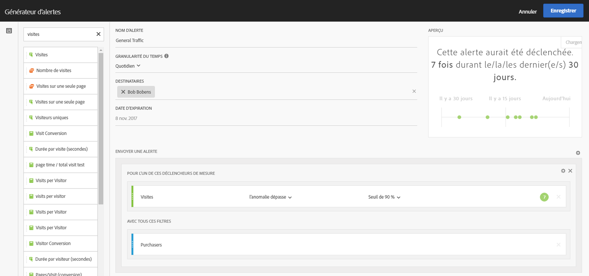
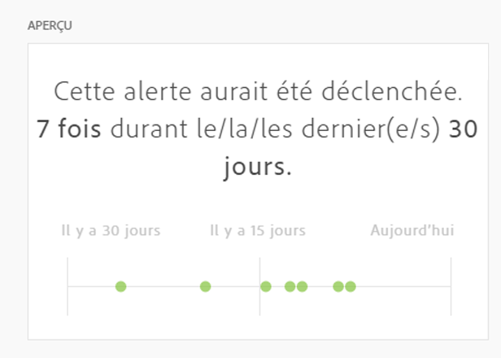

# Générateur d’alertes

>[!IMPORTANT]
>
>Les alertes intelligentes ne sont disponibles que pour les clients Adobe [!DNL Analytics] Prime et Adobe [!DNL Analytics] Ultimate.

Le Générateur d’alertes peut être ouvert de l’une des quatre façons suivantes :

* En utilisant le raccourci clavier suivant dans Analysis Workspace :

   `ctrl (or cmd) + shift + a`
* En sélectionnant **[!UICONTROL Workspace]** > **[!UICONTROL Composants]** > **[!UICONTROL Nouvelle alerte]**.
* En sélectionnant une ou plusieurs lignes de tableau à structure libre, en cliquant avec le bouton droit de la souris puis en sélectionnant **[!UICONTROL Créer une alerte d’après la sélection]**.
* Dans un rapport [!UICONTROL Reports &amp; Analytics], en sélectionnant **[!UICONTROL Plus]** > **[!UICONTROL Ajouter une alerte]**.

Les utilisateurs qui ont déjà créé des segments ou calculé des mesures dans [!DNL Analytics] ne seront pas dépaysés par l’interface du Générateur d’alertes :

**Nom d’alerte**

Spécifiez le nom de l’alerte. Le nom de l’alerte doit contenir le nom du rapport ou le seuil des mesures.

**Granularité du temps**

Spécifiez quand vérifier la mesure : chaque heure, chaque jour, chaque semaine ou chaque mois.

> [!NOTE] Dans le Générateur d’alertes, il n’est pas possible de sélectionner la granularité mensuelle pour les suites de rapports dotées d’un calendrier personnalisé.

**Destinataires**

Spécifiez où envoyer l’alerte. Une alerte peut être envoyée à un utilisateur [!DNL Analytics] ou à un groupe [!DNL Analytics], à une adresse électronique brute ou à un numéro de téléphone.

>[!IMPORTANT]
>
>Le numéro de téléphone doit être précédé d’un « + » et d’un [code de pays](https://countrycode.org/).

**Date d’expiration**

Spécifiez la date d’expiration de l’alerte.

**Envoyer une alerte lorsque...**

*Pour l’un de ces déclencheurs de mesure*

* Faites glisser et déplacez les mesures dans la zone de travail des déclencheurs.

   Notez qu’un message **« composants incompatibles »** s’affiche si certains composants (mesures/dimensions/segments) de l’alerte ne sont pas compatibles avec la suite de rapports actuellement sélectionnée.

* Déterminez le seuil que la mesure doit dépasser avant l’envoi d’une alerte. Vous pouvez définir un seuil, puis l’une des conditions suivantes :

   * il existe une anomalie
   * l’anomalie est supérieure à celle prévue
   * l’anomalie est inférieure à celle prévue
   * l’anomalie dépasse
   * est supérieur ou égal
   * est inférieur ou égal
   * change de

* Le paramètre « l’anomalie dépasse » est une nouvelle condition, qui va au-delà des seuils (statiques) actuels. Il applique les algorithmes de détection des anomalies qui définissent le déclencheur de manière dynamique. Le seuil peut être défini à 90 %, 95 %, 99 %, 99,75 % ou 99,90 %.
* Il est défini à 99,75 % pour les granularités horaires et à 99 % pour les granularités quotidiennes.
* Vous pouvez également utiliser les mesures calculées.

*Avec tous ces filtres*

Faites glisser et déplacez les segments ou dimensions pour ajouter des filtres. Par exemple, ajoutez un segment « Appareils mobiles seulement » afin de signifier que la règle se déclenche uniquement pour les appareils mobiles.

Pour ajouter d’autres filtres, utilisez une instruction ET.

**Ajouter une règle**

Pour ajouter des règles ET ou OU, cliquez sur l’icône d’engrenage.

## Aperçu des alertes {#section_10D75BA7B77E4C5FAF58A719C082E070}

Dans l’aperçu interactif des alertes, vous pouvez déterminer à quelle fréquence, approximativement, une alerte sera déclenchée en fonction d’une expérience antérieure.

Si, par exemple, vous définissez une granularité temporelle quotidienne, l’aperçu indique que, pour une certaine mesure, l’alerte aurait été déclenchée x fois durant les 30 ou 31 derniers jours.

Pour réduire le nombre d’alertes déclenchées, réglez le seuil dans le [Gestionnaire d’alertes](/help/components/c-alerts/alert-manager.md).

