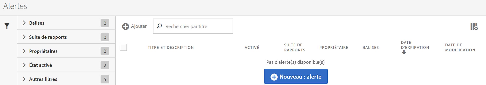
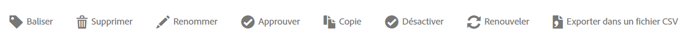

# Gestionnaire d’alertes

Vous pouvez gérer les alertes existantes dans le gestionnaire d’alertes. Vous pouvez effectuer différentes tâches de gestion sur les alertes, telles que le balisage, le changement de nom, la suppression, etc.

La structure du gestionnaire d’alertes est très similaire à celle du [Gestionnaire de segments](https://experienceleague.adobe.com/docs/analytics/components/segmentation/segmentation-workflow/seg-manage.html?lang=fr) et du [Gestionnaire de mesures calculées](https://experienceleague.adobe.com/docs/analytics/components/calculated-metrics/calcmetric-workflow/cm-manager.html?lang=fr).

## Créer des alertes

Pour créer des alertes à partir du gestionnaire d’alertes :

1. Sélectionnez **[!UICONTROL Composants]** > **[!UICONTROL Alertes]** pour accéder au gestionnaire d’alertes dans Adobe Analytics.

   

1. Sélectionnez [!UICONTROL **Ajouter**] (ou [!UICONTROL **Créer une alerte**] si vous ne disposez d’aucune alerte existante).

1. Sélectionnez le type d’alerte correspondant à l’alerte que vous souhaitez créer :

   * [!UICONTROL **Alerte de données Analytics**] : alerte permettant de vous avertir lorsque des événements anormaux se produisent dans vos données.

     Si vous sélectionnez cette option, continuez avec [Créer des alertes](/help/components/c-alerts/alert-builder.md) pour plus d’informations sur la création d’alertes.

   * [!UICONTROL **Alerte relative à l’utilisation de l’appel au serveur**] : alerte vous informant du risque ou de l’occurrence d’un dépassement dans les données de consommation et d’engagement de vos appels au serveur.

     Si vous sélectionnez cette option, continuez avec les alertes d’utilisation des appels au serveur [Server](/help/admin/admin/c-server-call-usage/scu-alerts.md).

     >[!NOTE]
     >
     >Vous devez être un administrateur Analytics ou un utilisateur disposant de l’autorisation Utilisation de l’appel au serveur pour pouvoir accéder à l’utilisation de l’appel au serveur.

## Gérer les alertes existantes

Vous pouvez effectuer différentes actions sur les alertes existantes, telles que le balisage, le changement de nom, la suppression, etc.

Pour gérer les alertes existantes dans le Gestionnaire d’alertes :

1. Sélectionnez **[!UICONTROL Composants]** > **[!UICONTROL Alertes]** pour accéder au gestionnaire d’alertes dans Adobe Analytics.

   

1. Sélectionnez une ou plusieurs alertes à gérer.

   

1. Dans la barre d’actions, sélectionnez l’une des options suivantes :

   | Action | Fonction |
   |---------|----------|
   | [!UICONTROL **Étiquette**] | Appliquez une balise à une alerte. Cela vous permet d’organiser les alertes pour une utilisation plus facile. |
   | [!UICONTROL **Supprimer**] | Supprime l’alerte. |
   | [!UICONTROL **Renommer**] | Renomme l’alerte. |
   | [!UICONTROL **Approuver**] | Marquez l’alerte comme approuvée. |
   | [!UICONTROL **Copier**] | Crée une copie (doublon) de l’alerte. |
   | [!UICONTROL **Désactiver**] | Désactive une alerte actuellement activée. |
   | [!UICONTROL **Activer**] | Active une alerte qui est actuellement désactivée. |
   | [!UICONTROL **Renouveler**] | Renouvelle la date d’expiration de l’alerte. Cette option étend la date d’expiration à 1 an à compter du jour où vous avez sélectionné cette option, quelle que soit la date d’expiration d’origine. |
   | [!UICONTROL **Exporter dans un fichier CSV**] | Exporte l’alerte vers un fichier .CSV. |

## Modification d’une alerte

Pour modifier une alerte existante :

1. Sélectionnez **[!UICONTROL Composants]** > **[!UICONTROL Alertes]** pour accéder au gestionnaire d’alertes dans Adobe Analytics.

   

1. Sélectionnez le nom de l’alerte dans la colonne [!UICONTROL **Titre et description**].

1. Modifiez l’alerte selon vos besoins.

   Voici quelques-unes des actions que vous pouvez effectuer lors de la modification d’une alerte :

   * Ajout d’alertes à d’autres suites de rapports
   * Ajouter ou modifier la description
   * Modifier la granularité temporelle
   * Modifier les destinataires
   * Modifier la date d’expiration
   * Modification des mesures et des filtres

1. Sélectionnez [!UICONTROL **Enregistrer**].

## Configurer les colonnes

Vous pouvez configurer les informations affichées pour chaque alerte dans le Gestionnaire d’alertes en configurant les colonnes affichées.

Pour configurer les colonnes visibles dans le gestionnaire d’alertes :

1. Dans Adobe Analytics, sélectionnez l’onglet **[!UICONTROL Composants]** puis sélectionnez **[!UICONTROL Alertes]**.

1. Dans le gestionnaire d’alertes, sélectionnez l’icône **Personnaliser les colonnes** , puis sélectionnez les colonnes à afficher dans le gestionnaire d’alertes.

   Les colonnes suivantes sont disponibles :

   | Titre de colonne | Description |
   |---|---|
   | Titre et description | Ces valeurs sont fournies dans le créateur d’alertes. Pour modifier le titre et la description, sélectionnez le lien du titre afin d’ouvrir le créateur d’alertes. |
   | Favoris | Affiche des icônes en étoile en regard de chaque alerte, ce qui vous permet de marquer les alertes comme favorites. <!-- For more information, see [Mark calculated metrics as favorites](/help/components/c-calcmetrics/c-workflow/cm-workflow/cm-favorite.md). --> |
   | Type | Indique s’il s’agit d’une alerte de données Analytics ou d’une alerte d’utilisation des appels au serveur. |
   | Activé | Indique si l’alerte est actuellement activée ou désactivée. |
   | Suite de rapports | Indique dans quelle suite de rapports l’alerte a été enregistrée en dernier. |
   | Personne propriétaire | Indique qui est le propriétaire de l’alerte. En tant que non administrateur, vous ne pouvez afficher que les alertes que vous possédez ou celles qui ont été partagées avec vous. |
   | Balises | Affiche les balises qui ont été appliquées à l’alerte, par vous ou par des personnes qui ont partagé l’alerte avec vous. |
   | Date d’expiration | Affiche la date et l’heure d’expiration de l’alerte. |
   | Date de modification | Indique la date de la dernière modification de l’alerte. |

   {style="table-layout:auto"}

   <!-- When "Last used" column is added, add this information as the description: Shows the date when the alert was last used. 
This information can help you determine whether a component is valuable to users in your organization, where it is used, and if it needs to be deleted or modified.

Consider the following when viewing this column:
<ul><li>This information does not include usage from the API, Report Builder, or Data Warehouse.</li><li>For some components, this column might not contain data if the component was last used prior to September 2023.</li></ul> -->

