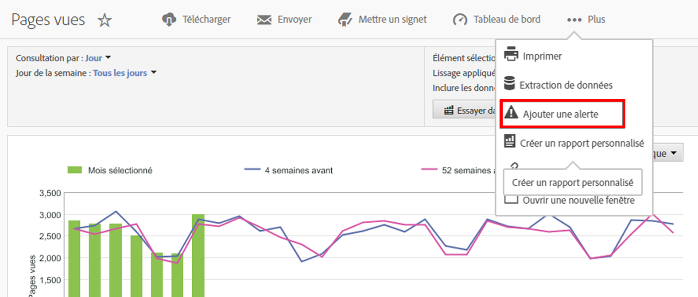

# Alertes intelligentes

Le nouveau système d’alertes intelligentes permet de contrôler plus précisément les alertes et intègre la détection des anomalies au système d’alerte.

## Aperçu {#section_6AC8CA81DEA94E99B0F192B60D0FDF03}

>[!IMPORTANT]
>
>Intelligent Alerts are available to Adobe [!DNL Analytics] Prime and Adobe [!DNL Analytics] Ultimate customers only.

The new Alert Builder and Alert Manager replace the existing alert functionality in Adobe [!DNL Analytics]. Grâce aux alertes intelligentes, vous pouvez :

* Créer des alertes d’après les anomalies (seuils de 90 %, 95 %, 99 %, 99,75 % et 99,90 % ; % de changement ; au-dessus/au-dessous).
* Prévisualiser le nombre de fois où une alerte sera déclenchée.
* Envoyer des alertes par courrier électronique ou par SMS, avec des liens vers des projets Analysis Workspace générés automatiquement.
* Créer des alertes « empilées » qui présentent plusieurs mesures dans une seule alerte.

Le nouveau système d’alerte se compose des éléments suivants : Générateur d’alertes, Gestionnaire d’alertes, Aperçu des alertes, ainsi qu’un meilleur accès en contexte à la création des alertes. L’interface utilisateur de l’ancien système d’alerte ne sera plus accessible, mais les alertes seront migrées. Toutefois, certaines de leurs fonctions héritées [ne seront plus disponibles](https://marketing.adobe.com/resources/help/en_US/sc/user/deprecated_alerts.html).

Vous pouvez accéder au Générateur d’alertes de quatre façons :

* En utilisant le raccourci clavier suivant dans Analysis Workspace :

   `ctrl (or cmd) + shift + a`
* By going directly to the Alert Builder:  **[!UICONTROL Workspace]** &gt; **[!UICONTROL Components]** &gt; **[!UICONTROL New Alert]** .
* En sélectionnant une ou plusieurs lignes de tableau à structure libre, en cliquant avec le bouton droit de la souris puis en sélectionnant **[!UICONTROL Créer une alerte d’après la sélection]**. Le Générateur d’alertes s’ouvre. Les mesures et filtres appropriés sont préappliqués à partir du tableau. Vous pouvez ensuite modifier l’alerte, si nécessaire.

   

* From within a [!UICONTROL Reports &amp; Analytics] report, by going to  **[!UICONTROL More]** &gt; **[!UICONTROL Add Alert]** . Le nouveau Générateur d’alertes s’ouvre. Les mesures et filtres appropriés sont préappliqués à partir du rapport. Vous pouvez ensuite modifier l’alerte, si nécessaire.

   

## FAQ : Calcul et déclenchement des alertes {#section_1F3B1DAF21784306953B49AAD4C3DCAB}

Les seuils (en %) sont des écarts types. Par exemple, 95 % = 2 écarts types et 99 % = 3 écarts types. Selon la granularité temporelle choisie, [différents modèles](/help/analyze/analysis-workspace/virtual-analyst/c-anomaly-detection/statistics-anomaly-detection.md) sont utilisés pour calculer à quel point chaque donnée s’écarte de la norme (le nombre d’écarts types). Si vous définissez un seuil inférieur (90 %, par exemple), vous obtiendrez davantage d’anomalies qu’avec un seuil plus élevé (99 %). Les seuils de 99,75 % et 99,99 % ont été introduits précisément pour la granularité horaire, afin de limiter le nombre d’anomalies déclenchées.

<table id="table_B3AA85E1DE3543DCA34966A52E3CE4AB"> 
 <thead> 
  <tr> 
   <th colname="col1" class="entry"> Question </th> 
   <th colname="col2" class="entry"> Réponse </th> 
  </tr> 
 </thead>
 <tbody> 
  <tr> 
   <td colname="col1"> 
<b>Q : Jusqu’où remonte la détection des anomalies de l’alerte pour déterminer les anomalies de données ?</b> 
 </td> 
   <td colname="col2"> 
La période de formation varie selon la granularité sélectionnée. Pour plus d'informations, voir [Techniques statistiques utilisées dans la détection des anomalies] (/help/analyze/analysis-workspace/virtual-analyst/c-anomalies-detection/statistics-anomalies-detection. md). Résumé : 
 
    <ul id="ul_4F8C2A41F06C498DBF5E7AE5DE803773"> 
     <li id="li_E246091A3F1E484C8444AF4052FCA784">Mensuel = 15 mois + même période l’an dernier </li> 
     <li id="li_CC014FB38AE1492B9647E990C29BFB3C">Hebdomadaire = 15 semaines + même période l’an dernier </li> 
     <li id="li_2517EE2097534324BE9C1B54CD181A62">Quotidienne = 35 jours + même période l’an dernier </li> 
     <li id="li_710BC8B009354542AA4962A59A646099">Horaire = 336 heures </li> 
    </ul> </td> 
  </tr> 
  <tr> 
   <td colname="col1"> 
<b>Q : Si je souhaite être alerté uniquement en cas de creux ou de pic du comportement, puis-je utiliser la fonction d’anomalie ou dois-je utiliser la valeur absolue ?</b> 
 </td> 
   <td colname="col2"> 
Le recours à la valeur absolue déclenche des alertes en cas de creux et de pics. Vous ne pouvez pas isoler les alertes pour les creux seulement ou les pics seulement. 
 </td> 
  </tr> 
  <tr> 
   <td colname="col1"> 
<b>Q : Puis-je configurer les alertes pour qu’elles se déclenchent uniquement durant certaines heures de la journée (heures ouvrables ou non ouvrables, par exemple) ?</b> 
 </td> 
   <td colname="col2"> 
Actuellement, non. 
 </td> 
  </tr> 
  <tr> 
   <td colname="col1"> 
<b>Q : Puis-je obtenir un tableau des « valeurs attendues » incluant la ligne pointillée ou un résultat quelconque indiquant à quoi correspondent ces valeurs ?</b> 
 </td> 
   <td colname="col2"> 
Pas dans l’espace de travail. Cela est possible en revanche dans le Report Builder (visionnez cette vidéo à propos de la <a href="https://www.youtube.com/watch?v=-a-8W6GQZnU" format="https" scope="external">détection des anomalies dans le Report Builder </a>). 
 
Gardez à l’esprit que le Report Builder applique des méthodes de détection des anomalies moins élaborées. It uses a fixed 30-day training period, fixed 95% interval, and is similar to <a href="https://marketing.adobe.com/resources/help/en_US/reference/anomaly.html" format="html" scope="external"> [!UICONTROL Reports &amp; Analytics] anomaly detection </a>. 
 </td> 
  </tr> 
 </tbody> 
</table>

