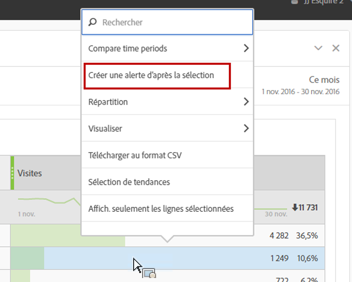

# Alertes intelligentes

Le système d’alertes intelligentes permet de contrôler plus précisément les alertes et intègre la détection des anomalies au système d’alerte.

Voici une présentation vidéo :

>[!VIDEO](https://video.tv.adobe.com/v/25446/?quality=12)

## Présentation {#section_6AC8CA81DEA94E99B0F192B60D0FDF03}

>[!IMPORTANT]
>
>Les alertes intelligentes ne sont disponibles que pour les clients Adobe [!DNL Analytics] Prime et Adobe [!DNL Analytics] Ultimate.

Grâce aux alertes intelligentes, vous pouvez :

* Créer des alertes d’après les anomalies (seuils de 90 %, 95 %, 99 %, 99,75 % et 99,90 % ; % de changement ; au-dessus/au-dessous).
* Prévisualiser le nombre de fois où une alerte sera déclenchée.
* Envoyer des alertes par e-mail ou par SMS, avec des liens pour générer automatiquement les projets Analysis Workspace.
* Créer des alertes « empilées » qui présentent plusieurs mesures dans une seule alerte.

Le système d’alerte se compose des éléments suivants : Générateur d’alertes, Gestionnaire d’alertes, Aperçu des alertes, ainsi qu’un meilleur accès en contexte à la création des alertes. L’interface utilisateur de l’ancien système d’alerte ne sera plus accessible, mais les alertes seront migrées. Toutefois, certaines de leurs fonctions héritées [ne sont plus disponibles](https://experienceleague.adobe.com/docs/analytics/analyze/reports-analytics/alerts.html?lang=fr).

Le Générateur d’alertes peut être consulté de trois façons :

* En utilisant le raccourci clavier suivant dans Analysis Workspace :

  `ctrl (or cmd) + shift + a`
* En sélectionnant directement le Générateur d’alertes : **[!UICONTROL Workspace]** > **[!UICONTROL Composants]** > **[!UICONTROL Nouvelle alerte]** .
* En sélectionnant une ou plusieurs lignes de tableau à structure libre, en cliquant avec le bouton droit de la souris puis en sélectionnant **[!UICONTROL Créer une alerte d’après la sélection]**. Le Générateur d’alertes s’ouvre. Les mesures et filtres appropriés sont préappliqués à partir du tableau. Vous pouvez ensuite modifier l’alerte, si nécessaire.

  

## FAQ : Calcul et déclenchement des alertes {#trigger}

Les seuils (en %) sont des écarts types. Par exemple, 95 % = 2 écarts types et 99 % = 3 écarts types. Selon la granularité temporelle choisie, [différents modèles](/help/analyze/analysis-workspace/c-anomaly-detection/statistics-anomaly-detection.md) sont utilisées pour calculer à quel point chaque donnée s’éloigne de la norme (le nombre d’écarts types). Si vous définissez un seuil inférieur (90 %, par exemple), vous obtiendrez davantage d’anomalies qu’avec un seuil plus élevé (99 %). Les seuils de 99,75 % et 99,99 % ont été introduits précisément pour la granularité horaire, afin de limiter le nombre d’anomalies déclenchées.

+++ Jusqu’où remonte la détection des anomalies de l’alerte pour déterminer les anomalies de données ?

La période de formation varie selon la granularité sélectionnée. Pour en savoir plus, voir Techniques statistiques utilisées dans <a href="/help/analyze/analysis-workspace/c-anomaly-detection/statistics-anomaly-detection.md">Détection des anomalies</a>. Résumé :

* Mensuel = 15 mois + même période l’an dernier
* Hebdomadaire = 15 semaines + même période l’an dernier
* Quotidienne = 35 jours + même période l’an dernier
* Horaire = 336 heures

+++

+++ Pour être alerté uniquement en cas de creux ou de pic du comportement, puis-je utiliser la fonction d’anomalie ou dois-je utiliser une valeur absolue ?

L’utilisation de la valeur absolue déclenche toujours des alertes en cas de creux et de pics. Vous ne pouvez pas isoler les alertes pour les creux seulement ou les pics seulement.

+++

+++ Puis-je configurer les alertes pour qu’elles se déclenchent uniquement pendant certaines heures de la journée (heures ouvrables ou non ouvrables, par exemple) ?

Actuellement, non.

+++

+++ Puis-je obtenir un tableau des &quot;valeurs attendues&quot; incluant la ligne pointillée, ou un résultat quelconque indiquant ce que sont ces valeurs ?

Pas dans Workspace, mais vous pouvez en Report Builder. Voir [cette vidéo](https://experienceleague.adobe.com/docs/analytics-learn/tutorials/exporting/report-builder/anomaly-detection-in-report-builder.html?lang=fr) sur la détection des anomalies dans le Report Builder.

Gardez à l’esprit que le Report Builder applique des méthodes de détection des anomalies moins élaborées. Le Report Builder utilise une période de formation fixe de 30 jours, avec un intervalle fixe de 95 %.

+++
