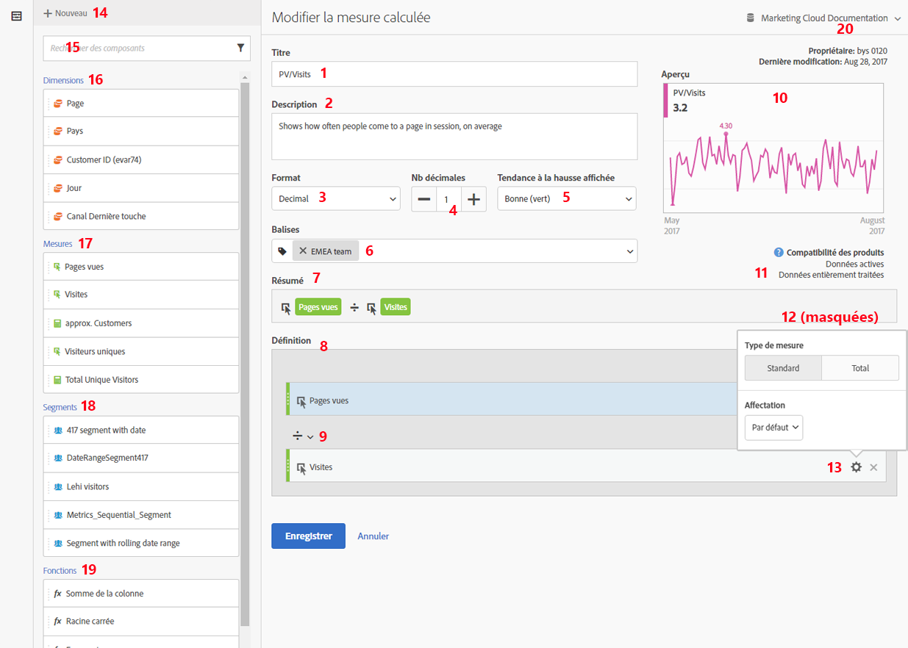
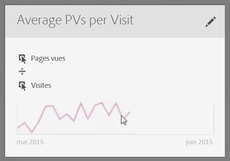

# Création de mesures

Le créateur de mesures calculées fournit un canevas où faire glisser et déposer des dimensions, des mesures, des segments et des fonctions permettant de créer des mesures personnalisées en fonction de la logique de hiérarchie des conteneurs, des règles et des opérateurs. Grâce à cet outil de développement intégré, vous pouvez créer et enregistrer des mesures calculées simples ou des mesures calculées avancées complexes.

Il existe plusieurs manières d’afficher le créateur de mesures calculées :

* Dans Analysis Workspace, ouvrez un projet et cliquez sur **[!UICONTROL + Nouveau]** > **[!UICONTROL Créer une mesure]** .
* Dans [!DNL Analytics], accédez à **[!UICONTROL Composants]** > **[!UICONTROL Mesures calculées]**.

* Cliquez sur **[!UICONTROL + Ajouter]** dans la partie supérieure du [Gestionnaire de mesures calculées](/help/components/c-calcmetrics/c-workflow/cm-workflow/cm-manager.md) ou

* Accédez à **[!UICONTROL Analytics]** > **[!UICONTROL Rapports]**, ouvrez un rapport, cliquez sur l’icône Mesures  pour afficher le rail Mesures, puis cliquez sur **[!UICONTROL Ajouter]**.

## Composants de l’interface utilisateur {#section_9382AEEBA4244DD6A9F6C1DD3F6D076B}

<table id="table_60A82936321047D1A335331BF83B0972"> 
 <thead> 
  <tr> 
   <th colname="col2" class="entry"> Champ </th> 
   <th colname="col3" class="entry"> Description </th> 
  </tr> 
 </thead>
 <tbody> 
  <tr> 
   <td colname="col2">  Titre  </td> 
   <td colname="col3"> 
La dénomination de la mesure est obligatoire. Vous ne pouvez pas enregistrer la mesure tant qu’elle ne porte pas de nom. 
 </td> 
  </tr> 
  <tr> 
   <td colname="col2">  Description  </td> 
   <td colname="col3"> 
Donnez-lui une description conviviale afin d’expliquer son utilisation et pour la distinguer de mesures similaires. 
 
La description apparaît également dans le rapport. Il est préférable de NE PAS mettre la formule dans la description. A la place, décrivez ce pour quoi cette mesure doit être utilisée ou ne doit pas être utilisée. (La formule est générée lorsque vous créez la mesure, sous l’en-tête Résumé. Il n’est donc pas nécessaire d’ajouter la formule à la description.) 
 </td> 
  </tr> 
  <tr> 
   <td colname="col2">  Format  </td> 
   <td colname="col3"> 
Décimale, Heure, Pourcentage et Devise font partie des choix possibles. 
 </td> 
  </tr> 
  <tr> 
   <td colname="col2">  Nombre de décimales  </td> 
   <td colname="col3"> 
Affiche le nombre de décimales qui apparaîtra dans le rapport. Le nombre maximal de décimales que vous pouvez spécifier est 10. 
 </td> 
  </tr> 
  <tr> 
   <td colname="col2">  Tendance à la hausse affichée...  </td> 
   <td colname="col3"> 
Ce paramètre de polarité des mesures indique si Analytics doit considérer une tendance à la hausse dans la mesure comme un événement positif (vert) ou négatif (rouge). En conséquence, le graphique du rapport s’affiche en vert ou rouge lorsque la tendance est à la hausse. 
 </td> 
  </tr> 
  <tr> 
   <td colname="col2">  Balises  </td> 
   <td colname="col3"> 
Le balisage est un moyen efficace d’organiser les mesures. Tous les utilisateurs peuvent créer des balises et en appliquer une ou plusieurs à un segment. Néanmoins, vous ne pouvez afficher les balises que pour les segments que vous possédez ou qui ont été partagés avec vous. Quels types de balises devriez-vous créer ? Vous trouverez ci-dessous quelques suggestions de balises utiles : 
     <ul id="ul_9A6CE5F179424687A39F2D5C1A953258"> 
      <li id="li_A8815F2D8D284874AD701A7B103D82A3">Des balises basées sur des <b>noms d’équipe</b>, par exemple Marketing des réseaux sociaux, Marketing des périphériques mobiles. </li> 
      <li id="li_A51A4515A541488E9D90296A955E9F4F">Les balises <b>Projet</b> (balises d’analyse), telle que l’analyse de la page d’accès. </li> 
      <li id="li_B4605470A7094026AC168420B64BBCC3">Les balises <b>Catégorie</b> : Hommes ; géographie. </li> 
      <li id="li_B6EAB0F2A96C41209C4EC97B9E64390B">Les balises <b>Processus</b> : Sous réserve d’approbation ; Organisé pour (une unité opérationnelle spécifique) </li> 
     </ul> 
 </td> 
  </tr> 
  <tr> 
   <td colname="col2">  Résumé  </td> 
   <td colname="col3"> 
La formule Résumé se met à jour chaque fois que vous apportez une modification à une définition de mesure. Cette formule s’affiche également dans le rail des mesures à gauche lorsque vous passez la souris sur une mesure et cliquez sur l’icône . 
 </td> 
  </tr> 
  <tr> 
   <td colname="col2">  Définition  </td> 
   <td colname="col3"> 
Il s’agit de l’emplacement où vous faites glisser les mesures/mesures calculées, les segments, et/ou les fonctions permettant de créer la mesure calculée. 
 
 
     <ul id="ul_B13401A266354DC594C6176025DB61CB"> 
      <li id="li_01776C32C7C5440AA1F847096CBED92B">Si vous faites glisser une mesure calculée, elle développe automatiquement sa définition de mesure. </li> 
      <li id="li_A483D352522E4572AB43042473053359">Vous pouvez imbriquer des définitions dans des conteneurs. Néanmoins, à la différence des conteneurs de segments, ces conteneurs fonctionnent comme une expression mathématique et déterminent la séquence des opérations. </li> 
     </ul> 
 </td> 
  </tr> 
  <tr> 
   <td colname="col2">  Opérateur  </td> 
   <td colname="col3"> 
L’opérateur de division (  ) est l’opérateur par défaut. Il existe également les opérateurs +, - et x. 
 </td> 
  </tr> 
  <tr> 
   <td colname="col2">  Aperçu  </td> 
   <td colname="col3"> 
Fournit une lecture rapide des erreurs possibles. L’aperçu couvre les 90 derniers jours. C’est une manière d’évaluer initialement si vous avez sélectionné les composants appropriés à votre mesure. Un résultat inattendu signifie que vous devez vérifier à nouveau la définition de mesure. 
 </td> 
  </tr> 
  <tr> 
   <td colname="col2">  Compatibilité des produits  </td> 
   <td colname="col3"> 
La compatibilité des produits montre si la mesure est compatible avec les <a href="https://marketing.adobe.com/resources/help/fr_FR/reference/data_latency.html"  >données actives</a>, avec les données entièrement traitées, ou uniquement avec les rapports Canaux marketing (allocation de première touche). 
Remarque : Les données actives ne prennent pas en charge toutes les mesures. Les mesures qui comportent des segments ou des fonctions ne sont pas compatibles avec les données actives. <a href="/help/components/c-calcmetrics/cm-compatibility.md"  > Plus... </a> 
 
 </td> 
  </tr> 
  <tr> 
   <td colname="col2">  Ajouter  </td> 
   <td colname="col3"> 
Pour tous les types de mesures calculées, vous pouvez ajouter des conteneurs et des nombres statiques à la définition. Pour les mesures calculées avancées, vous pouvez également ajouter des segments et des fonctions. 
 
 
     <ul id="ul_607C1B303F334062BC620317667DE490"> 
      <li id="li_53462789B8AF4F1AA9B45565D37CF22B">Les conteneurs fonctionnent comme une expression mathématique et déterminent la séquence des opérations. De ce fait, tout ce que contient un conteneur sera traité avant l’opération suivante. </li> 
      <li id="li_401A9E0D8B3B468990289DBF66A06F63">Le glissement d’un segment vers un conteneur segmente tout ce que contient ce conteneur. (Mesures calculées avancées uniquement) </li> 
      <li id="li_F191B200D7A944F9ADC0573A9A82A6DA">Vous pouvez empiler plusieurs segments dans un conteneur. </li> 
     </ul> 
 </td> 
  </tr> 
  <tr> 
   <td colname="col2"> Icône représentant un engrenage (Type de mesure,  Attribution ) </td> 
   <td colname="col3"> 
Lorsque vous sélectionnez l’icône représentant un engrenage en regard d’une mesure, vous pouvez spécifier <a href="/help/components/c-calcmetrics/c-workflow/cm-workflow/c-build-metrics/m-metric-type-alloc.md"  >le type de mesure et les modèles d’attribution </a>. 
 </td> 
  </tr> 
  <tr> 
   <td colname="col2">  + Nouveau  </td> 
   <td colname="col3"> 
Permet de créer un composant tel qu’un nouveau segment (grâce auquel vous accédez au <a href="https://marketing.adobe.com/resources/help/fr_FR/analytics/segment/seg_build_ui.html"  >créateur de segments</a>). 
 </td> 
  </tr> 
  <tr> 
   <td colname="col2"> 
Recherche de composants 
 </td> 
   <td colname="col3"> 
Cette barre de recherche permet de rechercher des dimensions, des mesures, des segments (mesures calculées avancées uniquement) et des fonctions (mesures calculées avancées uniquement). 
 </td> 
  </tr> 
  <tr> 
   <td colname="col2"> 
Liste des dimensions 
 </td> 
   <td colname="col3"> 
Plutôt que de quitter le créateur de mesures calculées pour créer un segment simple (dans le créateur de segments), par exemple « Page = Page d’accueil », vous pouvez faire glisser Page et sélectionner Page d’accueil directement dans le créateur de mesures calculées. 
 
Le processus de création de mesures calculées segmentées est ainsi beaucoup plus rationnel. 
 </td> 
  </tr> 
  <tr> 
   <td colname="col2"> 
Liste des mesures 
 </td> 
   <td colname="col3"> 
Les mesures sont réparties en 3 catégories : 
 
    <ul id="ul_7BF50F4964EF45858FBA1634FBFA45CF"> 
     <li id="li_90F2312927A6499CA1CE04F8FFC912CF">Mesures standard ( ) </li> 
     <li id="li_A3F59083E79B4AC780D6F8CEDFFD20C9">Mesures calculées ( ) </li> 
     <li id="li_8735E76637ED4C3F983731A66E04C93E">Modèles de mesures () - à la fin de la liste. </li> 
    </ul> 
Lorsque vous passez le curseur sur une mesure, vous pouvez voir l’icône Infos à droite de celle-ci : . Le fait de cliquer sur cette icône vous donne les informations suivantes : 
 
    <ul id="ul_DF35DDB9FBFA40C8A93FA0F2286A0BBE"> 
     <li id="li_4215AA9BF93F4C8B941002A7A4D2F50B">La formule de calcul. </li> 
     <li id="li_6A8E39EB6DCE4377B0B594B6D4FC0294">Une tendance d’aperçu de la mesure. </li> 
     <li id="li_44C1595E4BE64ED69D1DB3BB6655ED55">Une icône de modification (stylo) dans la partie supérieure droite qui permet d’accéder au créateur de mesures calculées dans lequel vous pouvez modifier la mesure calculée. </li> 
    </ul> 
 
 </td> 
  </tr> 
  <tr> 
   <td colname="col2"> 
Liste des segments 
 </td> 
   <td colname="col3"> 
(Mesures calculées avancées uniquement) Si vous êtes l’administrateur, cette liste affiche tous les segments créés dans votre société utilisée pour la connexion. Si vous êtes un utilisateur non administrateur, cette liste affiche les segments que vous possédez et ceux que vous partagez. <a href="https://marketing.adobe.com/resources/help/fr_FR/analytics/segment/seg_rights.html"  > Plus... </a> 
 </td> 
  </tr> 
  <tr> 
   <td colname="col2"> 
Liste des fonctions 
 </td> 
   <td colname="col3"> 
(Mesures calculées avancées uniquement) Les fonctions sont divisées en deux listes :  <a href="/help/components/c-calcmetrics/cm-reference/cm-functions.md"  > De base</a> (utilisée le plus souvent) et <a href="/help/components/c-calcmetrics/cm-reference/cm-adv-functions.md"  >Avancée</a>. 
 </td> 
  </tr> 
  <tr> 
   <td colname="col2"> 
Sélecteur de suite de rapports 
 </td> 
   <td colname="col3"> 
Permet de basculer vers une suite de rapports différente. 
 </td> 
  </tr> 
 </tbody> 
</table>

