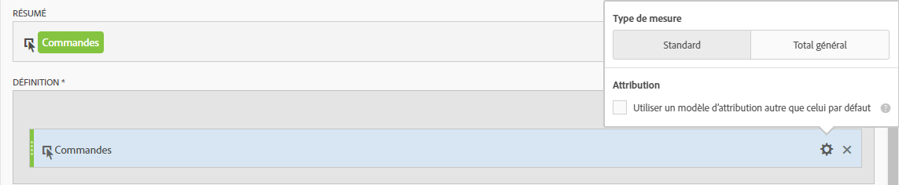
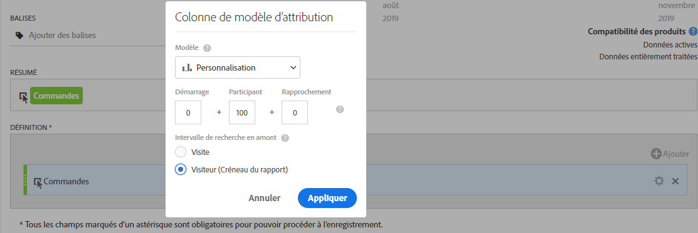
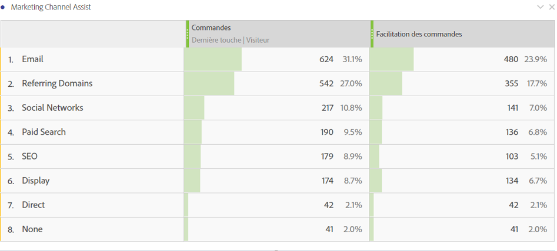

# Mesure d’aide à la commande

Explique comment créer une mesure qui indique les canaux marketing aidant au pilotage des commandes. Cette procédure peut être adaptée à toute dimension ou tout événement de succès.

1. Dans le créateur de mesures calculées, nommez la mesure « Commandes assistées ».
1. Dans le canevas Définition, faites glisser une mesure Commandes. Ensuite, ajustez le modèle d’attribution par le biais de l’icône engrenage des paramètres en cochant la case **[!UICONTROL Utiliser des modèles d’attribution qui ne sont pas par défaut]**.

   

1. Sélectionnez **[!UICONTROL Personnalisé]** en tant que modèle d’attribution. Changez les poids en 0 (démarrage), 100 (joueur) et 0 (le plus proche).

   

1. Enregistrez la mesure.
1. Créez un tableau à structure libre dans Analysis Workspace avec la dimension Canaux marketing, Commandes et la nouvelle mesure Commandes assistées.

   

C’est un moyen facile d’indiquer les canaux marketing qui ont aidé au pilotage des commandes. Vous pouvez également, dans un tableau à structure libre, cliquer avec le bouton droit sur une mesure et ajuster directement le modèle d’attribution depuis le tableau.
