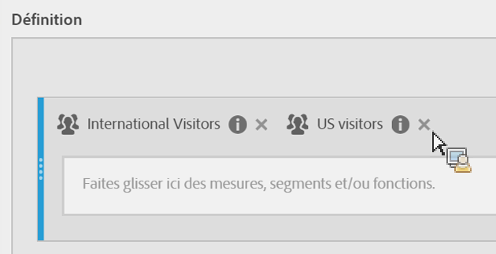
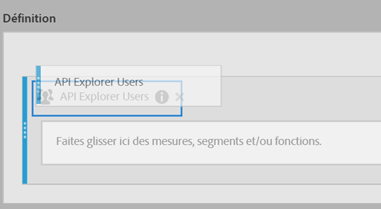

# Empilage et remplacement des segments

Vous pouvez empiler et remplacer des segments dans le créateur de mesures calculées.

## Empilement de segments {#section_3FC1118FEE2B40B7BB90F29C8521AF53}

Dans le canevas Définition, déposez simplement le nouveau segment en regard de celui existant :

## Remplacer un segment par un autre {#section_3DA899DF522A44D7A583C5DC8C0A033E}

Dans le canevas Définition, déposez simplement le nouveau segment au-dessus de celui existant :

