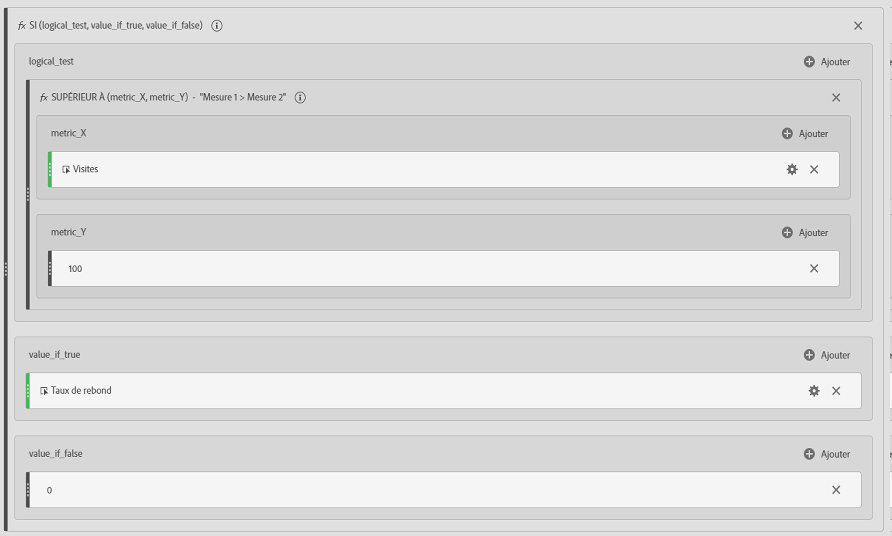
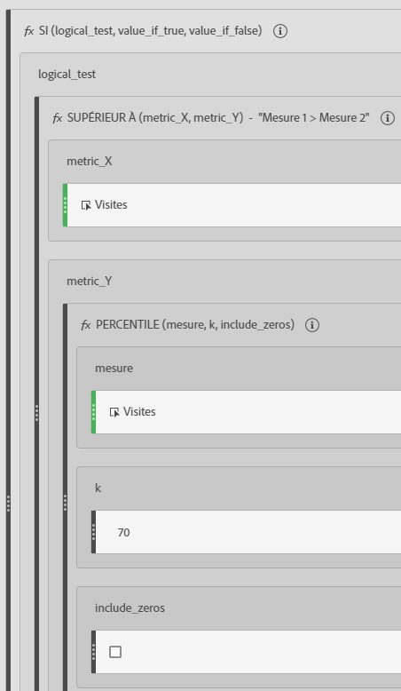
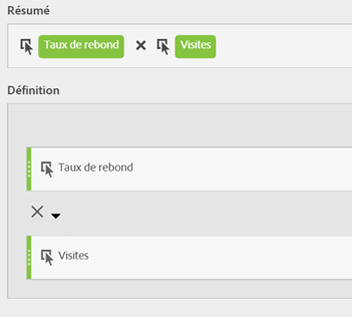

# Mesures filtrées et pondérées

Affiche des exemples de mesures filtrées et pondérées.

## Taux de rebond filtré  {#section_D42F2452E4464948934063EB6F2DAAB4}

Cette mesure filtrée simple affiche le taux de rebond, uniquement pour les pages comportant plus de 100 visites :

Gardez à l’esprit que cette formule dépend d’une période cohérente. Si vous exécutez un rapport pour un seul jour, toute page comportant plus de 20 visiteurs présente un vif intérêt. Si vous exécutez pour un mois, vous souhaitez sans doute que le filtre inclut plus de visites.

## Taux de rebond filtré avec percentile  {#section_4F3E6D33A1FD438A932FA662B3510552}

Ce filtre affiche le taux de rebond pour les 30 % supérieurs des pages, lors du tri par visite.

## Mesure pondérée  {#section_F2D16B14569948289CF1310F9E6E3FC2}

Supposons que vous souhaitiez trier par taux de rebond en général mais que les pages avec des visites supérieures doivent être plus élevées sur la liste. Vous pouvez créer un taux de rebond pondéré qui ressemble à ceci :

