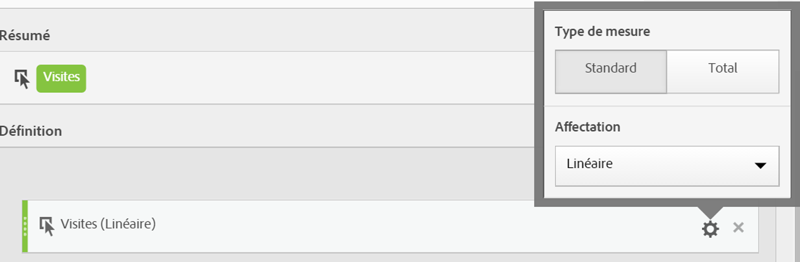

# Type de mesure et attribution

Lors de la [création d’une mesure calculée](/help/components/c-calcmetrics/c-workflow/cm-workflow/c-build-metrics/cm-build-metrics.md), vous pouvez spécifier le type de mesure et le modèle d’attribution.

## Type de mesure

Pour spécifier le type de mesure lors de la création d’une mesure calculée :

1. Sélectionnez l’icône d’engrenage en regard de la mesure dont vous souhaitez sélectionner le type.

   

1. Choisissez l’une des options suivantes :

   | Type de mesure | Définition |
   |---|---|
   | Standard | Ces mesures sont les mêmes mesures que celles utilisées dans la création de rapports standard [!DNL Analytics]. Si une formule est composée d’une seule mesure standard, elle affiche des données identiques à sa contrepartie de mesure non calculée. Les mesures standard sont utiles pour créer des mesures calculées spécifiques à chaque ligne. Par exemple, [Commandes] / [Visites] utilise des commandes pour cette ligne spécifique et la divise par le nombre de visites correspondant à cette ligne spécifique. |
   | Total général | Utilisez Total général pour la période de création de rapports dans chaque ligne. Si une formule est composée d’une seule mesure Total général, elle affiche le même nombre total sur chaque ligne. Les mesures totales globales sont utiles pour créer des mesures calculées qui se comparent au total des données du site. Par exemple, [Commandes] / [Nombre total de visites] affiche la proportion des commandes par rapport à TOUTES les visites sur votre site, et non juste les visites sur la ligne spécifique objet. |

## Fonctionnement de l’affectation linéaire

[Attribution](/help/analyze/analysis-workspace/attribution/overview.md) est la manière dont les modèles d’attribution dans les mesures calculées sont évalués.

Pour obtenir la liste complète des modèles dʼattribution et des intervalles de recherche en amont autres que par défaut pris en charge, voir [Modèles dʼattribution et intervalles de recherche en amont](/help/analyze/analysis-workspace/attribution/models.md).

L’exemple suivant illustre le fonctionnement des mesures calculées avec des attributions linéaires dans les rapports :

| | Accès 1 | Accès 2 | Accès 3 | Accès 4 | Accès 5 | Accès 6 | Accès 7 |
|--- |--- |--- |--- |--- |--- |--- |--- |
| Données envoyées dans | PROMO A | - | PROMO A | PROMO B | - | PROMO C | $10 |
| eVar de dernière touche | PROMO A | PROMO A | PROMO A | PROMO B | PROMO B | PROMO C | $10 |
| eVar de première touche | PROMO A | PROMO A | PROMO A | PROMO A | PROMO A | PROMO A | $10 |
| Exemple de Prop | PROMO A | - | PROMO A | PROMO B | - | PROMO C | $10 |

Dans cet exemple, les valeurs A, B et C ont été envoyées dans une variable aux accès 1, 3, 4 et 6 avant la réalisation d’un achat de 10 $ à l’accès 7. Dans la deuxième ligne, ces valeurs persistent dans les accès sur une base de visite de dernière touche. La troisième ligne représente une persistance de visite de première touche. Enfin, la dernière ligne indique comment les données seraient enregistrées pour une Prop qui ne présente pas de persistance.

