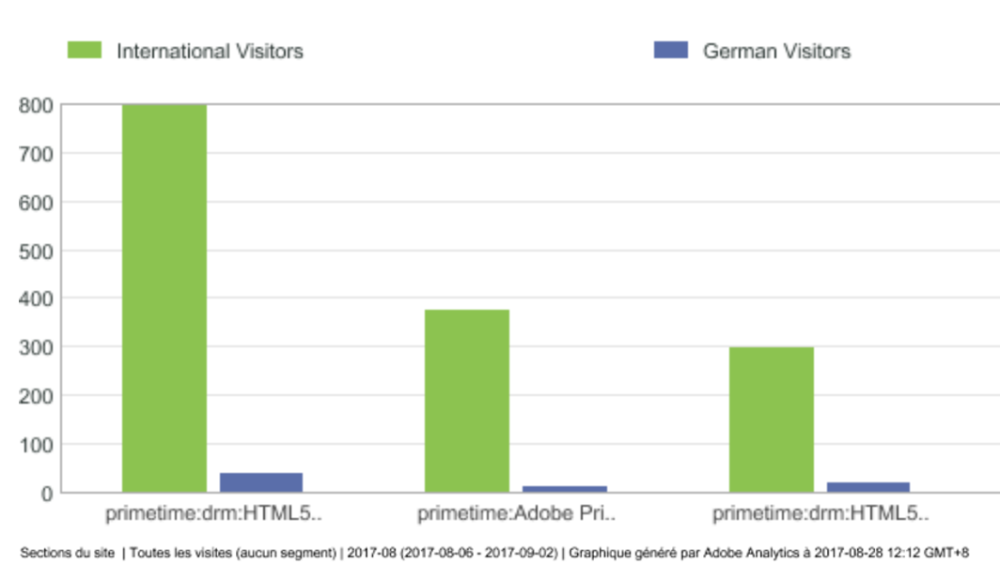
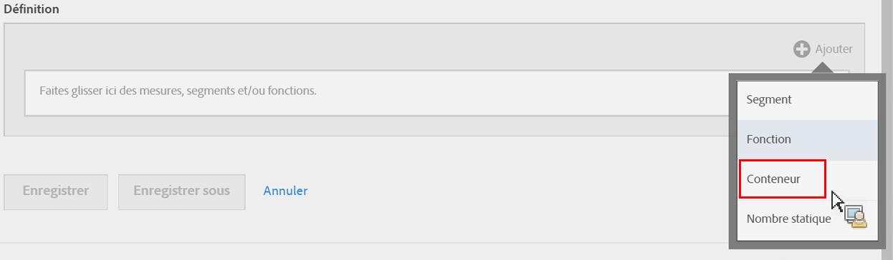
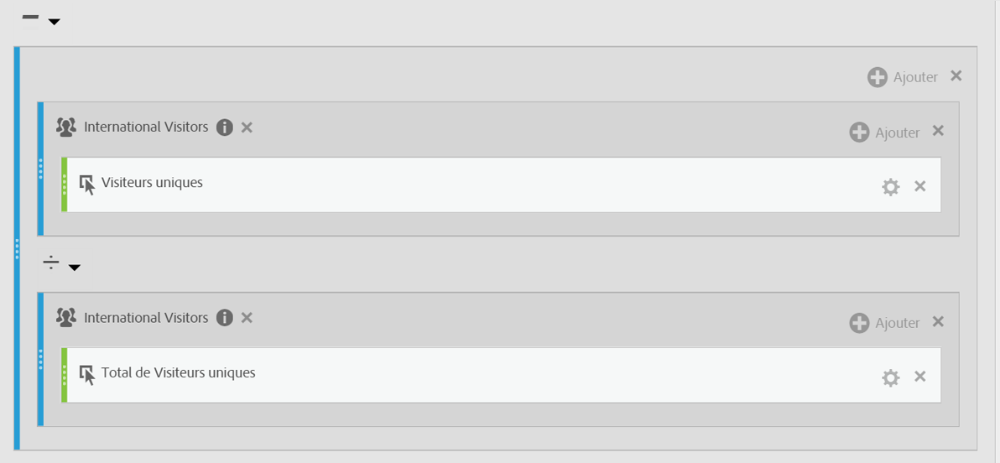

# Mesures segmentées

La segmentation de mesures individuelles permet d’effectuer des comparaisons de mesures dans le même rapport. (Mesures dérivées uniquement)

## Comparaison de segments {#section_29A6E0070F084BFDB6228FA9CE106F48}

Imaginons que vous souhaitez comparer différents aspects du segment « Visiteurs E.U. » à ceux du segment « Visiteurs internationaux ». Vous pouvez créer des mesures qui vous donneront des informations telles que :

* Qu’obtient-on en termes de comparaison du comportement de navigation du contenu entre ces deux groupes ? (Un autre exemple : qu’obtient-on en termes de comparaison du taux de conversion entre ces deux segments ?)
* En termes de pourcentage du nombre de visiteurs total, combien de visiteurs E.U. parcourent certaines pages par rapport aux visiteurs internationaux ?
* Quelles sont les différences majeures en termes de contenu parcouru par ces différents segments ?

Explorons la première question : qu’obtient-on en termes de comparaison du comportement de navigation du contenu entre ces deux groupes ?

1. Si vous ne disposez pas d’un segment à comparer, créez un segment interne directement dans le créateur de mesures calculées nommé « Visiteurs allemands », où « Pays » est « Allemagne ». Faites simplement glisser la dimension Pays dans le canevas Définition et sélectionnez Allemagne comme valeur :

   

   >[!NOTE]
   >
   >Vous pouvez également effectuer cette opération dans le [Créateur de segments](https://marketing.adobe.com/resources/help/fr_FR/analytics/segment/seg_build.html), mais nous avons simplifié le processus en rendant les dimensions disponibles dans le créateur de mesures calculées.

   >[!NOTE]
   >
   >« Interne » signifie que le segment n’est pas visible dans la liste **[!UICONTROL Segments]** du rail de gauche. Vous pouvez néanmoins le rendre public en pointant sur l’icône « i » en regard et en cliquant sur **[!UICONTROL Rendre public]**.

1. Si vous n’avez pas de segment à comparer, créez un segment appelé « Visiteurs internationaux » où « Pays » n’est pas « Allemagne ».
1. Créez et enregistrez une mesure appelée « Visiteurs allemands » en faisant glisser le segment Allemagne dans le canevas Définition et en y faisant glisser la mesure Visiteurs uniques :

   

1. Répétez l’étape 3 avec le segment Visiteurs internationaux et la mesure Visiteurs uniques afin de créer une mesure Visiteurs internationaux.
1. Dans Analysis Workspace, faites glisser la dimension **[!UICONTROL Page]** dans un tableau à structure libre, puis faites glisser les 2 nouvelles mesures calculées l’une à côté de l’autre dans la partie supérieure :

   

1. Ou, dans les [!UICONTROL Reports &amp; Analytics], ouvrez le rapport [!UICONTROL Pages] et cliquez sur **[!UICONTROL Afficher les mesures]**, puis appliquez les nouvelles mesures segmentées Visiteurs E.U. et Visiteurs internationaux pour comparer leur comportement de navigation du contenu.

   

## Comparaison des pourcentages des totaux {#section_846CB89725F04388AE0352DB20189EE8}

Vous pouvez introduire un autre niveau de requête en comparant le comportement de navigation des visiteurs sous la forme de pourcentages normalisés. Pour ce faire, créez deux nouvelles mesures, « % du total des visiteurs allemands » et « % du total des visiteurs internationaux » :

1. Déposez le segment Visiteurs allemands (ou internationaux) dans le canevas.
1. Déposez un autre segment Visiteurs allemands (ou internationaux) dessous. Néanmoins, cette fois-ci, cliquez sur l’icône (engrenage) de configuration pour sélectionner le type de mesure « Total ». Le format doit être « Pourcentage ». L’opérateur doit être « divisé par ». Vous terminez avec cette définition de mesure :

   

1. Appliquez cette mesure à votre projet :

   

## Comparaison des différences en pourcentages (en utilisant des conteneurs) {#section_13D6353259B74C09B37BA6378A501938}

Si vous souhaitez visualiser les plus grandes différences de comportement de navigation entre les visiteurs E.U. et internationaux en un coup d’œil, vous pouvez créer une autre mesure qui soustrait les pourcentages les uns des autres. Pour ce faire, vous pouvez utiliser la fonctionnalité Conteneur qui agit effectivement comme des parenthèses autour des 2 ensembles de mesures.

1. Dans le canevas [!UICONTROL Définition], cliquez sur **[!UICONTROL Ajouter]** > **[!UICONTROL Conteneur]** :

   

1. Déposez la mesure « % du total des visiteurs E.U. » que vous avez créée précédemment dans le premier conteneur - elle se développe à sa définition complète :

   

1. Créez un autre conteneur dessous et déposez-y la mesure « % du total des visiteurs E.U. ».
1. Modifiez l’opérateur entre les 2 conteneurs sur un signe moins (-).

   

1. Enregistrez la mesure (assurez-vous que vous l’avez nommée « Différence en % entre E.U. et international » ou une dénomination similaire).
1. Lorsque vous l’appliquez au rapport, vous pouvez facilement déterminer où se trouvent les plus grandes différences en pourcentage et vous pouvez trier le rapport en conséquence.

   

