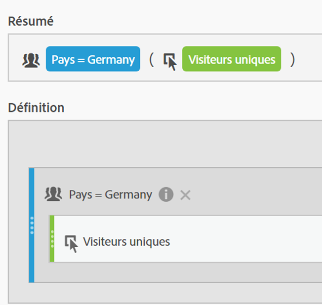
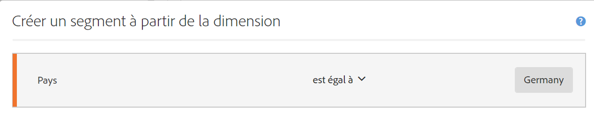
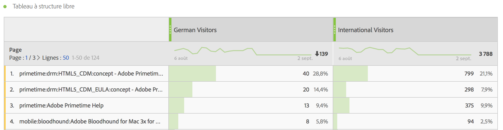
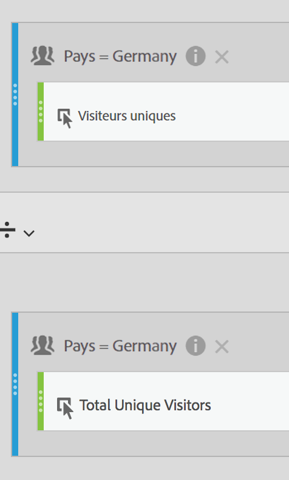
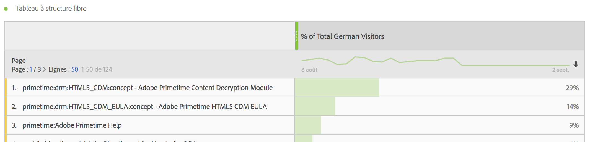

# Mesures segmentées

Dans le créateur de mesures calculées, vous pouvez appliquer des segments dans votre définition de mesure. Cela s’avère utile si vous souhaitez extraire de nouvelles mesures afin de les utiliser dans votre analyse. N’oubliez pas que les définitions de segment peuvent être mises à jour par le biais du créateur de segments. Si des modifications sont apportées, le segment se met automatiquement à jour là où il est appliqué, y compris s’il fait partie d’une définition de mesure calculée.

## Création d’une mesure segmentée {#create}

Imaginons que vous souhaitez comparer différents aspects d’un segment « Visiteurs allemands » à ceux d’un segment « Visiteurs internationaux ». Vous pouvez créer des mesures qui vous donneront des informations telles que :

* Qu’obtient-on en termes de comparaison du comportement de navigation du contenu entre ces deux groupes ? (Un autre exemple : qu’obtient-on en termes de comparaison du taux de conversion entre ces deux segments ?)
* En termes de pourcentage du nombre de visiteurs total, combien de visiteurs allemands parcourent certaines pages par rapport aux visiteurs internationaux ?
* Quelles sont les différences majeures en termes de contenu parcouru par ces différents segments ?

Créez et enregistrez une mesure appelée « Visiteurs allemands » et une mesure appelée « Visiteurs internationaux » :

1. Créez un segment ad hoc dans le créateur de mesures calculées appelé « Visiteurs allemands », où « Pays » est « Allemagne ».

   Faites glisser la dimension Pays dans le canevas Définition et sélectionnez [!UICONTROL **Allemagne**] comme valeur :

   

   >[!NOTE]
   >
   >Vous pouvez également effectuer cette opération dans le [Créateur de segments](/help/components/segmentation/segmentation-workflow/seg-build.md), mais nous avons simplifié le processus en rendant les dimensions disponibles dans le créateur de mesures calculées. « Ad hoc » signifie que le segment n’est pas visible dans la liste **[!UICONTROL Segments]** du rail de gauche. Vous pouvez néanmoins le rendre public en pointant sur l’icône « i » en regard et en cliquant sur **[!UICONTROL Rendre public]**.

1. Faites glisser le segment Allemagne dans le canevas Définition et faites glisser la mesure Visiteurs uniques à l’intérieur :

   

1. Sélectionnez [!UICONTROL **Enregistrer**] pour enregistrer la mesure calculée.

1. Créez un segment ad hoc dans le créateur de mesures calculées appelé « Visiteurs internationaux », où « Pays » n’est pas égal à « Allemagne ».

   Faites glisser la dimension Pays dans le canevas Définition, sélectionnez [!UICONTROL **Allemagne**] comme valeur, puis sélectionnez [!UICONTROL **n’est pas égal à**] comme opérateur.

1. Faites glisser la mesure Visiteurs uniques vers l’intérieur.

1. Sélectionnez [!UICONTROL **Enregistrer**] pour enregistrer la mesure calculée.

1. Dans Analysis Workspace, faites glisser la dimension **[!UICONTROL Page]** dans un tableau à structure libre, puis faites glisser les 2 nouvelles mesures calculées l’une à côté de l’autre dans la partie supérieure :

   

>[!BEGINSHADEBOX]

Voir  [Mesures segmentées](https://video.tv.adobe.com/v/37940?quality=12&learn=on&captions=fre_fr){target="_blank"} pour une vidéo de démonstration.

>[!ENDSHADEBOX]

## Pourcentage de mesures totales {#percent-total}

Vous pouvez aller plus loin avec l’exemple ci-dessus en comparant votre segment à une population totale. Pour ce faire, créez deux mesures, « % du total des visiteurs allemands » et « % du total des visiteurs internationaux » :

1. Déposez le segment Visiteurs allemands (ou internationaux) dans le canevas.
1. Déposez un autre segment Visiteurs allemands (ou internationaux) dessous. Néanmoins, cette fois-ci, cliquez sur l’icône (engrenage) de configuration pour sélectionner le type de mesure « Total ». Le format doit être « Pourcentage ». L’opérateur doit être « divisé par ». Vous terminez avec cette définition de mesure :

   

1. Appliquez cette mesure à votre projet :

   
