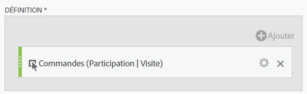
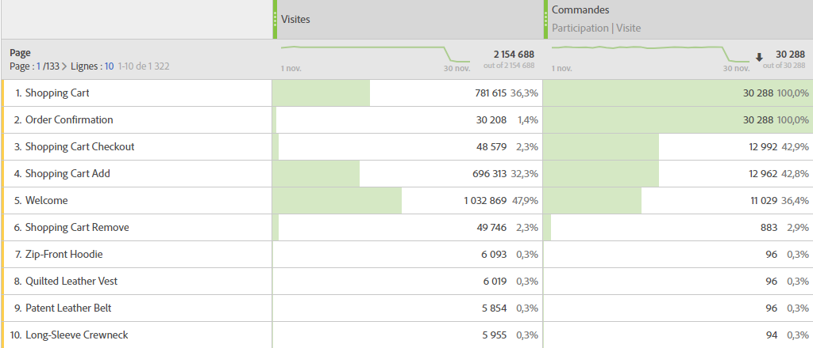

# Mesures de participation

Les mesures de participation sont utilisées pour quantifier la contribution ou la participation des valeurs individuelles d’une dimension (comme Pages vues) aux visites contenant une mesure spécifique (comme Commandes).

Les étapes ci-dessous montrent comment créer une mesure de participation.

1. [Créez une mesure calculée](../cm-workflow.md) puis, dans le [créateur de mesures calculées](cm-build-metrics.md), nommez la mesure `Orders (Visit Participation)` ou une méthode similaire.
1. Faites glisser une mesure contenant un événement de succès, par exemple [!DNL Online Orders], dans la zone [!UICONTROL **[!UICONTROL Définition]**].
1. Sélectionnez  pour la mesure.
1. Dans la fenêtre contextuelle qui s’affiche, sélectionnez **[!UICONTROL Utiliser un modèle d’attribution autre que celui par défaut]** pour définir le [modèle d’attribution](m-metric-type-alloc.md#attribution-models) de cet événement sur **[!UICONTROL Participation]** et sélectionnez **[!UICONTROL Visites]** pour le [!UICONTROL Conteneur]. Sélectionnez **[!UICONTROL Appliquer]** pour confirmer.

   

   **(Participation|Visites|30 jours)** est ajouté au nom du composant de mesure.

1. Sélectionnez [!UICONTROL **Enregistrer**] pour enregistrer la mesure.
1. Utilisez la mesure calculée dans votre rapport. Par exemple, utilisez la mesure [!DNL Orders (Session Participation)] calculée dans un rapport pour indiquer le niveau client qui a contribué aux sessions contenant une commande ou qui y a participé.

   

<!--

The following information explains how to create a metric that shows which pages contributed to (or participated in) visits that contained an order.

This type of information could be useful for any content owner.

>[!NOTE]
>
>You can enable participation metrics in the Admin Tools, but only for custom events 1 - 100.

1. Begin creating a calculated metric, as described in [Build metrics](/help/components/c-calcmetrics/c-workflow/cm-workflow/c-build-metrics/cm-build-metrics.md).

1. In the Calculated metrics builder, name the metric "Participation".

1. Drag the success event "Orders" into the Definition canvas.

1. Change the [attribution model](/help/components/c-calcmetrics/c-workflow/cm-workflow/c-build-metrics/m-metric-type-alloc.md) of that event to **[!UICONTROL Participation]** under the **[!UICONTROL Settings]** gear. Select **[!UICONTROL Visit]** lookback. The definition should look similar to this:

   

1. Select [!UICONTROL **Save**] to save the metric.

1. Use the calculated metric in a **[!UICONTROL Pages]** report.

    

1. (Optional) Share the metric with other users in your organization, as described in [Share calculated metrics](/help/components/c-calcmetrics/c-workflow/cm-workflow/cm-sharing.md).
-->