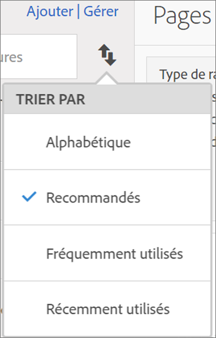
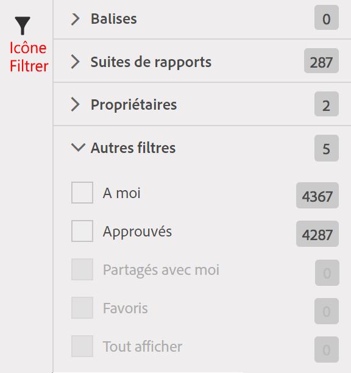

# Recherche de mesures

Décrit les deux moyens principaux de recherche de mesures : le tri et le filtrage.

## Tri  {#section_89F9C4D515084F5796F2A54D468BF6C8}

Lorsque vous ouvrez un rapport et cliquez sur l’icône Mesures  située à gauche d’un rapport pour afficher le rail Mesures, la liste déroulante **[!UICONTROL Trier par]** du sélecteur de mesures propose quatre options de tri :

| Option | Quand l’utiliser |
|---|---|
| Alphabétique | Utile si vous connaissez le nom. |
| Recommandés | Mesures courantes que les personnes utilisent dans le rapport : rassemblées par le serveur principal auprès des utilisateurs des mesures couramment utilisées avec ce rapport. |
| Fréquemment utilisés | Utile si vous êtes un utilisateur novice et que vous avez besoin de consulter ce qui est couramment utilisé dans le rapport. |
| Utilisés récemment | Utile si vous travaillez sur un projet et utilisez sans arrêt le même jeu de mesures. |

## Filtrage - sélection avancée  {#section_33818CC048C04F098703AC229693F8CA}

Lorsque vous ouvrez un rapport et cliquez sur l’icône Mesures, cliquez sur **[!UICONTROL Gérer]**. Cliquez maintenant sur l’icône Filtrer. Vous pouvez appliquer un filtre de plusieurs façons différentes.

<table id="table_269081BC9DF54FFDA4E949FFC7488F42"> 
 <thead> 
  <tr> 
   <th colname="col1" class="entry"> Si vous souhaitez </th> 
   <th colname="col2" class="entry"> Alors triez par </th> 
  </tr>
 </thead>
 <tbody> 
  <tr> 
   <td colname="col1"> Afficher toutes les mesures dans cette suite de rapports </td> 
   <td colname="col2"> Autres filtres &gt; Tout afficher </td> 
  </tr> 
  <tr> 
   <td colname="col1"> Afficher uniquement les mesures dont vous disposez </td> 
   <td colname="col2"> Autres filtres &gt; À moi </td> 
  </tr> 
  <tr> 
   <td colname="col1"> Afficher les mesures partagées avec quelqu’un d’autre </td> 
   <td colname="col2">Propriétaires ou 
 Autres filtres &gt; Partagés avec moi 
 </td> 
  </tr> 
  <tr> 
   <td colname="col1"> Afficher uniquement les mesures qui sont approuvées par la société </td> 
   <td colname="col2"> Approuvés </td> 
  </tr> 
  <tr> 
   <td colname="col1"> Filtrer les mesures d’un projet sur lequel vous travaillez </td> 
   <td colname="col2">Une des Balises. </td> 
  </tr> 
 </tbody> 
</table>

