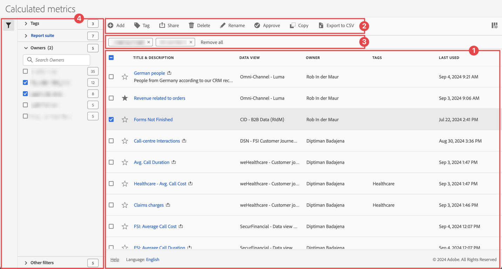

# Gestion des mesures calculées

Vous pouvez partager, filtrer, baliser, approuver, renommer, copier, supprimer, exporter les mesures calculées et les marquer comme favoris à partir d’une interface de gestion centrale [!UICONTROL Mesures calculées]. Pour gérer les mesures calculées :

* Sélectionnez **[!UICONTROL Composants]** dans l’interface principale, puis sélectionnez **[!UICONTROL Mesures calculées]**.

## Gestionnaire de mesures calculées

Le gestionnaire de mesures calculées comporte les éléments d’interface suivants :

### Liste des mesures calculées

La liste des mesures calculées ➊ affiche toutes les mesures calculées que vous possédez ou qui ont été partagées avec vous. La liste comporte les colonnes suivantes :

<!-- I think this table incorrectly talks about quick calculated metrics -->

| Colonne | Description |
| --- | --- | 
|  | Sélectionnez pour favoriser  ou annuler l’avantage  une mesure calculée. Voir [Marquer la mesure calculée comme favori](cm-favorite.md) |
| **[!UICONTROL Titre et description]** | Pour modifier la mesure calculée, sélectionnez le lien du titre, qui ouvre le [créateur de mesures calculées](c-build-metrics/cm-build-metrics.md). Une mesure calculée partagée est indiquée par . |
| **[!UICONTROL Suite de rapports]** | Suites de rapports auxquelles cette mesure calculée s’applique. |
| **[!UICONTROL Propriétaire]** | Propriétaire de la mesure calculée. En tant qu’utilisateur ou utilisatrice, vous ne pouvez consulter que les annotations que vous possédez ou celles qui ont été partagées avec vous. |
| **[!UICONTROL Étiquettes]** | Répertorie les balises de cette mesure calculée. |
| **[!UICONTROL Partagé avec]** | Répertorie le nombre d’individus ou de groupes avec lesquels vous avez partagé la mesure calculée. Sélectionnez pour ouvrir la boîte de dialogue **[!UICONTROL Partager la mesure calculée]**. Voir [Partage de mesures calculées](cm-sharing.md) pour plus d’informations. |
| **[!UICONTROL Date de modification]** | Date et heure de la dernière modification de la mesure calculée. |
| **[!UICONTROL Utilisation dans]** | Indique où les mesures calculées sont actuellement utilisées et combien de fois elles sont utilisées dans chaque zone. 
Par exemple, si la mesure calculée est utilisée dans 40 projets et 2 alertes, la valeur de cette colonne s’affiche sous la forme de composants [!UICONTROL **42**]. 
Sélectionnez la valeur dans cette colonne pour afficher la répartition des emplacements où les mesures calculées sont utilisées (par exemple, [!UICONTROL **Projets (40)**], [!UICONTROL **Cartes de performance mobiles (2)**]). De plus, vous pouvez afficher la liste des éléments pour lesquels les mesures calculées sont utilisées. Par exemple, pour afficher la liste des projets dans lesquels ils sont utilisés, sélectionnez le lien [!UICONTROL **Projets (40)**].

Chacune des zones suivantes affiche le nombre d’instances de mesures calculées utilisées dans cette zone :
 <ul><li>[!UICONTROL **Projets**]
Contient des mesures calculées qui ont été [créées dans le créateur de mesures calculées](c-build-metrics/cm-build-metrics.md) et qui sont disponibles pour tous les projets.
</li><li>[!UICONTROL **Composants ad hoc**]
Contient des mesures calculées qui ont été [créées en tant que mesures calculées rapides](/help/analyze/analysis-workspace/components/apply-create-metrics.md#create-calculated-metrics-for-a-single-project) et qui ne sont disponibles que dans un seul projet.
</li><li>[!UICONTROL **Projets planifiés**]</li><li>[!UICONTROL **Cartes de performances mobiles**]</li><li>[!UICONTROL **Annotations**]</li><li>[!UICONTROL **Report Builder**]
La sélection de cette option télécharge un fichier CSV, avec les colonnes de données suivantes :
<ul><li>Nom dans Report Builder</li><li>Dernier accès</li><li>Dernier ID d’utilisateur ou utilisatrice IMS consulté</li><li>Nom de l’utilisateur ou de l’utilisatrice consulté en dernier</li></ul></li></ul>
Ces informations peuvent vous aider à déterminer si un composant est utile pour les utilisateurs et utilisatrices de votre organisation, où il est utilisé et s’il doit être supprimé ou modifié.

Tenez compte des points suivants lorsque vous affichez cette colonne :
<ul><li>Ces informations sont réservées aux administrateurs et administratrices système.</li><li>La colonne [!UICONTROL **Utilisation dans**] ne s’affiche pas par défaut. Utilisez  pour configurer l’affichage de cette colonne.</li><li>Ces informations n’incluent pas l’utilisation de l’API ou de Data Warehouse.</li><li>Si cette colonne ne contient aucune donnée pour un composant donné, mais qu’elle comporte une date [!UICONTROL **Dernière utilisation**], le composant peut avoir été utilisé dans une analyse sans avoir été enregistré.</li><li>Les informations d’utilisation sont disponibles à partir de septembre 2023.</li></ul>
Vous pouvez utiliser le [dictionnaire de données](/help/analyze/analysis-workspace/components/data-dictionary/data-dictionary-overview.md) avec ces informations pour vous aider à effectuer le suivi et à mieux comprendre comment les composants sont utilisés dans votre organisation.
 |
| **[!UICONTROL Dernière utilisation]** | Date de la dernière utilisation de la mesure calculée. |

{style="table-layout:auto"}

Utilisez  pour spécifier les colonnes à afficher.

### Barre d’actions

Vous pouvez agir sur les filtres à l’aide de la barre d’actions ➋. La barre d’actions contient les actions suivantes :

| Icône | Action | Description |
|:---:|---|---|
|  | **[!UICONTROL Ajouter]** | Ajoutez une autre mesure calculée à l’aide du [créateur de mesures calculées](c-build-metrics/cm-build-metrics.md). |
|  | [!UICONTROL *Rechercher par titre*] | Lorsqu’aucune mesure calculée n’est sélectionnée dans la liste, recherchez des filtres à l’aide de ce champ de recherche. |
|  | **[!UICONTROL Étiquette]** | Balisez les mesures calculées sélectionnées. Dans la boîte de dialogue **[!UICONTROL Baliser une mesure calculée]**, sélectionnez ou désélectionnez les balises de la mesure calculée sélectionnée. Sélectionnez **[!UICONTROL Enregistrer]** pour enregistrer les balises des mesures calculées sélectionnées. Voir [Balisage des mesures calculées](cm-tagging.md) pour plus d’informations. |
|  | **[!UICONTROL Partager]** | Partagez les mesures calculées sélectionnées. Dans la boîte de dialogue **[!UICONTROL Partager les mesures calculées]**, vous pouvez  *Rechercher des individus ou des groupes* ou sélectionner **[!UICONTROL Organisation]** ou **[!UICONTROL Groupes]**. Sélectionnez **[!UICONTROL Enregistrer]** pour enregistrer les détails de partage pour les mesures calculées sélectionnées. Voir [Partage de mesures calculées](cm-sharing.md) pour plus d’informations. |
|  | **[!UICONTROL Supprimer]** | Supprimez les mesures calculées sélectionnées. Il vous est demandé de confirmer. |
|  | **[!UICONTROL Renommer]** | Renommez une mesure calculée sélectionnée unique. Lorsque cette option est sélectionnée, vous pouvez renommer la mesure calculée en ligne. |
|  | **[!UICONTROL Approuver]** | Approuver les mesures calculées sélectionnées. Voir [ Approuver les mesures calculées ](cm-approving.md). |
|  | **[!UICONTROL Copier]** | Copiez les mesures calculées sélectionnées. De nouvelles mesures calculées sont créées avec le même nom et le même suffixe `(Copy)` |
|  | **[!UICONTROL Exporter dans un fichier CSV]** | Exportez les mesures calculées dans un fichier `Calculated  metric List.csv`. |

### Barre de filtres actifs

La barre de filtrage affiche ➌ les filtres actifs appliqués à partir du panneau de filtrage à la liste des mesures calculées (le cas échéant). Vous pouvez supprimer rapidement un filtre à l’aide de . Si plusieurs filtres sont spécifiés, vous pouvez tous les supprimer à l’aide de **[!UICONTROL Tout supprimer]**.

### Panneau Filtrer

Vous pouvez filtrer la liste des mesures calculées à l’aide du ➍ du panneau de gauche  **[!UICONTROL Filtrer]**. Le panneau de filtrage affiche le type de filtre et le nombre de mesures calculées qui respectent le filtre spécifique. Sélectionnez  pour afficher ou masquer le panneau Filtrer.

Voir [Filtrer la liste des mesures calculées](cm-filter.md) pour plus d’informations.

<!-- OLD CONTENT

The Calculated metrics page offers many ways of curating metrics, such as sharing, filtering, tagging, approving, copying, deleting, and marking as favorites.

The Calculated metrics page shows you all the segments you own and that have been shared with you. Admin-level users can see all custom metrics in the organization. 

## Access the Calculated metrics manager

1. In Adobe Analytics, select [!UICONTROL **Components**] > [!UICONTROL **Calculated metrics**].

## Available actions in the Calculated metrics manager

In the Calculated metrics manager, you can:

* [Filter calculated metrics](/help/components/c-calcmetrics/c-workflow/cm-workflow/cm-filter.md)

* [Mark calculated metrics as favorites](/help/components/c-calcmetrics/c-workflow/cm-workflow/cm-favorite.md)

* [Approve calculated metrics](/help/components/c-calcmetrics/c-workflow/cm-workflow/cm-approving.md)

* [Tag calculated metrics](/help/components/c-calcmetrics/c-workflow/cm-workflow/cm-tagging.md)

* [Share calculated metrics](/help/components/c-calcmetrics/c-workflow/cm-workflow/cm-sharing.md)

* Export a calculated metric to a CSV file. 

* [Copy calculated metrics](/help/components/c-calcmetrics/c-workflow/cm-workflow/cm-copy.md)

* Delete calculated metrics

## Configure columns

You can configure the information displayed for each calculated metric in the Calculated metrics manager by configuring the columns that are displayed.

To configure the visible columns in the Calculated metrics manager:

1. In Adobe Analytics, select the **[!UICONTROL Components]** tab, then select **[!UICONTROL Calculated metrics]**. 

1. In the Calculated metrics manager, select the **Customize columns** icon , then select the columns that you want to be displayed in the Calculated metrics manager.

   The following columns are available:

   | Column title  | Description |
   |---|---|
   | Favorites  | Displays star icons next to each calculated metric, allowing you to mark calculated metrics as favorites. For more information, see [Mark calculated metrics as favorites](/help/components/c-calcmetrics/c-workflow/cm-workflow/cm-favorite.md). |
   | Title and description | These values are provided in the Calculated metric builder. To edit the title and description, select the title link to open the Calculated metric builder.  |
   | Report suite | Indicates in which report suite the metric was last saved.  |
   | Owner | Indicates who owns the custom metric. As a non-admin, you can see only metrics you own or those that were shared with you.  |
   | Tags | Shows tags that were applied to the metric, either by you or by people who shared the calculated metric with you.  |
   | Shared with | Lists individuals or groups (admin only) or All (admin only) that you shared the calculated metric with. 
When a calculated metric is being shared, a share icon displays next to the calculated metric name.
  |
   | Date modified | Indicates the date when the custom metric was last modified.  |
   | Used in | Shows where calculated metrics are currently being used, and how many times they are being used in each area. 
For example, if the calculated metric is being used in 40 projects and 2 alerts, then the value of this column shows as [!UICONTROL **42 components**]. 
Select the value in this column to see the breakdown of where the calculated metrics are being used (for example, [!UICONTROL **Projects (40)**], [!UICONTROL **Alerts (2)**]). Furthermore, you can view the list of items where the calculated metrics are being used. For example, so see the list of projects where they are being used, select the [!UICONTROL **Projects (40)**] link.

Each of the following areas shows the number of instances of calculated metrics being used in that area:
 <ul><li>[!UICONTROL **Projects**]
Contains calculated metrics that were [created in the calculated metric builder](/help/analyze/analysis-workspace/components/apply-create-metrics.md#create-calculated-metrics-for-all-projects) and are available for all projects.
</li><li>[!UICONTROL **Ad hoc components**]
Contains calculated metrics that were [created as quick calculated metrics ](/help/analyze/analysis-workspace/components/apply-create-metrics.md#create-calculated-metrics-for-a-single-project) and are available only within a single project.
</li><li>[!UICONTROL **Scheduled projects**]</li><li>[!UICONTROL **Mobile Scorecards**]</li><li>[!UICONTROL **Annotations**]</li><li>[!UICONTROL **Alerts**]</li><li>[!UICONTROL **Report Builder**]
Selecting this option downloads a CSV file, with the following columns of data:
<ul><li>Report Builder Name</li><li>Last accessed</li><li>Last accessed IMS User ID</li><li>Last accessed user name</li></ul>
When viewing information for Report Builder, usage information is available starting in September 2024.
</li></ul>
This information can help you determine whether a component is valuable to users in your organization, where it is used, and if it needs to be deleted or modified.

Consider the following when viewing this column:
<ul><li>This information is available only to system administrators.</li><li>The [!UICONTROL **Used in**] column does not display by default. [Configure columns](#configure-columns) to display it.</li><li>If a calculated metric includes another calculated metric in its definition, any use of that calculated metric is not shown in the [!UICONTROL **Used in**] column. If a calculated metric is included in the definition of another type of component (such as a segment), then usage is shown in the [!UICONTROL **Used in**] column.</li><li>This information does not include usage from the API or Data Warehouse.</li><li>If there is no data in this column for a given component but it has a [!UICONTROL **Last used**] date, the component might have been used in an analysis without being saved.</li><li>Usage information is available starting in September 2023.</li></ul>
You can use the [Data Dictionary](/help/analyze/analysis-workspace/components/data-dictionary/data-dictionary-overview.md) along with this information to help you keep track of and better understand how components are being used in your organization.
 |
   | Last used | Shows the date when the calculated metric was last used in any of the following areas: <ul><li>Alerts</li><li>Calculated metrics</li><li>Projects</li><li>Scheduled projects</li></ul> 
This information can help you determine whether a component is valuable to users in your organization, where it is used, and if it needs to be deleted or modified.

Consider the following when viewing this column:
<ul><li>This information does not include usage from the API, Report Builder, or Data Warehouse.</li><li>For some components, this column might not contain data if the component was last used prior to September 2023.</li><li>This information is available only to system administrators.</li></ul>
You can use the [Data Dictionary](/help/analyze/analysis-workspace/components/data-dictionary/data-dictionary-overview.md) along with this information to help you keep track of and better understand how components are being used in your organization. |

   {style="table-layout:auto"}

-->