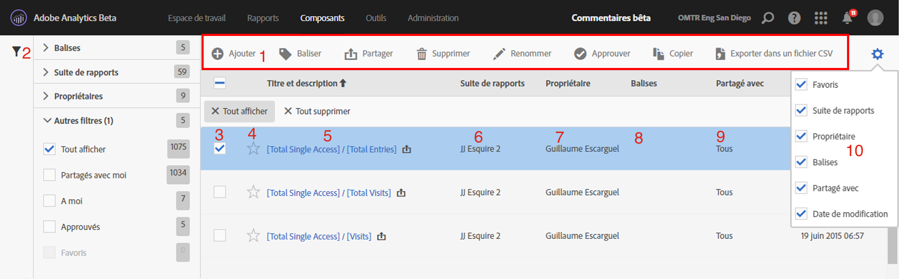

# Gestionnaire de mesures calculées

La page Mesures calculées offre plusieurs manières d’organiser les mesures, par exemple le partage, le filtrage, le balisage, l’approbation, la copie, la suppression et le marquage en tant que favoris.

La page Mesures calculées vous présente tous les segments que vous possédez et qui ont été partagés avec vous. Les utilisateurs de niveau administrateur peuvent consulter toutes les mesures personnalisées de l’entreprise.

## Accès au gestionnaire des mesures calculées

1. Dans Adobe Analytics, sélectionnez [!UICONTROL **Composants**] > [!UICONTROL **Mesures calculées**].

## Zones du gestionnaire des mesures calculées

L’image suivante et le tableau qui l’accompagne décrivent certains des principaux domaines et fonctionnalités du Gestionnaire de mesures calculées.

| Emplacement dans l’image | Nom et fonction |
|---|---|
| 1 | **Barre d’outils du gestionnaire de mesures calculées :** Une fois que vous avez sélectionné une mesure, cette barre d’outils s’affiche. La plupart des tâches de gestion peuvent être effectuées à partir de cette barre d’outils. |
| 2 | **Filtre :** Vous pouvez filtrer par balises, suites de rapports, propriétaires, tous (administrateur uniquement), partagés avec moi, les miens, les favoris et approuvés (administrateur uniquement). |
| 3 | **Zones de sélection :** Sélectionnez une mesure personnalisée pour la gérer. |
| 4 | **Favoris :** La sélection de l’étoile en regard d’une mesure marque la mesure comme favori. |
| 5 | **Titre et description des segments :** Ces valeurs sont fournies dans le créateur de mesures calculées. Pour modifier le titre et la description, cliquez sur le lien du titre pour ouvrir le créateur de mesures calculées. |
| 6 | **Suite de rapports :** Indique dans quelle suite de rapports la mesure a été enregistrée en dernier. |
| 7 | **Propriétaire :** Indique qui possède la mesure personnalisée. En tant que non administrateur, vous ne pouvez consulter que les mesures que vous possédez ou celles qui ont été partagées avec vous. |
| 8 | **Balises :** Affiche les balises qui ont été appliquées à la mesure, soit par vous, soit par des personnes qui ont partagé le segment avec vous. |
| 9 | **Partagé avec :** Répertorie les individus ou les groupes (administrateur uniquement) ou toutes les personnes (administrateur uniquement) avec lesquelles vous avez partagé le segment. |
| 10 | **Sélecteur de colonnes :** Permet de sélectionner ou désélectionner des colonnes dans la page Mesures calculées afin que vous puissiez personnaliser l’affichage. |
| Non affiché dans l’image | **Date de modification :** Indique la date de la dernière modification de la mesure personnalisée. |

{style="table-layout:auto"}
