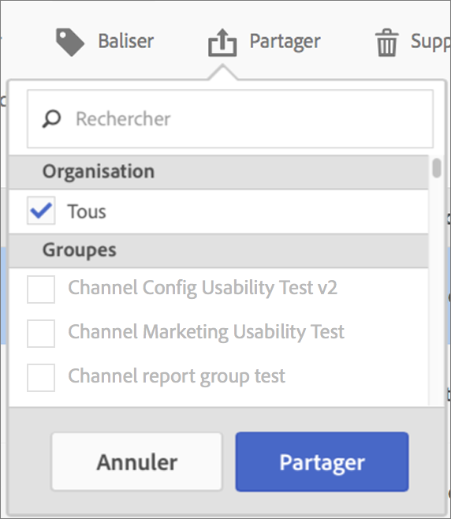

# Partage des mesures calculées

Selon vos autorisations, vous pouvez partager des mesures calculées avec l’ensemble de l’entreprise, des groupes ou des utilisateurs individuels.

| Rôle | Autorisations |
|---|---|
| Administrateur | Peut partager des mesures calculées avec l’ensemble de l’entreprise (Tous), avec des groupes et avec des utilisateurs. Les groupes sont configurés en tant que groupes d’autorisations dans la Admin Console. |
| Non administrateur | Peut partager les mesures calculées uniquement avec des utilisateurs individuels. |

A quel moment devriez-vous partager des mesures calculées à l’échelle de l’entreprise au lieu de vous limiter à des groupes d’utilisateurs ou des individus ? Vous trouverez ci-dessous quelques bonnes pratiques que vous pouvez suivre :

* En tant qu’administrateur, partagez une mesure avec **[!UICONTROL Tous]** s’il est utile à l’ensemble de l’entreprise et si tout le monde sait l’utiliser correctement. Dans ce cas, vous devez également envisager d’en faire une mesure approuvée.
* En tant qu’administrateur, partagez une mesure avec un **[!UICONTROL Groupe]** spécifique si la mesure offre une valeur ajoutée intéressante à l’équipe en question.
* En tant qu’administrateur ou utilisateur individuel, le partage d’une mesure avec d’autres individus approuve et valide la mesure en question. S’il ne s’avère pas utile, elle peut être ignorée. N’approuvez pas officiellement ce type de mesure.

1. Dans le Gestionnaire de mesures calculées, cochez la case en regard de la mesure que vous souhaitez partager. La barre des tâches s’affiche :

   

1. Cliquez sur l’icône **[!UICONTROL Partager]**.

   

   Si vous êtes administrateur, vous pouvez sélectionner **[!UICONTROL Tous]** ou effectuer une sélection dans les **[!UICONTROL Groupes]** et (faire défiler jusqu’à) **[!UICONTROL Utilisateurs]** de votre entreprise. En tant que non administrateur, vous ne pouvez consulter que les utilisateurs individuels. Utilisez le champ **[!UICONTROL Rechercher]** pour rechercher des groupes ou des utilisateurs

1. Cliquez sur **[!UICONTROL Partager]**.

   L’icône Partagé s’affiche en regard de la mesure : 

1. Vous pouvez filtrer par mesures partagées avec vous en accédant à **[!UICONTROL Filtres]** > **[!UICONTROL Autres filtres]** > **[!UICONTROL Partagé avec moi]**.

