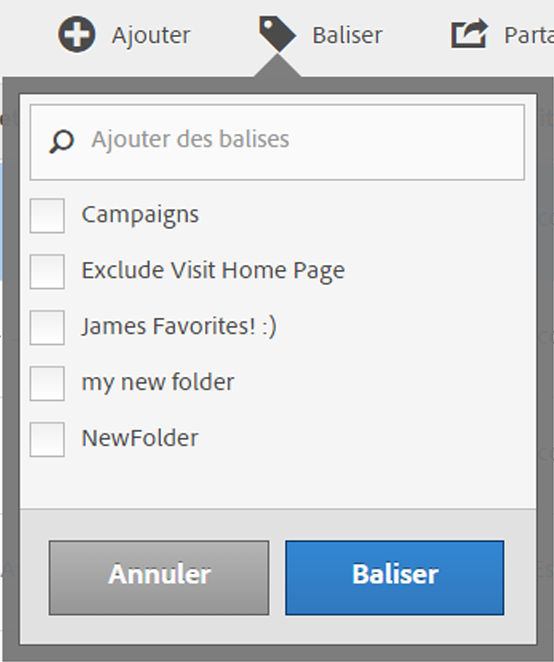

# Balisage des mesures calculées

Dans le Gestionnaire de mesures calculées, le balisage des segments permet de les organiser.

Tous les utilisateurs peuvent créer des balises pour les mesures calculées et en appliquer une ou plusieurs à une mesure. Néanmoins, vous ne pouvez afficher les balises que pour les mesures calculées que vous possédez ou qui ont été partagées avec vous. Quels types de balises devriez-vous créer ? Vous trouverez ci-dessous quelques suggestions de balises utiles :

* Des balises basées sur des **noms d’équipe**, par exemple Marketing des réseaux sociaux, Marketing des périphériques mobiles.
* Les balises **Projet** (balises d’analyse), telle que l’analyse de la page d’accès.
* Les balises **Catégorie** : Hommes ; géographie.
* Les balises **Processus** : Sous réserve d’approbation ; Organisé pour (une unité opérationnelle spécifique)

1. Dans le Gestionnaire de mesures calculées, cochez la case en regard de la mesure que vous souhaitez baliser. La barre d’outils de gestion apparaît :
1. Cliquez sur **[!UICONTROL Balise]** et

   * effectuez une sélection dans les balises existantes, ou
   * ajoutez un nouveau nom de balise dans la boîte de dialogue Ajouter des balises/Rechercher et appuyez sur **[!UICONTROL Entrée]**.

      

1. Cliquez à nouveau sur **[!UICONTROL Balise]** pour marquer la mesure.

La balise doit à présent apparaître dans la colonne Balises. (Cliquez sur l’icône en forme d’engrenage dans la partie supérieure droite pour gérer vos colonnes.)

Vous pouvez également filtrer par balises en accédant à **[!UICONTROL Afficher les filtres]** > **[!UICONTROL Balises]**.
