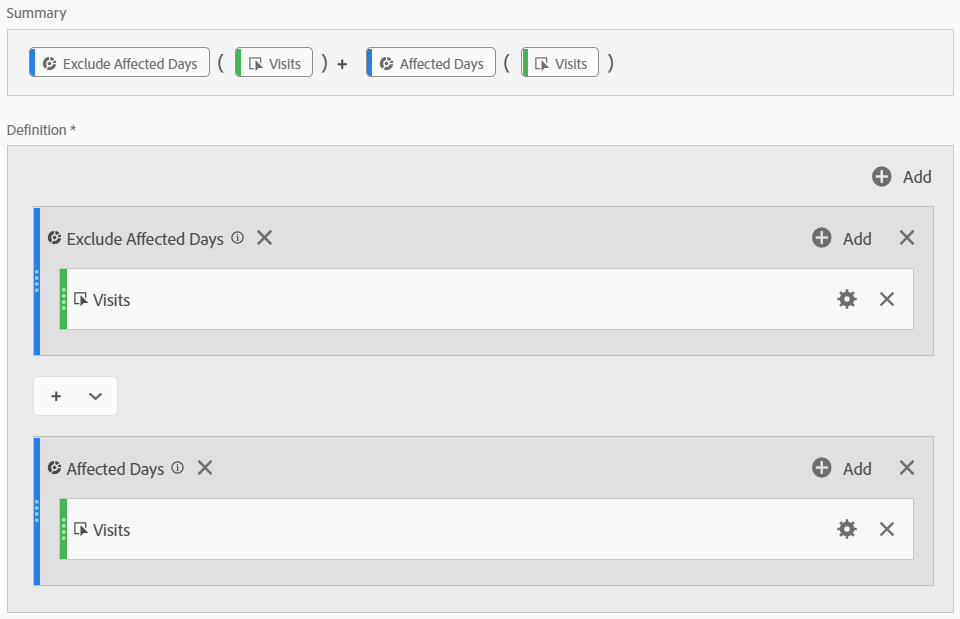

# Dériver les données affectées par les 

Si des données sont [affectées par une](/help/technotes/event-impacted.md), vous pouvez utiliser des mesures calculées pour dériver des valeurs de tendance pour la durée du . Si, par exemple, vous avez eu un  qui a provoqué une baisse de 25 % des données, vous pouvez l’utiliser comme multiplicateur dans une mesure calculée.

>[!NOTE] Ces étapes fonctionnent mieux lorsque vous comprenez l’impact d’un , à la fois du point de vue de la segmentation et de la comparaison de dates. Veillez à suivre la [comparaison des dates affectées par un aux plages](/help/analyze/analysis-workspace/components/calendar-date-ranges/compare-event.md) précédentes et à [exclure des dates spécifiques dans](../c-segmentation/use-cases/exclude-date-range.md) avant de suivre cette page.

1. Créez deux segments pour &quot;Jours affectés&quot; et &quot;Exclure les jours affectés&quot;, comme indiqué dans la section [Exclure des dates spécifiques dans ](../c-segmentation/use-cases/exclude-date-range.md)du.
2. Accédez à **[!UICONTROL Components]** > **[!UICONTROL Calculated metrics]**.
3. Cliquez sur **[!UICONTROL Add]**.
4. Faites glisser les deux segments ci-dessus vers le canevas de définition. Modifiez l’opérateur entre eux sur un `+` pour les additionner.
5. Ajouter la mesure souhaitée dans les deux segments. Par exemple, vous pouvez utiliser la mesure Visites.

   

6. Cliquez **[!UICONTROL Add]** dans l&#39;angle supérieur droit du  &quot;Jours affectés&quot;, puis cliquez sur **[!UICONTROL Static number]**. Définissez le nombre statique sur le pourcentage de décalage de vos données, comme indiqué sous [Comparer les dates affectées par un aux plages](/help/analyze/analysis-workspace/components/calendar-date-ranges/compare-event.md)précédentes. Dans cet exemple, le décalage est de 25 %, soit 1,25.

   

7. Appliquez côte à côte la mesure &quot;corrigée&quot; dans un tableau à structure libre de tendance. Tous les jours en dehors du reflètent leur nombre de mesures normal, tandis que tous les jours affectés utilisent le décalage du multiplicateur.

   

8. les données dans une visualisation en ligne pour voir l’effet de votre mesure corrigée.

   
