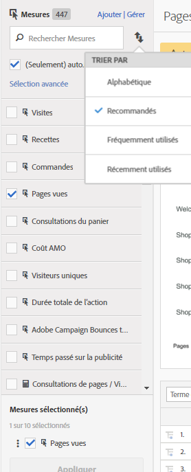

# Mesures calculées ou calculées avancées (dérivées)

Les mesures calculées ou calculées avancées (ou dérivées) sont des mesures personnalisées que vous pouvez créer à partir de mesures existantes.

>[!IMPORTANT]
>
>En juillet 2018, Adobe a ajouté la nouvelle fonctionnalité [Attribution IQ](https://marketing.adobe.com/resources/help/fr_FR/analytics/analysis-workspace/attribution.html), qui a revu la manière dont les modèles d’attribution dans les mesures calculées sont évalués. Dans le cadre de cette modification, les mesures calculées qui n’utilisent pas un modèle d’attribution par défaut ont été migrées vers des nouveaux modèles d’attribution améliorés :
>
>* Les modèles d’attribution « Dernière touche canal marketing » et « Première touche canal marketing » ont été migrés vers les nouveaux modèles d’attribution « Dernière touche » et « Première touche », respectivement. (Remarque : les rapports « Canaux marketing » ne sont pas devenus obsolètes, seuls les deux modèles d’attribution qui apparaissent dans les mesures calculées le sont devenus.)
>* De plus, nous avons corrigé la façon dont l’affectation linéaire est calculée. Pour les clients qui utilisent des mesures calculées avec des modèles d’attribution « linéaire », les rapports peuvent légèrement changer afin de tenir compte du nouveau modèle d’attribution corrigé. Ce changement apporté aux mesures calculées est pris en compte dans [!UICONTROL Analysis Workspace], dans les [!UICONTROL Reports &amp; Analytics], dans l’API de création de rapports dans Report Builder et dans les Ad Hoc Analysis. Pour plus d’informations, consultez la section [Fonctionnement de l’affectation linéaire à partir du 19 juillet 2018](/help/components/c-calcmetrics/c-workflow/cm-workflow/c-build-metrics/m-metric-type-alloc.md#section_EDBB2E14A6C248C5A79C0913C02D7CA1).

Nos outils de mesures calculées offrent un moyen bien plus souple pour créer, gérer et organiser les mesures. Ils vous permettent, en tant que responsables du marketing, chefs de produits et analystes, de poser des questions relatives aux données sans avoir à modifier votre implémentation [!DNL Analytics]. Les mesures personnalisées disponibles dans chaque module [!DNL Analytics] sont les suivantes :

* Adobe [!DNL Analytics] Foundation : calculées
* [Adobe Analytics Select](https://www.adobe.com/data-analytics-cloud/analytics/select.html) : calculées  + calculées avancées
* [Adobe Analytics Prime](https://www.adobe.com/data-analytics-cloud/analytics/prime.html) : calculées + calculées avancées
* [Adobe Analytics Ultimate](https://www.adobe.com/data-analytics-cloud/analytics/ultimate.html) : calculées + calculées avancées

Dans le tableau ci-dessous, vous trouverez une comparaison des fonctionnalités des mesures calculées et des mesures calculées avancées :

| Options du créateur | Mesures calculées | Mesures calculées avancées (dérivées) |
|---|---|---|
| [Types de format (décimal, heure, pourcentage, devise)](/help/components/c-calcmetrics/c-workflow/cm-workflow/c-build-metrics/cm-build-metrics.md) | Oui | Oui |
| [Modifications d’attribution (par défaut, linéaire, participation, etc.)](/help/components/c-calcmetrics/c-workflow/cm-workflow/c-build-metrics/m-metric-type-alloc.md) | Oui | Oui |
| [Types de mesure (standard, total)](/help/components/c-calcmetrics/c-workflow/cm-workflow/c-build-metrics/m-metric-type-alloc.md) | Oui | Oui |
| Opérateurs de base (ajouter, soustraire, multiplier, diviser) | Oui | Oui |
| [Appliquer les segments](/help/components/c-calcmetrics/c-workflow/cm-workflow/c-build-metrics/metrics-with-segments.md) | Non | Oui |
| [Fonctions de base (décompte, valeur absolue, moyenne, etc.)](/help/components/c-calcmetrics/cm-reference/cm-functions.md) | Non | Oui |
| [Fonctions avancées (régression, si/alors, score normalisé, etc.)](/help/components/c-calcmetrics/cm-reference/cm-adv-functions.md) | Non | Oui |

## Fonctionnalités  {#section_A0A5C275B68A4D628950BBB0B1EE631F}

Vous pouvez

* Créer des mesures dans [!UICONTROL Analysis Workspace], [!UICONTROL Reports &amp; Analytics], [!UICONTROL Ad Hoc Analysis], [!UICONTROL Report Builder], [!UICONTROL détection des anomalies] et [!UICONTROL analyse des contributions].
* Créer des mesures segmentées qui sont dérivées au moment de l’exécution du rapport, [sans avoir à modifier l’implémentation](https://youtu.be/CuQTm9RaUpY). Elles peuvent être consultées de manière historique car elles sont basées sur des segments.
* Partagez des mesures dans l’ensemble des suites de rapports. Cela signifie que toutes les mesures nouvellement créées s’appliquent à toutes les suites de rapports de la même société de connexion.
* (Mesures calculées avancées uniquement) Segmenter sur les mesures. Par exemple, vous pouvez créer une mesure « Nouveaux visiteurs », avec un décompte des personnes pour lesquelles il s’agit de la première session.
* (Mesures calculées avancées uniquement) Incorporer les fonctions statistiques afin de vous aider à mieux décrire les données. Par exemple, vous pouvez comptabiliser le nombre d’éléments d’un rapport ou ajouter le nombre d’écarts types pour chaque élément.
* Utilisez les mesures créées dans les [!UICONTROL Ad Hoc Analysis] dans les autres outils d’[!DNL Analytics] et vice versa.

   >[!NOTE]
   >
   >Vous pouvez continuer à créer des mesures dans les Ad Hoc Analysis. Son interface utilisateur de créateur de mesures calculées est désormais similaire au nouveau créateur de mesures.

## Limites {#section_CB878B02451541D68A68B508D4DBD19A}

Certaines fonctions d’[!DNL Analytics] permettent d’utiliser des événements, mais pas des mesures calculées :

* [!UICONTROL Entonnoirs] dans [!UICONTROL Reports &amp; Analytics]
* [!UICONTROL Abandons] dans [!UICONTROL Analysis Workspace]
* [!UICONTROL Analyse de cohortes] dans Analysis Workspace
* [!UICONTROL Data Warehouse]
* [!UICONTROL Segments]
* [!UICONTROL Rapports en temps réel]
* [!UICONTROL Rapports Données actives]
* [!DNL Analytics] for [!DNL Target]

## Outils {#section_D65E9C067E9C45E1A50DD30F50561BB2}

Vous trouverez un bref aperçu des outils de [!UICONTROL mesures calculées] :

<table id="table_520AFE97DB514958ABE23FD3C9CE0ABD"> 
 <thead> 
  <tr> 
   <th colname="col1" class="entry"> Outil </th> 
   <th colname="col2" class="entry"> Fonctionnalités </th> 
  </tr>
 </thead>
 <tbody> 
  <tr> 
   <td colname="col1"><a href="/help/components/c-calcmetrics/c-workflow/cm-workflow/c-build-metrics/cm-build-metrics.md"  > Créateur de mesures calculées</a> </td> 
   <td colname="col2"> 
    <ul id="ul_E6F02AB9DF204C2F9A0AC92A31594B3E"> 
     <li id="li_A4A6E716374243A190C539A3F4A41C0C">Créer des mesures calculées et calculées avancées à l’aide des modèles d’affectation avancés. </li> 
     <li id="li_C8C97BA4E227463E98077ABA5818FFC6">Ajouter des segments insérés aux formules de mesure. </li> 
     <li id="li_8503D9E06A3C46569B5CDB4B90F72446">Comparer des segments dans le même rapport. Par exemple, comparer les visiteurs locaux et les visiteurs internationaux. </li> 
     <li id="li_4B528FDE1F96400DBA0D3276408FF919">Utiliser les fonctions statistiques. </li> 
     <li id="li_C1162B1EA6784B8189A8A87E2B0DA79A">Fournir des descriptions de mesure détaillées (indiquer ce que la mesure fait, où l’utiliser, où NE PAS l’utiliser). </li> 
     <li id="li_DEA13F5E8BF94AF1B311C467FE6E2A74">Copier des définitions dans les nouvelles mesures. </li> 
     <li id="li_8C21F55015D44910904202D2BF74221C">Fournir un aperçu des mesures insérées. </li> 
     <li id="li_3704F66C321C477F9D4F52E068C231BD">Définir la polarité de la mesure qui indique si, lorsqu’un événement personnalisé (mesure) donné s’accroît, il s’agit un événement positif ou négatif. </li> 
     <li id="li_9D45319FA965476FB1C90DE8AA72BBD7">Baliser les mesures. </li> 
    </ul> </td> 
  </tr> 
  <tr> 
   <td colname="col1"><a href="/help/components/c-calcmetrics/c-workflow/cm-workflow/cm-manager.md"  > Gestionnaire de mesures calculées</a> </td> 
   <td colname="col2"> 
    <ul id="ul_E4D20D5DD3904CC6A85785B5BD4C1B1E"> 
     <li id="li_E0B216BA1478406EB6212263DF71D85B">Partager des mesures avec les autres. </li> 
     <li id="li_96EB16FAF3454211AAEF78EA5B08927F">Approuver et organiser les mesures. </li> 
     <li id="li_3ADBD2428EAC4B0AA61222D87C3AF2B7">Organiser (baliser) vos mesures afin que les personnes puissent les trouver. </li> 
     <li id="li_726F3C3390744E49BA63606FE196880E">Supprimer des mesures. </li> 
     <li id="li_F306BA4FA8AF4A6E987BA62634659A2F">Renommer des mesures. </li> 
    </ul> </td> 
  </tr> 
  <tr> 
   <td colname="col1"> Rail Sélecteur de mesure </td> 
   <td colname="col2"> 
Remplace la fenêtre contextuelle Afficher les mesures dans les Reports &amp; Analytics. 
 
Il permet de rechercher et d’ajouter/appliquer des mesures au rapport. Vous pouvez également modifier l’ordre de  <a href="/help/components/c-calcmetrics/c-workflow/cm-workflow/cm-finding.md"  >tri</a> (les options sont : Alphabétique, Recommandés, Fréquemment utilisés, Récemment utilisés). En outre, vous pouvez filtrer selon les suites de rapports pour n’afficher que les mesures créées dans une suite de rapports spécifique. 
 
Pour accéder à ce sélecteur de mesures, cliquez sur l’icône Mesures  située à gauche d’un rapport. Le sélecteur de mesure ressemble à ceci : 
 
 
 </td> 
  </tr> 
  <tr> 
   <td colname="col1"><a href="https://www.adobe.io/apis/experiencecloud/analytics/docs.html#!AdobeDocs/analytics-2.0-apis/master/README.md"  > API pour les mesures calculées</a> </td> 
   <td colname="col2"> 
Partie du jeu d’API d’Adobe Analytics 2.0. 
 </td> 
  </tr> 
 </tbody> 
</table>

