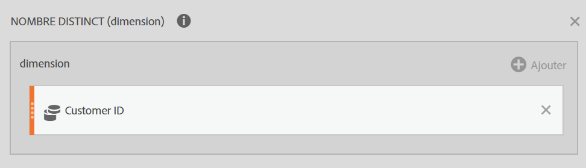
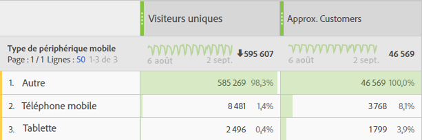

# Référence : fonctions avancées

Accédez à ces fonctions en cochant **[!UICONTROL Afficher les options avancées]** dans la liste déroulante **[!UICONTROL Fonctions]**.

## Fonctions de tableau et fonctions de ligne {#section_8977BE40A47E4ED79EB543A9703A4905}

Une fonction de tableau consiste à ce que la sortie soit la même pour chaque ligne du tableau. Une fonction de ligne consiste à ce que la sortie soit différente pour chaque ligne du tableau.

## Que signifie le paramètre d’inclusion de zéros ?  {#section_C7A2B05929584C65B308FD372CB8E8E3}

Il indique s’il faut inclure des zéros dans le calcul. Parfois, zéro signifie « rien » mais parfois, il est important.

Par exemple, en présence d’une mesure Recettes, vous ajoutez une mesure Pages Vues au rapport. Soudainement, des lignes supplémentaires apparaissent pour votre recette, qui contiennent toutes zéro. Vous souhaitez probablement que cela n’affecte pas les calculs de MOYENNE, de MINIMUM, de QUARTILE, etc. de la colonne des recettes. Dans ce cas, vous devez activer le paramètre d’inclusion de zéros.

D’un autre côté, si deux mesures vous intéressent, il n’est pas juste d’indiquer que l’une dispose d’une moyenne ou d’un minimum supérieur car certaines de ses lignes sont des zéros. Dans ce cas, n’activez pas le paramètre permettant d’inclure des zéros.

## ET {#concept_E14513FE464F4491AD0D4130D4EE621C}

Renvoie la valeur de son argument. Utilisez SAUF pour vous assurer qu’une valeur est différente d’une valeur spécifique.

> [!NOTE] 0 (zéro) signifie False, et toute autre valeur est True.

```
AND(logical_test1,[logical_test2],...)
```

| Argument | Description |
|---|---|
| *logical_test1* | Obligatoire. Toute valeur ou expression qui peut être évaluée sur TRUE ou FALSE. |
| *logical_test2* | Facultatif. Conditions supplémentaires que vous souhaitez évaluer en tant TRUE ou FALSE. |

## Nombre distinct approximatif (dimension) {#concept_000776E4FA66461EBA79910B7558D5D7}

Renvoie le nombre distinct approximatif d’éléments de dimension pour la dimension sélectionnée. La fonction utilise la méthode HyperLogLog (HLL) d’approximation des nombres distincts.  Elle est configurée pour garantir que la valeur est comprise dans les 5 % de la valeur réelle 95 % du temps.

```
Approximate Count Distinct (dimension)
```

| Argument |  |
|---|---|
| *dimension* | Dimension pour laquelle vous souhaitez obtenir le nombre distinct approximatif d’éléments. |

## Exemple de cas d’utilisation  {#section_424E3FC5092948F0A9D655F6CCBA0312}

Le nombre distinct approximatif (eVar ID de client) est un cas d’utilisation courant pour cette fonction.

Définition d’une nouvelle mesure calculée « Nombre approximatif de clients » :



Voici comment cette mesure pourrait être utilisée dans les rapports :



## Valeurs uniques dépassées  {#section_9C583858A9F94FF7BA054D1043194BAA}

Les fonctions Like Count(), RowCount() et Approximate Count Distinct() sont soumises aux [limites « Valeurs uniques dépassées »](https://marketing.adobe.com/resources/help/fr_FR/reference/metrics_uniques_high_numbers.html). Si la limite « Valeurs uniques dépassées » est atteinte au cours d’un mois spécifique pour une dimension, la valeur est comptée en tant que 1 élément de dimension.

## Comparaison des fonctions de comptage  {#section_440FB8FB44374459B2C6AE2DA504FC0B}

La fonction Approximate Count Distinct() est une amélioration des fonctions Count() et RowCount(), car vous pouvez utiliser la mesure créée dans un rapport de dimensions pour générer un nombre approximatif d’éléments pour une dimension distincte. Par exemple, un nombre d’ID de client utilisés dans un rapport Type de périphérique mobile.

Cette fonction sera légèrement moins précise que Count() et RowCount(), car elle utilise la méthode HLL alors que Count() et RowCount() sont des nombres exacts.

## Arc cosinus (ligne) {#concept_1DA3404F3DDE4C6BAF3DBDD655D79C7B}

Renvoie l’arc cosinus, ou l’inverse du cosinus, d’une mesure. L’arc cosinus d’un nombre est l’angle dont le cosinus vaut ce nombre. L’angle renvoyé est donné en radians dans la plage 0 (zéro) à pi. Si vous souhaitez convertir le résultat de radians en degrés, multipliez-le par 180/PI( ).

```
ACOS(metric)
```

| Argument |  |
|---|---|
| *metric* | Cosinus de l’angle que vous souhaitez obtenir de -1 à 1. |

## Arc sinus (ligne) {#concept_90F00DEC46BA47F8A21493647D9668CD}

Renvoie l’arc sinus, ou le sinus inverse, d’un nombre. L’arc sinus d’un nombre est l’angle dont le sinus vaut ce nombre. L’angle renvoyé est donné en radians dans la plage -pi/2 à pi/2. Pour exprimer l’arc sinus en degrés, multipliez le résultat par 180/PI( ).

```
ASIN(metric) 
```

| Argument |  |
|---|---|
| *metric* | Cosinus de l’angle que vous souhaitez obtenir de -1 à 1. |

## Arc tangent (ligne) {#concept_3408520673774A10998E9BD8B909E90C}

Renvoie l’arc tangent, ou la tangente inverse, d’un nombre. L’arc tangent d’un nombre est l’angle dont la tangente vaut ce nombre. L’angle renvoyé est donné en radians dans la plage -pi/2 à pi/2. Pour exprimer l’arc tangent en degrés, multipliez le résultat par 180/PI( ).

```
ATAN(metric)
```

| Argument |  |
|---|---|
| *metric* | Cosinus de l’angle que vous souhaitez obtenir de -1 à 1. |

## Régression exponentielle : Y prédit (ligne) {#concept_25615693312B4A7AB09A2921083502AD}

Calcule les valeurs y prédites (metric_Y), selon les valeurs x connues (metric_X) en utilisant la méthode des « moindres carrés » pour calculer la ligne de meilleure approximation basée sur .

```
ESTIMATE.EXP(metric_X, metric_Y)
```

| Argument | Description |
|---|---|
| *metric_X* | Mesure que vous souhaitez désigner comme données dépendantes. |
| *metric_Y* | Mesure que vous souhaitez désigner comme données indépendantes. |

## Cdf-T {#concept_4E2F2673532A48B5AF786521DE428A66}

Renvoie le pourcentage des valeurs d’un distribution en t de Student avec n degrés de liberté ayant un score centré réduit inférieur à x.

```
cdf_t( -∞, n ) = 0 
cdf_t(  ∞, n ) = 1 
cdf_t( 3, 5 ) ? 0.99865 
cdf_t( -2, 7 ) ? 0.0227501 
cdf_t( x, ∞ ) ? cdf_z( x )
```

## Cdf-Z {#concept_99C97ACC40A94FADBCF7393A17BC2D12}

Renvoie le pourcentage des valeurs d’une distribution normale ayant un score centré réduit inférieur à x.

```
cdf_z( -∞ ) = 0 
cdf_z( ∞ ) = 1 
cdf_z( 0 ) = 0.5 
cdf_z( 2 ) ? 0.97725 
cdf_z( -3 ) ? 0.0013499 
 
```

## Plafond (ligne) {#concept_A14CDB1E419B4AA18D335E5BA2548346}

Renvoie l’entier le plus petit, non inférieur à une valeur donnée. Par exemple, si vous souhaitez éviter de signaler les décimales de devise pour les recettes et qu’un produit a une recette de 569,34 $, utilisez la formule PLAFOND(*Recettes*) pour arrondir la recette au dollar le plus proche, soit 570 $.

```
CEILING(metric)
```

| Argument | Description |
|---|---|
| *metric* | Mesure que vous souhaitez arrondir. |

## Cosinus (ligne) {#concept_DD07AA1FB08145DC89B69D704545FD0A}

Renvoie le cosinus de l’angle donné. Si l’angle est en degrés, multipliez l’angle par PI( )/180.

```
COS(metric)
```

| Argument | Description |
|---|---|
| *metric* | Angle en radians que vous souhaitez obtenir pour le cosinus. |

## Racine cubique {#concept_BD93EFA45DF7447A8F839E1CA5B5F795}

Renvoie la racine cubique positive d’un nombre. La racine cubique d’un nombre est la valeur de ce nombre élevée à la puissance 1/3.

```
CBRT(metric)
```

| Argument | Description |
|---|---|
| *metric* | Mesure pour laquelle vous souhaitez obtenir la racine cubique. |

## Cumulé {#concept_3D3347797B6344CE88B394C3E39318ED}

Renvoie la somme des x pour les N dernières lignes (dans l’ordre défini par la dimension, en utilisant des valeurs d’empreinte pour les champs basés sur des chaînes).

Si N &lt;= 0, elle utilise toutes les lignes précédentes. Puisque la moyenne cumulée est triée selon la dimension, elle n’est utile que pour les dimensions qui possèdent un ordre naturel, comme la date ou la longueur de chemin.

```
| Date | Rev  | cumul(0,Rev) | cumul(2,Rev) | 
|------+------+--------------+--------------| 
| May  | $500 | $500         | $500         | 
| June | $200 | $700         | $700         | 
| July | $400 | $1100        | $600         | 
 
```

## Moyenne cumulée {#concept_ABB650962DC64FD58A79C305282D3E61}

Renvoie la moyenne des N dernières lignes.

Si N &lt;= 0, elle utilise toutes les lignes précédentes. Puisque la moyenne cumulée est triée selon la dimension, elle n’est utile que pour les dimensions qui possèdent un ordre naturel, comme la date ou la longueur de chemin.

> [!NOTE] La moyenne cumulée ne fonctionne pas comme vous pourriez l’attendre avec des mesures de taux comme recettes/visiteur : elle fait la moyenne des taux au lieu d’additionner les recettes sur le dernier N et les visiteurs sur le dernier N, puis les diviser. À la place, utilisez

```
cumul(revenue)/cumul(visitor)
```

## equal (égal à) {#concept_A3B97152B5F74E04A97018B35734BEEB}

Renvoie des éléments qui correspondent exactement à une valeur numérique ou de chaîne.

## Régression exponentielle : coefficient de corrélation (tableau) {#concept_C18BBFA43C1A499293290DF49566D8D8}

Renvoie le coefficient de corrélation, *r*, entre deux colonnes de mesures (*metric_A* et *metric_B*) pour l’équation de régression.

```
CORREL.EXP(metric_X, metric_Y)
```

| Argument | Description |
|---|---|
| *metric_X* | Mesure que vous souhaitez corréler à *metric_Y*. |
| *metric_Y* | Mesure que vous souhaitez corréler à *metric_X*. |

## Régression exponentielle : ordonnée à l’origine (tableau) {#concept_0047206C827841AD936A3BE58EEE1514}

Renvoie l’ordonnée à l’origine, *b*, entre deux colonnes de mesures (*metric_X* et *metric_Y*) pour.

```
INTERCEPT.EXP(metric_X, metric_Y)
```

| Argument | Description |
|---|---|
| *metric_X* | Mesure que vous souhaitez désigner comme données dépendantes. |
| *metric_Y* | Mesure que vous souhaitez désigner comme données indépendantes. |

## Régression exponentielle : inclinaison (tableau) {#concept_230991B0371E44308C52853EFA656F04}

Renvoie l’inclinaison, *a*, entre deux colonnes de mesures (*metric_X* et *metric_Y*) pour.

```
SLOPE.EXP(metric_X, metric_Y)
```

| Argument | Description |
|---|---|
| *metric_X* | Mesure que vous souhaitez désigner comme données dépendantes. |
| *metric_Y* | Mesure que vous souhaitez désigner comme données indépendantes. |

## Plancher (ligne) {#concept_D368150EC3684077B284EE471463FC31}

Renvoie l’entier le plus grand, non supérieur à une valeur donnée. Par exemple, si vous souhaitez éviter de signaler les décimales de devise pour les recettes et qu’un produit a une recette de 569,34 $, utilisez la formule PLANCHER(*Recettes*) pour arrondir la recette au dollar le plus proche, soit 569 $.

```
FLOOR(metric)
```

| Argument | Description |
|---|---|
| *metric* | Mesure que vous souhaitez arrondir. |

## Supérieur à {#concept_A83734A0C0C14646B76D2CC5E677C644}

Renvoie les éléments dont le nombre est supérieur à la valeur saisie.

## Supérieur ou égal à {#concept_8CA6DF1F84784D50849BF1C566AE1D37}

Renvoie les éléments dont le nombre est supérieur ou égal à la valeur saisie.

## Cosinus hyperbolique (ligne) {#concept_79DD5681CE9640BDBA3C3F527343CA98}

Renvoie le cosinus hyperbolique d’un nombre.

```
COSH(metric)
```

| Argument | Description |
|---|---|
| *metric* | Angle en radians pour lequel vous souhaitez obtenir le cosinus hyperbolique. |

## Sinus hyperbolique (ligne) {#concept_96230731600C45E3A4E823FE155ABA85}

Renvoie le sinus hyperbolique d’un nombre.

```
SINH(metric)
```

| Argument | Description |
|---|---|
| *metric* | Angle en radians pour lequel vous souhaitez obtenir le sinus hyperbolique. |

## Tangente hyperbolique (ligne) {#concept_BD249013732F462B9863629D142BCA6A}

Renvoie la tangente hyperbolique d’un nombre.

```
TANH(metric)
```

| Argument | Description |
|---|---|
| *metric* | Angle en radians pour lequel vous souhaitez obtenir la tangente hyperbolique. |

## SI (ligne) {#concept_6BF0F3EAF3EF42C288AEC9A79806C48E}

La fonction SI renvoie une valeur si une condition que vous spécifiez est évaluée sur TRUE, et une autre valeur si cette condition est évaluée sur FALSE.

```
IF(logical_test, [value_if_true], [value_if_false])
```

| Argument | Description |
|---|---|
| *logical_test* | Obligatoire. Toute valeur ou expression qui peut être évaluée sur TRUE ou FALSE. |
| *[value_if_true]* | Valeur que vous souhaitez voir renvoyer si l’argument *logical_test* est évalué sur VRAI. (Cet argument est défini sur la valeur par défaut de 0 si non inclus.) |
| *[value_if_false]* | Valeur que vous souhaitez voir renvoyer si l’argument *logical_test* est évalué sur FAUX. (Cet argument est défini sur la valeur par défaut de 0 si non inclus.) |

## Inférieur à {#concept_A4A85C0FDF944AACAD4B8B55699D1B11}

Renvoie les éléments dont le nombre est inférieur à la valeur saisie.

## Inférieur ou égal à {#concept_99D12154DE4848B1B0A6327C4322D288}

Renvoie les éléments dont le nombre est inférieur ou égal à la valeur saisie.

## Régression linéaire : coefficient de corrélation {#concept_132AC6B3A55248AA9C002C1FBEB55C60}

Y = a X + b. Renvoie le coefficient de corrélation.

## Régression linéaire : ordonnée à l’origine {#concept_E44A8D78B802442DB855A07609FC7E99}

Y = a X + b. Renvoie b.

## Régression linéaire : Y prédit {#concept_9612B9BF106D4D278648D2DF92E98EFC}

Y = a X + b. Renvoie Y.

## Régression linéaire : inclinaison {#concept_12352982082A4DDF824366B073B4C213}

Y = a X + b. Renvoie a.

## Logarithme de base 10 {#concept_4C65DF9659164261BE52AA5A95FD6BC1}

Renvoie le logarithme de base 10 d’un nombre.

```
LOG10(metric)
```

| Argument | Description |
|---|---|
| *metric* | Nombre réel positif pour lequel vous souhaitez obtenir le logarithme de base 10. |

## Régression logarithmique : coefficient de corrélation (tableau) {#concept_F3EB35016B754E74BE41766E46FDC246}

Renvoie le coefficient de corrélation, *r*, entre deux colonnes de mesures (*metric_X* et *metric_Y*) pour l’équation de régression [!DNL Y = a ln(X) + b]. Il est calculé en utilisant l’équation CORREL.

```
CORREL.LOG(metric_X,metric_Y)
```

| Argument | Description |
|---|---|
| *metric_X* | Mesure que vous souhaitez corréler à *metric_Y*. |
| *metric_Y* | Mesure que vous souhaitez corréler à *metric_X*. |

## Régression logarithmique : ordonnée à l’origine (tableau) {#concept_75A3282EDF54417897063DC26D4FA363}

Renvoie l’ordonnée à l’origine *b* en tant que régression aux moindres carrés entre deux colonnes de mesures (*metric_X* et *metric_Y*) pour l’équation de régression [!DNL Y = a ln(X) + b]. Elle est calculée en utilisant l’équation INTERCEPT.

```
INTERCEPT.LOG(metric_X, metric_Y)
```

| Argument | Description |
|---|---|
| *metric_X* | Mesure que vous souhaitez désigner comme données dépendantes. |
| *metric_Y* | Mesure que vous souhaitez désigner comme données indépendantes. |

## Régression logarithmique : Y prédit (ligne) {#concept_5F3A9263BBB84E6098160A4DFB9E3607}

Calcule les valeurs [!DNL y] prédites (metric_Y), selon les valeurs [!DNL x] connues (metric_X) en utilisant la méthode des « moindres carrés » pour calculer la ligne de meilleure approximation d’après [!DNL Y = a ln(X) + b]. Elle est calculée en utilisant l’équation ESTIMATE.

Dans une analyse de régression, cette fonction calcule les valeurs [!DNL y] prédites (*metric_Y*), selon les valeurs [!DNL x] connues (*metric_X*) en utilisant l’algorithme pour calculer la ligne de meilleure approximation pour l’équation de régression [!DNL Y = a ln(X) + b]. Les valeurs [!DNL a] correspondent à chaque valeur x et [!DNL b] est une valeur constante.

```
ESTIMATE.LOG(metric_X, metric_Y)
```

| Argument | Description |
|---|---|
| *metric_X* | Mesure que vous souhaitez désigner comme données dépendantes. |
| *metric_Y* | Mesure que vous souhaitez désigner comme données indépendantes. |

## Régression logarithmique : inclinaison (tableau) {#concept_B291EFBE121446A6B3B07B262BBD4EF2}

Renvoie l’inclinaison, *a*, entre deux colonnes de mesures (*metric_X* et *metric_Y*) pour l’équation de régression [!DNL Y = a ln(X) + b]. Elle est calculée en utilisant l’équation SLOPE.

```
SLOPE.LOG(metric_A, metric_B)
```

| Argument | Description |
|---|---|
| *metric_A* | Mesure que vous souhaitez désigner comme données dépendantes. |
| *metric_B* | Mesure que vous souhaitez désigner comme données indépendantes. |

## Logarithme népérien {#concept_D3BE148A9B84412F8CA61734EB35FF9E}

Renvoie le logarithme népérien d’un nombre. Les logarithmes népériens sont basés sur la constante *e* (2,71828182845904). LN est l’inverse de la fonction EXP.

```
LN(metric)
```

| Argument | Description |
|---|---|
| *metric* | Nombre réel positif pour lequel vous souhaitez obtenir le logarithme népérien. |

## SAUF {#concept_BD954C455A8148A3904A301EC4DC821E}

Renvoie 1 si le nombre est 0 ou renvoie 0 si autre nombre.

```
NOT(logical)
```

| Argument | Description |
|---|---|
| *logical* | Obligatoire. Toute valeur ou expression qui peut être évaluée sur TRUE ou FALSE. |

L’utilisation de SAUF nécessite de connaître si les expressions (&lt;, >, =, &lt;> , etc.) renvoient la valeur 0 ou 1.

## Différent de {#concept_EC010B7A9D2049099114A382D662FC16}

Renvoie les éléments qui ne comportent pas une correspondance exacte avec la valeur saisie.

## Ou (ligne) {#concept_AF81A33A376C4849A4C14F3A380639D2}

Renvoie TRUE si un argument est VRAI ou renvoie FALSE si tous les arguments sont FAUX.

> [!NOTE] 0 (zéro) signifie False, et toute autre valeur est True.

```
OR(logical_test1,[logical_test2],...)
```

| Argument | Description |
|---|---|
| *logical_test1* | Obligatoire. Toute valeur ou expression qui peut être évaluée sur TRUE ou FALSE. |
| *logical_test2* | Facultatif. Conditions supplémentaires que vous souhaitez évaluer en tant TRUE ou FALSE. |

## Pi {#concept_41258789660D4A33B5FB86228F12ED9C}

Renvoie la constante PI, 3,14159265358979, exacte jusqu’à 15 chiffres.

```
PI()
```

La fonction [!DNL PI] ne comporte aucun argument.

## Régression puissance : coefficient de corrélation (tableau) {#concept_91EC2CFB5433494F9E0F4FDD66C63766}

Renvoie le coefficient de corrélation, *r*, entre deux colonnes de mesures (*metric_X* et *metric_Y*) pour [!DNL Y = b*X].

```
CORREL.POWER(metric_X, metric_Y)
```

| Argument | Description |
|---|---|
| *metric_X* | Mesure que vous souhaitez corréler à *metric_Y*. |
| *metric_Y* | Mesure que vous souhaitez corréler à *metric_X*. |

## Régression puissance : ordonnée à l’origine (tableau) {#concept_7781C85597D64D578E19B212BDD1764F}

Renvoie l’ordonnée à l’origine, *b*, entre deux colonnes de mesures (*metric_X* et *metric_Y*) pour [!DNL Y = b*X].

```
 INTERCEPT.POWER(metric_X, metric_Y)
```

| Argument | Description |
|---|---|
| *metric_X* | Mesure que vous souhaitez désigner comme données dépendantes. |
| *metric_Y* | Mesure que vous souhaitez désigner comme données indépendantes. |

## Régression puissance : Y prédit (ligne) {#concept_CD652C0A921D4EFBA8F180CB8E486B18}

Calcule les valeurs [!DNL y] prédites ( [!DNL metric_Y]), selon les valeurs [!DNL x] connues ( [!DNL metric_X]) en utilisant la méthode des « moindres carrés » pour calculer la ligne de meilleure approximation pour [!DNL Y = b*X].

```
 ESTIMATE.POWER(metric_X, metric_Y)
```

| Argument | Description |
|---|---|
| *metric_X* | Mesure que vous souhaitez désigner comme données dépendantes. |
| *metric_Y* | Mesure que vous souhaitez désigner comme données indépendantes. |

## Régression puissance : inclinaison (tableau) {#concept_5B9E71B989234694BEB5EEF29148766C}

Renvoie l’inclinaison, *a*, entre deux colonnes de mesures (*metric_X* et *metric_Y*) pour [!DNL Y = b*X].

```
SLOPE.POWER(metric_X, metric_Y)
```

| Argument | Description |
|---|---|
| *metric_X* | Mesure que vous souhaitez désigner comme données dépendantes. |
| *metric_Y* | Mesure que vous souhaitez désigner comme données indépendantes. |

## Régression quadratique : coefficient de corrélation (tableau) {#concept_9C9101A456B541E69BA29FCEAC8CD917}

Renvoie le coefficient de corrélation, *r*, entre deux colonnes de mesures (*metric_X* et *metric_Y*) pour [!DNL Y=(a*X+b)]****.

```
CORREL.QUADRATIC(metric_X, metric_Y)
```

| Argument | Description |
|---|---|
| *metric_X* | Mesure que vous souhaitez corréler à *metric_Y*. |
| *metric_Y* | Mesure que vous souhaitez corréler à *metric_X*. |

## Régression quadratique : ordonnée à l’origine (tableau) {#concept_69DC0FD6D38C40E9876F1FD08EC0E4DE}

Renvoie l’ordonnée à l’origine, *b*, entre deux colonnes de mesures (*metric_X* et *metric_Y*) pour [!DNL Y=(a*X+b)]****.

```
INTERCEPT.POWER(metric_X, metric_Y)
```

| Argument | Description |
|---|---|
| *metric_X* | Mesure que vous souhaitez désigner comme données dépendantes. |
| *metric_Y* | Mesure que vous souhaitez désigner comme données indépendantes. |

## Régression quadratique : Y prédit (ligne) {#concept_2F1ED70B1BDE4664A61CC09D30C39CBB}

Calcule les valeurs [!DNL y] prédites (metric_Y), selon les valeurs [!DNL x] connues (metric_X) en utilisant la méthode des « moindres carrés » pour calculer la ligne de meilleure approximation en utilisant [!DNL Y=(a*X+b)]**** .

```
ESTIMATE.QUADRATIC(metric_A, metric_B)
```

| Argument | Description |
|---|---|
| *metric_A* | Mesure que vous souhaitez désigner comme données dépendantes. |
| *metric_B* | Mesure que vous souhaitez désigner comme données dépendantes. |

## Régression quadratique : inclinaison (tableau) {#concept_0023321DA8E84E6D9BCB06883CA41645}

Renvoie l’inclinaison, *a*, entre deux colonnes de mesures (*metric_X* et metric_Y) pour [!DNL Y=(a*X+b)]****.

```
SLOPE.QUADRATIC(metric_X, metric_Y)
```

| Argument | Description |
|---|---|
| *metric_X* | Mesure que vous souhaitez désigner comme données dépendantes. |
| *metric_Y* | Mesure que vous souhaitez désigner comme données indépendantes. |

## Régression réciproque : coefficient de corrélation (tableau) {#concept_EBEC509A19164B8AB2DBDED62F4BA2A5}

Renvoie le coefficient de corrélation *r*, entre deux colonnes de mesures (*metric_X)* et *metric_Y*) pour [!DNL Y = a/X+b].

```
CORREL.RECIPROCAL(metric_X, metric_Y)
```

| Argument | Description |
|---|---|
| *metric_X* | Mesure que vous souhaitez corréler à *metric_Y*. |
| *metric_Y* | Mesure que vous souhaitez corréler à *metric_X*. |

## Régression réciproque : ordonnée à l’origine (tableau) {#concept_2DA45B5C69F140EC987649D2C88F19B3}

Renvoie l’ordonnée à l’origine, *b*, entre deux colonnes de mesures (*metric_X* et *metric_Y*) pour [!DNL Y = a/X+b].

```
INTERCEPT.RECIPROCAL(metric_A, metric_B)
```

| Argument | Description |
|---|---|
| *metric_X* | Mesure que vous souhaitez désigner comme données dépendantes. |
| *metric_Y* | Mesure que vous souhaitez désigner comme données indépendantes. |

## Régression réciproque : Y prédit (ligne) {#concept_2CF4B8F417A84FE98050FE488E227DF8}

Calcule les valeurs [!DNL y] prédites (metric_Y), selon les valeurs [!DNL x] connues (metric_X) en utilisant la méthode des « moindres carrés » pour calculer la ligne de meilleure approximation en utilisant [!DNL Y = a/X+b].

```
ESTIMATE.RECIPROCAL(metric_X, metric_Y)
```

| Argument | Description |
|---|---|
| *metric_X* | Mesure que vous souhaitez désigner comme données dépendantes. |
| *metric_Y* | Mesure que vous souhaitez désigner comme données indépendantes. |

## Régression réciproque : inclinaison (tableau) {#concept_8A8B68C9728E42A6BFDC6BD5CBDCCEC5}

Renvoie l’inclinaison, *a*, entre deux colonnes de mesures (*metric_X* et *metric_Y*) pour [!DNL Y = a/X+b].

```
SLOPE.RECIPROCAL(metric_X, metric_Y)
```

| Argument | Description |
|---|---|
| *metric_X* | Mesure que vous souhaitez désigner comme données dépendantes. |
| *metric_Y* | Mesure que vous souhaitez désigner comme données indépendantes. |

## Sinus (ligne) {#concept_21C8C3AA835947A28B53A4E756A7451E}

Renvoie le sinus de l’angle donné. Si l’angle est en degrés, multipliez l’angle par PI( )/180.

```
SIN(metric)
```

| Argument | Description |
|---|---|
| *metric* | Angle en radians pour lequel vous souhaitez obtenir pour le sinus. |

## Score normalisé {#concept_80D2B4CED3D0426896B2412B4FC73BF7}

Alias de score centré réduit, soit l’écart par rapport à la moyenne divisé par l’écart type

## Test en t {#concept_A1F78F4A765348E38DBCAD2E8F638EB5}

Exécute un test en t m-latéral avec un score normalisé de col et n degrés de liberté.

La signature est `t_test( x, n, m )`. En dessous, elle appelle simplement `m*cdf_t(-abs(x),n)`. Cela est semblable à la fonction test en_z qui exécute `m*cdf_z(-abs(x))`.

Ici, `m` correspond au nombre de queues et `n`, aux degrés de liberté. Il doit s’agir de nombres (c’est une constante pour l’ensemble du rapport ; en d’autres termes, cela ne doit pas changer d’une ligne à l’autre).

`X` est la statistique du test en t. Il s’agira généralement d’une formule (zscore, par exemple) basée sur une mesure et évaluée sur chaque ligne.

La valeur renvoyée est la probabilité de voir la statistique de test x, étant donné les degrés de liberté et le nombre de queues.

**Exemples:**

1. Utilisez-la pour trouver des valeurs aberrantes :

   ```
   t_test( zscore(bouncerate), row-count-1, 2)
   ```

1. Combinez-la à `if` pour ignorer les taux de rebond très élevés ou très bas, et comptabiliser les visites dans tous les autres cas :

   ```
   if ( t_test( z-score(bouncerate), row-count, 2) < 0.01, 0, visits )
   ```

## Tangente {#concept_C25E00CB17054263AB0460D9EF94A700}

Renvoie la tangente de l’angle donné. Si l’angle est en degrés, multipliez l’angle par PI( )/180.

```
TAN (metric)
```

| Argument | Description |
|---|---|
| *metric* | Angle en radians pour lequel vous souhaitez obtenir pour la tangente. |

## Score centré réduit (ligne) {#concept_96BEAC79476C49B899DB7E193A5E7ADD}

Renvoie le score centré réduit, ou score normal, selon une distribution normale. Le score centré réduit est le nombre d’écarts types où une observation se trouve depuis la moyenne. Un score centré réduit de 0 (zéro) signifie que le score est le même que la moyenne. Un score centré réduit peut être positif ou négatif, indiquant s’il est au-dessus ou en-dessous de la moyenne et par quel nombre d’écarts types.

L’équation pour le score centré réduit est la suivante :


où [!DNL x] est le score brut, [!DNL μ] la moyenne de la population et [!DNL σ] l’écart type de la population.

> [!NOTE] [!DNL μ] (mu) et[!DNL σ] (sigma) sont automatiquement calculés à partir de la mesure.

Score centré réduit (mesure)

<table id="table_AEA3622A58F54EA495468A9402651E1B"> 
 <thead> 
  <tr> 
   <th colname="col1" class="entry"> Argument </th> 
   <th colname="col2" class="entry"> Description </th> 
  </tr> 
 </thead>
 <tbody> 
  <tr> 
   <td colname="col1"> <i>metric</i> </td> 
   <td colname="col2"> <p> Renvoie la valeur de son premier argument différent de zéro. </p> </td> 
  </tr> 
 </tbody> 
</table>

## Test Z {#concept_2A4ADD6B3AEB4A2E8465F527FAFC4C23}

Exécute un test Z n-latéral avec un score centré réduit de A.

Renvoie la probabilité que la ligne actuelle puisse être vue par hasard dans la colonne.

> [!NOTE] Présume que les valeurs sont distribuées normalement.

