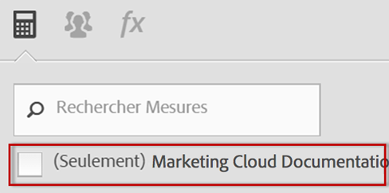

# Questions fréquentes

Les modifications suivantes apportées à la manière dont les mesures calculées fonctionnent dans [!DNL Analytics] peuvent avoir un impact sur vous.

[Comment puis-je accéder au créateur de mesures calculées ?](/help/components/c-calcmetrics/cm-transition.md#section_D9AE9A0ACF824BACB5D05F0C2F7E9CA1)

[Comment puis-je accéder au Gestionnaire de mesures calculées ?](/help/components/c-calcmetrics/cm-transition.md#section_DD0BD13E9EC940268EBE8BC88241A152)

[Pourquoi vois-je de nombreuses mesures calculées avec le même nom ?](/help/components/c-calcmetrics/cm-transition.md#section_E15C5B6CCC58498CAEC3FBDA8988F0A1)

[Qu’est-il advenu de mes mesures calculées globales ?](/help/components/c-calcmetrics/cm-transition.md#section_7351D4C7361F4ABAA1B43F8E89AAD211)

[Qu’est-il advenu des mesures calculées globales qui étaient partagées au sein des sociétés de connexion ?](/help/components/c-calcmetrics/cm-transition.md#section_59E5CD948ED643AE9AD3D2E4277647F8)

[Qu’est-il advenu des mesures calculées avec une classification numérique ou numérique2 ?](/help/components/c-calcmetrics/cm-transition.md#section_71AFE6C4A7CD4AA19AB3A9D3C41D115B)

[Qu’est-il advenu des mesures de durée de vie ?](/help/components/c-calcmetrics/cm-transition.md#section_AEDB02EF24584DAD8731BED9DDCE4F48)

[Qu’ai-je besoin de savoir sur les mesures calculées selon les mesures Visiteur unique quotidiennes/hebdomadaires/mensuelles/annuelles ?](/help/components/c-calcmetrics/cm-transition.md#section_E9A77EBB41CE4881B196CC1C282B2DF3)

[Qu’en est-il des mesures calculées créées ou gérées avec les méthodes de l’ancienne API de suite de rapports ?](/help/components/c-calcmetrics/cm-transition.md#section_13ED1BAD02634674BDAEB479B060A4B6)

[Les données actives prennent-elles en charge tous les types de mesures calculées ?](/help/components/c-calcmetrics/cm-transition.md#section_1DAA718BB8DB4413BAF8AD4B4FAAFFA2)

[Que signifie « Aucun nom fourni » en association avec des mesures calculées migrées ?](/help/components/c-calcmetrics/cm-transition.md#section_C90CBB72A67644F38D583301981F8D03)

[Qu’advient-il des mesures calculées d’un utilisateur si cet utilisateur a été supprimé ?](/help/components/c-calcmetrics/cm-transition.md#section_42ED4C15830540879C4A161423690E5A)

[Pourquoi vois-je des mesures calculées « inconnues » qui ne sont pas valides pour d’autres suites de rapport même si elles peuvent être créées et appliquées à ces suites de rapports ?](/help/components/c-calcmetrics/cm-transition.md#section_6772818EFDED46E9B7095D64C3B77211)

[Pourquoi des modifications que j’ai apportées à mes mesures calculées héritées n’ont-elles pas été enregistrées ?](/help/components/c-calcmetrics/cm-transition.md#section_81CDEFCA1FD542579AF183DA1494EAF0)

[Pourquoi mes mesures calculées ne s’affichent-elles pas dans le rapport Canaux marketing ?](/help/components/c-calcmetrics/cm-transition.md#section_FC350359A775433AB5F43C7CAB304D62)

[Pourquoi certaines des mesures calculées affichent-elles des formules sans les parenthèses que j’ai ajoutées ?](/help/components/c-calcmetrics/cm-transition.md#section_AC0D1E9714AD487F9A1C73359F518B5E)

[(Ad Hoc Analysis uniquement) Les mesures calculées avec des définitions de segment incorporées ou insérées sont-elles toujours prises en charge ?](/help/components/c-calcmetrics/cm-transition.md#section_B25C924A282F49388AB604E3D826F44C)

[(Report Builder uniquement) Pourquoi les mesures calculées ont-elles disparu de mes demandes ?](/help/components/c-calcmetrics/cm-transition.md#section_DA4792FE5D7945218CD5E6328DE08E82)

[Comment fonctionnent les totaux des mesures calculées ?](/help/components/c-calcmetrics/cm-transition.md#section_57BA3A299C7948ABB82B0392A9B0F33E)

## Comment puis-je accéder au créateur de mesures calculées ? {#section_D9AE9A0ACF824BACB5D05F0C2F7E9CA1}

* Click **[!UICONTROL + Add]** at the top of the Calculated Metric Manager, or
* In any Analytics report, click the Metrics icon   to the left of a report to bring up the Metrics rail, then click **[!UICONTROL Add]**.

## Comment puis-je accéder au Gestionnaire de mesures calculées ? {#section_DD0BD13E9EC940268EBE8BC88241A152}

* Go to  **[!UICONTROL Analytics]** > **[!UICONTROL Components]** in the left navigation. Ensuite, cliquez sur **[!UICONTROL Calculated Metrics]**.

* In any [!DNL Analytics] report, click the Metrics icon   to the left of a report to bring up the Metrics rail, then click **[!UICONTROL Manage]**.

## Pourquoi vois-je de nombreuses mesures calculées avec le même nom ? {#section_E15C5B6CCC58498CAEC3FBDA8988F0A1}

(Auparavant, les mesures calculées globales n’appartenaient à aucun utilisateur administrateur spécifique et étaient visibles par tous les utilisateurs de cette suite de rapports. Les mesures étaient séparées par suite de rapports. Si une mesure d’une suite de rapports porte le même nom qu’une mesure d’une suite de rapports différente, elle apparaîtra simplement aux utilisateurs comme la même mesure lorsqu’ils changeront de suite de rapports.)

Désormais, les mesures ne sont plus séparées par des suites de rapports. Si une mesure d’une suite de rapports porte le même nom qu’une mesure d’une suite de rapports différente, elle est visible dans le créateur de mesures calculées ainsi que dans le sélecteur de mesures et peut apparaître sous la forme de mesures , même si elles ont ou non la même définition.

Vous voyez plusieurs mesures calculées avec le même nom (mais créées dans différentes suites de rapport) uniquement si vous avez désactivé la case à cocher (Uniquement `<report suite>`) comme illustré ci-dessous :

**Ce que vous devez faire**

Envisagez de consolider les mesures calculées avec des noms et des définitions similaires, mais soyez prudent lorsque vous le faites. Vous pouvez vérifier la suite de rapports pour une mesure calculée dans le Gestionnaire de mesures calculées afin de vérifier sa suite de rapports d’origine. Vous devez également vérifier les définitions des mesures lors de la suppression des  potentielles afin de vous assurer que vous consolidez correctement les mesures.

>[!NOTE] Même si les mesures calculées ne sont plus liées à une suite de rapports spécifique et peuvent être utilisées pour n’importe quelle suite de rapports visible de la société de connexion, la suite de rapports sous laquelle la mesure calculée a été créée ou enregistrée en dernier est toujours visible dans le Gestionnaire de mesures calculées.

>[!NOTE] Même si une mesure calculée est supprimée, tout rapport de signets ou de tableau de bord qui référence cette mesure fonctionne toujours.

## Qu’est-il advenu de mes mesures calculées globales ? {#section_7351D4C7361F4ABAA1B43F8E89AAD211}

(Antérieurement, un administrateur pouvait créer des mesures calculées, connues sous le nom de « mesures calculées globales » ou « mesures calculées de la suite de rapports », dans une suite de rapports par l’intermédiaire des outils d’administration.

Les mesures calculées globales sont désormais détenues par le premier utilisateur administrateur dans le de connexion  les utilisateurs administrateurs. Ils seront partagés avec &quot;Tout le monde&quot; par défaut. Ce modèle suit le même modèle de partage et les mêmes plans de migration que les segments.

**Ce que vous devez faire**

Rien. Toutefois, le nouveau propriétaire administrateur doit faire preuve de prudence lors de la modification ou de la suppression de ces mesures calculées : elles peuvent être utilisées dans un certain nombre de rapports et de  en signet.

>[!NOTE] Même si une mesure calculée est supprimée, tout rapport de signets ou de tableau de bord qui référence cette mesure fonctionne toujours.

## Qu’est-il advenu des mesures calculées globales qui étaient partagées au sein des sociétés de connexion ? {#section_59E5CD948ED643AE9AD3D2E4277647F8}

(Antérieurement, un administrateur pouvait créer des mesures calculées, connues sous le nom de « mesures calculées globales » ou « mesures calculées de la suite de rapports », dans une suite de rapports par l’intermédiaire des outils d’administration. Ces mesures peuvent ensuite être &quot;partagées&quot; entre les  de connexion en ajoutant la suite de rapports à plusieurs  de connexion.)

Les mesures calculées globales ne peuvent plus être partagées entre les  de connexion. Ils ne sont plus liés ou liés à une suite de rapports spécifique, mais sont liés à un de connexion spécifique. Mesures calculées qui ont été partagées entre les de connexion

* ont été migrées vers toutes les sociétés de connexion avec accès à cette suite de rapports ;
* prendront comme valeur par défaut « partagées avec tout le monde » ;
* Seront des copies indépendantes de toutes les autres sociétés de connexion.

>[!NOTE] Si la mesure calculée a été utilisée dans un signet, un tableau de bord, une alerte ou un rapport planifié, la modification de la nouvelle copie N’affecte PAS l’ancienne mesure calculée conservée.

## Qu’est-il advenu des mesures calculées avec une classification numérique ou numérique2 ? {#section_71AFE6C4A7CD4AA19AB3A9D3C41D115B}

(Previously, calculated metrics with a Numeric or Numeric2 classification were only visible in [!UICONTROL Reports & Analytics], [!UICONTROL Report Builder], and the APIs.)

Now, calculated metrics with a Numeric or Numeric2 classification will continue to be visible in [!UICONTROL Reports & Analytics], [!UICONTROL Report Builder], and the APIs. Néanmoins, elles ne seront pas prises en charge dans un rapport avec un segment appliqué.

En outre, les mesures calculées avec une classification numérique ou numérique 2 ne seront pas prises en charge dans les composants suivants : [!UICONTROL Ad Hoc Analysis], [!UICONTROL Analysis Workspace][!UICONTROL Real-Time] , rapports, [!UICONTROL Anomaly Detection]et [!UICONTROL Contribution Analysis]. Lorsque vous créez ou modifiez une mesure calculée avec une classification numérique ou numérique2, un avertissement de compatibilité s’affiche indiquant que la mesure calculée n’est pas compatible avec certaines zones du produit.

**Ce que vous devez faire**

Evitez de créer des mesures calculées avec des classifications Numérique1 ou Numérique2 si la mesure est destinée à être utilisée avec un segment ou avec l’un des composants non compatibles.

## Qu’est-il advenu des mesures de durée de vie ? {#section_AEDB02EF24584DAD8731BED9DDCE4F48}

Les mesures de durée de vie ne sont plus prises en charge et ne sont plus visibles dans l’interface utilisateur des [!UICONTROL Reports & Analytics] ou toute autre interface utilisateur. Elles ne peuvent pas être interrogées par l’API Rapport.

Les signets, les , les rapports planifiés ou les alertes qui contenaient une mesure en cours d’exécution continueront de s’exécuter sans cette mesure tant qu’au moins une autre mesure valide figure également sur le rapport. Si la seule mesure sur le signet, le , le rapport planifié ou l’alerte est une mesure de tout temps, le rapport ne s’exécute plus.

## Qu’ai-je besoin de savoir sur les mesures calculées selon les mesures Visiteur unique quotidiennes/hebdomadaires/mensuelles/annuelles ? {#section_E9A77EBB41CE4881B196CC1C282B2DF3}

Calculated metrics based on Unique Visitor metrics will be visible in the following [!DNL Analytics] components: [!UICONTROL Reports & Analytics], [!UICONTROL Report Builder], and Reporting API.

Toutefois, ces mesures ne seront pas prises en charge dans les composants suivants : [!UICONTROL Segments], [!UICONTROL Analysis Workspace][!UICONTROL Real-Time] , rapports, [!UICONTROL Anomaly Detection]et [!UICONTROL Contribution Analysis]. Lorsque vous créez ou modifiez une mesure calculée basée sur des mesures Visiteurs uniques, un avertissement de compatibilité s’affiche indiquant que la mesure n’est pas compatible avec certaines zones du produit.

Vous utilisez une mesure de unique de base sur un rapport avec un segment. Vous pouvez créer une mesure calculée basée sur une mesure Visiteur unique. Néanmoins, cette mesure calculée ne peut pas être appliquée à un rapport avec un segment. Elle ne peut pas non plus comporter un segment incorporé.

## Qu’en est-il des mesures calculées créées ou gérées avec les méthodes de l’ancienne API de suite de rapports ? {#section_13ED1BAD02634674BDAEB479B060A4B6}

Auparavant, l’enregistrement d’une mesure calculée avec la méthode API (1.3 ou 1.4) ReportSuite.SaveCalculatedMetrics était identique à la création ou à la mise à jour d’une mesure calculée dans la console d’administration. Idem pour ReportSuite.DeleteCalculatedMetrics. En outre, le  des mesures calculées affiché dans la console d’administration ou lors de l’appel de ReportSuite.GetCalculatedMetrics était le même.

À présent, les méthodes API ReportSuite CalculatedMetrics (1.3 ou 1.4) continueront à enregistrer, supprimer ou récupérer les mesures calculées en utilisant l’ancienne boutique. Les mesures calculées existantes seront migrées et visibles dans le nouveau créateur de mesures calculées. **Les nouvelles mesures calculées créées à l’aide des méthodes API ne sont visibles que dans l’API. Elles seront toujours utilisables dans l’API  de.**

**Ce que vous devez faire**

Si vous devez utiliser à la fois l’API et le créateur de mesures calculées, arrêtez d’utiliser les méthodes API ReportSuite CalculatedMetrics et utilisez plutôt les nouvelles méthodes API CalculatedMetrics (Get, Save, Delete et GetFunctions).

## Les données actives prennent-elles en charge tous les types de mesures calculées ? {#section_1DAA718BB8DB4413BAF8AD4B4FAAFFA2}

Les données actives ne prennent pas en charge les mesures calculées qui contiennent des segments ou des fonctions statistiques. Les seules fonctions prises en charge sont les fonctions mathématiques de base telles que l&#39;addition, la suppression, la multiplication, la division et la négation (-x).

## Que signifie « Aucun nom fourni » en association avec des mesures calculées migrées ? {#section_C90CBB72A67644F38D583301981F8D03}

« Aucun nom fourni » signifie qu’aucun nom de mesure n’est associé à cette mesure migrée (juste une formule sans nom explicite).

## Qu’advient-il des mesures calculées d’un utilisateur si cet utilisateur a été supprimé ? {#section_42ED4C15830540879C4A161423690E5A}

Toutes les mesures calculées que cet utilisateur a créées sont également supprimées. Toutefois, les mesures calculées supprimées fonctionneront toujours dans le cadre des signets enregistrés, des  de ou des rapports planifiés.

## Pourquoi vois-je des mesures calculées « inconnues » qui ne sont pas valides pour d’autres suites de rapport même si elles peuvent être créées et appliquées à ces suites de rapports ? {#section_6772818EFDED46E9B7095D64C3B77211}

L’interface utilisateur affiche « inconnu » si la mesure calculée contient des mesures ou des dimensions de base qui n’existent pas pour la suite de rapports sélectionnée.

## Pourquoi des modifications que j’ai apportées à mes mesures calculées héritées n’ont-elles pas été enregistrées ? {#section_81CDEFCA1FD542579AF183DA1494EAF0}

Cela peut être dû au moment de la migration vers la nouvelle base de données de mesures calculées, qui s’est déroulée du 15 au 18 juin 2015.

**Ce que vous devez faire**

Vous devrez rétablir les modifications que vous avez apportées à vos mesures héritées.

## Pourquoi mes mesures calculées ne s’affichent-elles pas dans le rapport Canaux marketing ? {#section_FC350359A775433AB5F43C7CAB304D62}

(Auparavant, toutes les mesures calculées étaient répertoriées dans le sélecteur de mesures sur les rapports de marketing avec une option Première touche et Dernière touche.)

Désormais, seules les mesures calculées dont le type d’allocation est spécifiquement défini sur Première touche ou Dernière touche dans le créateur de mesures calculées sont disponibles dans le sélecteur de mesures sur les rapports  de Marketing Cloud. Notez que toutes les mesures calculées déjà appliquées aux rapports de marketing continueront d’être appliquées et fonctionnent comme auparavant. Pour créer une mesure calculée pour les  Marketing, cliquez sur l’icône de configuration dans le créateur de mesures et sélectionnez Première touche ou Dernière touche comme type d’allocation. Gardez à l’esprit qu’une telle opération rend la mesure calculée compatible uniquement avec les rapports Canal marketing et elle ne pourra pas être utilisée pour d’autres rapports.

## Pourquoi certaines des mesures calculées affichent-elles des formules sans les parenthèses que j’ai ajoutées ? {#section_AC0D1E9714AD487F9A1C73359F518B5E}

Au cours de la migration, Adobe a supprimé les parenthèses superflues de certaines formules. Seules les parenthèses qui n’affectent pas la manière dont la mesure est calculée ont été supprimées. Cela ne modifie pas les données, mais simplifie juste la formule.

## (Ad Hoc Analysis uniquement) Les mesures calculées avec des définitions de segment incorporées ou insérées sont-elles toujours prises en charge ? {#section_B25C924A282F49388AB604E3D826F44C}

Les mesures calculées créées dans les ad hoc   pouvaient auparavant contenir des définitions de segment intégrées. Ce n&#39;est plus possible.

**Ce que vous devez faire**

Vous devez enregistrer explicitement le segment. Les mesures calculées existantes avec des définitions de segment insérées continuent à s’exécuter correctement et peuvent être visualisées dans les Ad Hoc Analysis mais elles ne peuvent pas être enregistrées sans enregistrer explicitement le segment.

## (Report Builder uniquement) Pourquoi les mesures calculées ont-elles disparu de mes demandes ? {#section_DA4792FE5D7945218CD5E6328DE08E82}

Si la demande a été créée dans la version 5.2 et qu’elle contient des mesures calculées, ces mesures ne sont pas visibles dans la version 5.1 (ou des versions antérieures). En effet, les mesures calculées utilisent désormais des ID globaux (identifiants non spécifiques à une suite de rapports).

**Ce que vous devez faire**

Vous devez effectuer la mise à niveau vers la version 5.2 pour pouvoir voir ces mesures.

## Comment fonctionnent les totaux des mesures calculées ? {#section_57BA3A299C7948ABB82B0392A9B0F33E}

When [!UICONTROL Reports & Analytics] shows a calculated metrics total in [!UICONTROL Reports & Analytics], it&#39;s just applying the formula to the total. Par exemple, le total de la mesure calculée Commandes/visite prend le total des commandes et le divise par le total des visites. Dans certains cas, cependant, le total de la mesure calculée n’est pas seulement la somme des éléments de ligne, mais un total pour le site.

Exemple 1 : d&#39;un terme de recherche : le même a peut-être recherché plusieurs termes. Dans ce cas, le nombre total de n’est donc pas égal à la somme des éléments de ligne.

Exemple 2 : pages vues sur les produits : comme le panier comporte plusieurs produits, il existe plusieurs pages vues pour le panier. Pour plus d’informations sur la comparaison de la somme des éléments de ligne avec les totaux des rapports, consultez [cet article](https://helpx.adobe.com/fr/analytics/kb/sum-line-items-different-from-total.html)de la base de connaissances.
