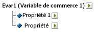
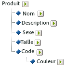

# À propos des sous-classifications

Adobe Analytics prend en charge les modèles de classification à niveau unique et à plusieurs niveaux. Une hiérarchie de classification vous permet d’appliquer une classification à une autre classification.

> [!NOTE] Une sous-classification fait référence à la possibilité de créer des classifications de classification. However, this is not the same as a [!UICONTROL Classification Hierarchy] used to create [!UICONTROL Hierarchy] reports. Pour plus d’informations sur les hiérarchies de classification, voir [Hiérarchies de classification](classification-hierarchies.md).

Par exemple :

Chaque classification de ce modèle est indépendante et correspond à un nouveau sous-rapport pour la variable  de sélectionnée. En outre, chaque classification constitue une colonne de données dans le fichier de données, avec le nom de la classification comme en-tête de colonne. Par exemple :

| CLÉ | PROPRIÉTÉ 1 | PROPRIÉTÉ 2 |
|---|---|---|
| 123 | ABC | A12B |
| 456 | DEF | C3D4 |

Pour plus d’informations sur le fichier de données, consultez  [Fichiers de données de classification](/help/components/c-classifications2/c-classifications-importer/c-saint-data-files.md).

Les classifications à plusieurs niveaux sont composées de classifications parentes et enfants. Par exemple :

**Classifications parentes** : une classification parente est une classification associée à une classification fille. Une classification peut être une classification parente et fille. Les classifications parentes de niveau supérieur correspondent à des classifications à niveau unique (Voir  [Classifications à niveau unique](/help/components/c-classifications2/c-sub-classifications.md)).

**Classifications enfants** : une classification enfant est une classification qui possède une autre classification en tant que parent à la place de la variable. Les classifications enfants fournissent des informations supplémentaires sur leur classification parente. Par exemple, une [!UICONTROL Campaigns] classification peut avoir une classification enfant Propriétaire Campaign. [!UICONTROL Numeric] les classifications fonctionnent également comme des mesures dans les rapports de classification.

Chaque classification, parent ou enfant, constitue une colonne de données dans le fichier de données. En-tête de colonne pour une classification enfant utilisant le format d’affectation de nom suivant :

`<parent_name>^<child_name>`

Pour plus d’informations sur le format de fichier de données, voir [Fichiers de données de classification](/help/components/c-classifications2/c-classifications-importer/c-saint-data-files.md).

Par exemple :

| CLÉ | PROPRIÉTÉ 1 | Property 1&amp;Hat;Property 1-1 | Property 1&amp;Hat;Property 1-2 | Propriété 2 |
|---|---|---|---|---|
| 123 | ABC | Vert | Petite | A12B |
| 456 | DEF | Rouge  | Grande | C3D4 |

Bien que le modèle de fichier d’une classification à plusieurs niveaux soit plus complexe, la puissance des classifications à plusieurs niveaux réside dans le fait que des niveaux distincts peuvent être téléchargés sous forme de fichiers distincts. Cette approche peut être utilisée pour minimiser la quantité de données à télécharger périodiquement (quotidiennement, hebdomadairement, etc.) en regroupant les données dans des niveaux de classification qui changent au fil du temps par rapport à ceux qui ne changent pas.

> [!NOTE] Si la [!UICONTROL Key] colonne d’un fichier de données est vide, Adobe génère automatiquement des clés uniques pour chaque ligne de données. Pour éviter toute corruption de fichier lors du transfert d’un fichier de données avec des données de classification de deuxième niveau ou de niveau supérieur, utilisez un astérisque (*) pour remplir chaque ligne de la [!UICONTROL Key] colonne.

Pour plus d’informations sur la résolution des problèmes, reportez-vous à la section [Problèmes de téléchargement de classifications courants](https://marketing.adobe.com/resources/help/en_US/home/index.html#kb-common-saint-upload-issues).

## Exemples

>[!NOTE] Les données de classification de produit sont limitées aux attributs de données correspondant directement au produit, Les données ne se limitent pas à la manière dont les produits sont classés ou vendus sur le site Web. Les éléments de données tels que les  de vente, les noeuds de navigation du site ou les articles de vente ne sont pas des données de classification de produit. Ces éléments sont plutôt capturés dans les variables de conversion des rapports.

Lors du téléchargement de fichiers de données pour cette classification de produit, vous pouvez télécharger les données de classification sous la forme d’un fichier unique ou de plusieurs fichiers (voir ci-dessous). En séparant le code de couleur du fichier 1 et le nom de la couleur du fichier 2, les données relatives au nom de la couleur (qui peuvent ne correspondre qu&#39;à quelques lignes) doivent être mises à jour uniquement lors de la création de nouveaux codes de couleur. Cela a pour effet d’éliminer le champ du nom de la couleur (CODE&amp;Hat;COLOR) du fichier 1, qui est mis à jour plus souvent, et de réduire la complexité et la taille du fichier lors de la création du fichier de données.

### Classification de produit - fichier unique {#section_E8C5E031869C449F9B636F5EB3BFEC17}

| CLÉ | NOM DU PRODUIT | DÉTAILS DU PRODUIT | SEXE | TAILLE | CODE | CODE&amp;Hat;COLOR |
|---|---|---|---|---|---|---|
| 410390013 | Polo-SS | Polo homme, manches courtes (M,01) | L | L | 01 | Pierre |
| 410390014 | Polo-SS | Polo homme, manches courtes (L,03) | L | L | 03 | Bruyère |
| 410390015 | Polo-LS | Polo femme, manches longues (S,23) | Ve | S | 23 | Aqua |

### Classification de produit - plusieurs fichiers (fichier 1)  {#section_A99F7D0F145540069BA4EEC0597FF13F}

| CLÉ | NOM DU PRODUIT | DÉTAILS DU PRODUIT | SEXE | TAILLE | CODE |
|---|---|---|---|---|---|
| 410390013 | Polo-SS | Polo homme, manches courtes (M,01) | L | L | 01 |
| 410390014 | Polo-SS | Polo homme, manches courtes (L,03) | L | L | 03 |
| 410390015 | Polo-LS | Polo femme, manches longues (S,23) | Ve | S | 23 |

### Classification de produit - plusieurs fichiers (fichier 2)  {#section_19ED95C33B174A9687E81714568D56A3}

| CLÉ | CODE | CODE&amp;Hat;COLOR |
|---|---|---|
| * | 01 | Pierre |
| * | 03 | Bruyère |
| * | 23 | Aqua |
