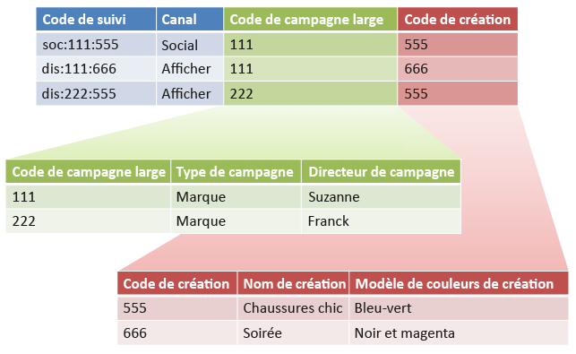
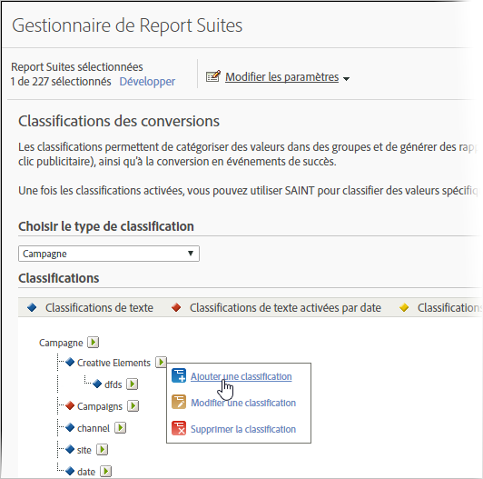

# Sous-classifications et Créateur de règles – Cas d’utilisation

Vous pouvez associer le Créateur de règles de classifications à des sous-classifications afin de simplifier la gestion des classifications et de réduire le nombre de règles requises. Vous pouvez procéder de la sorte si votre code de suivi se compose de codes que vous souhaitez classer séparément.

## Sous-classifications et Créateur de règles – Cas d’utilisation {#concept_6C8672C242544D7487E82886BBFABE6E}

Vous pouvez associer le Créateur de règles de classifications à des sous-classifications afin de simplifier la gestion des classifications et de réduire le nombre de règles requises. Vous pouvez procéder de la sorte si votre code de suivi se compose de codes que vous souhaitez classer séparément.

Voir [Sous-classifications](/help/components/c-classifications2/c-sub-classifications.md) pour obtenir des informations conceptuelles sur les sous-classifications.

**Exemple**

Prenons comme exemple le code de suivi ci-dessous :

`channel:broad_campaign:creative`

Une hiérarchie de classification vous permet d’appliquer une classification à une autre (appelée *`sub-classification`*). En d’autres termes, vous pouvez utiliser l’importateur comme une base de données relationnelle, avec plusieurs tables. Une table fait correspondre des codes de suivi complets à des clés, tandis qu’une autre fait correspondre ces clés à d’autres tables.

Une fois cette structure en place, vous pouvez utiliser le [Créateur de règles de classifications](/help/components/c-classifications2/crb/classification-rule-builder.md) pour télécharger des petits fichiers qui mettent uniquement à jour les tables de recherche (tables de couleurs verte et rouge dans l’image précédente). Vous pouvez ensuite utiliser le créateur de règles pour assurer la mise à jour du tableau de classification principal.

La tâche ci-dessous décrit la marche à suivre.

## Configurer des sous-classifications à l’aide du Créateur de règles {#task_2D9016D8B4E84DBDAF88555E5369546F}

<!-- 

t_rule_builder_subclass.xml

 -->

Cette procédure décrit le téléchargement de sous-classifications à l’aide du Créateur de règles.

>[!NOTE]
>
>Ces étapes décrivent la procédure à suivre pour réaliser le cas d’utilisation décrit dans [Sous-classifications et Créateur de règles](/help/components/c-classifications2/crb/sub-classification-rule-builder.md).

1. Créez des classifications et des sous-classifications dans le [Gestionnaire de classifications](https://marketing.adobe.com/resources/help/en_US/reference/classifications.html).

   Exemple :

   

1. Dans [Créateur de règles de classifications](/help/components/c-classifications2/crb/classification-rule-builder.md), classez la clé de sous-classification à partir du code de suivi d’origine.

   Pour ce faire, utilisez une expression régulière. Dans cet exemple, la règle servant à compléter *`Broad Campaign code`* utilisera cette expression régulière :

   | `#` | Type de règle | Correspond à | Définir la classification | À |
   |---|---|---|---|---|
   |  | Expression régulière | `[^\:]:([^\:]):([^\:]`) | Code de campagne large | `$1` |
   |  | Expression régulière | `[^\:]:([^\:]):([^\:]`) | Code de création | `$2` |

   >[!NOTE]
   >
   >À ce stade, vous ne complétez pas les sous-classifications *`Campaign Type`* et *`Campaign Director`*.

1. Téléchargez un fichier de classification contenant uniquement les sous-classifications spécifiées.

   Voir [Classifications à plusieurs niveaux](/help/components/c-classifications2/c-sub-classifications.md).

   Exemple :

   | Clé | Canal | Code de campagne large | Broad Campaign code&amp;Hat;Campaign type | Broad Campaign code&amp;Hat;Campaign Director | ... |
   |---|---|---|---|---|---|
   | * |  | 111 | Marque | Suzanne |  |
   | * |  | 222 | Marque | Frank |  |

1. Pour gérer les tables de recherche, téléchargez un petit fichier (comme illustré ci-dessus).

   Le téléchargement de ce fichier sera effectué, par exemple, lors de l’insertion d’un nouveau *`Broad Campaign code`*. Ce fichier s’appliquera aux valeurs classées précédemment. De même, si vous créez une sous-classification (telle que *`Creative Theme`* en tant que sous-classification de *`Creative code`*), vous ne téléchargerez que le fichier de sous-classification, au lieu de l’intégralité du fichier de classification.

   Dans le cadre de la création de rapports, ces sous-classifications se comportent exactement comme des classifications de niveau supérieur. Cela a pour effet d’alléger la charge de gestion associée à leur utilisation.
