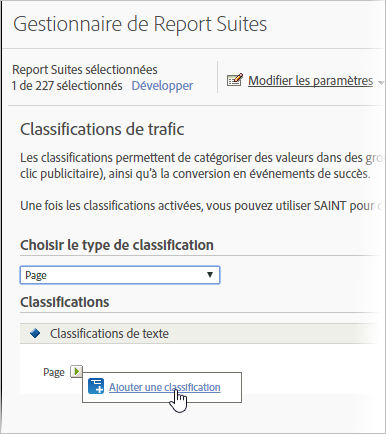

# Classifications de trafic

Les classifications de trafic vous permettent de classifier des variables de trafic (props). Elles ne peuvent utiliser que des classifications de texte.

## Classifications de trafic {#concept_028079B29A9C412AA68910A87E11176F}

Les classifications de trafic vous permettent de classifier des variables de trafic (props). Elles ne peuvent utiliser que des classifications de texte.

La page Classifications de trafic permet de créer des classifications pour les suites de rapports sélectionnées. Une fois classifié, tout rapport pouvant être généré en utilisant les données clés peut également l’être à l’aide des attributs associés.

Après avoir activé les classifications, utilisez [l’importateur de classifications](/help/components/c-classifications2/c-classifications-importer/c-working-with-saint.md) pour affecter des valeurs spécifiques à la classification appropriée.

## Ajouter une classification de trafic {#task_4DB49CCB1D764483907BC33A5CEB7315}

<!-- 

t_classification_add_traffic.xml

 -->

Cette procédure décrit l’ajout ou la modification de classifications pour les suites de rapports sélectionnées.

1. Cliquez sur **[!UICONTROL Admin]** &gt; **[!UICONTROL Suites de rapports]** dans l’en-tête de la suite.
1. Sélectionnez une suite de rapports.
1. Dans le champ **[!UICONTROL Choisir le type de classification]**, sélectionnez la variable qui doit contenir une classification.
1. Cliquez sur **[!UICONTROL Modifier les paramètres]** &gt; **[!UICONTROL Trafic]** &gt; **[!UICONTROL Classifications de trafic]**.

   

1. Survolez l’icône **[!UICONTROL Modifier la classification]** avec votre souris, puis sélectionnez **[!UICONTROL Ajouter une classification]** ou **[!UICONTROL Modifier la classification]**.
1. Dans la boîte de dialogue **[!UICONTROL Classifications de texte]**, configurez la classification selon vos besoins:

   **[!UICONTROL Nom]** : indiquez le nom de la classification.

   **[!UICONTROL Description]** : fournissez une description plus détaillée.
1. Cliquez sur **[!UICONTROL Enregistrer]**.
