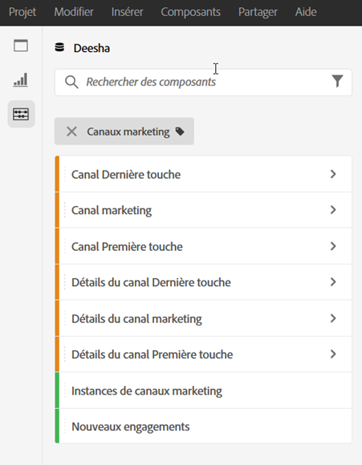
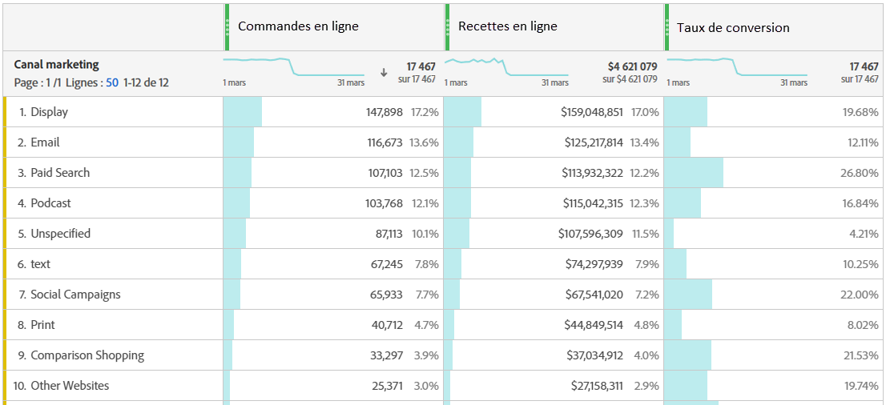
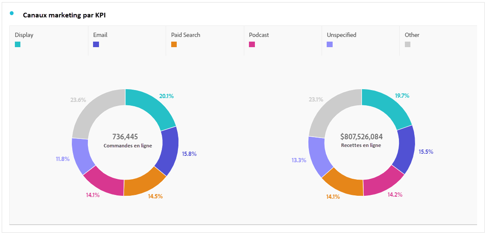
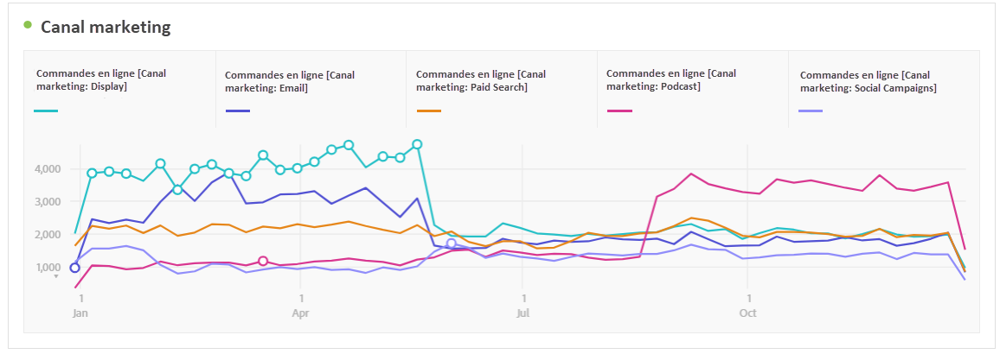
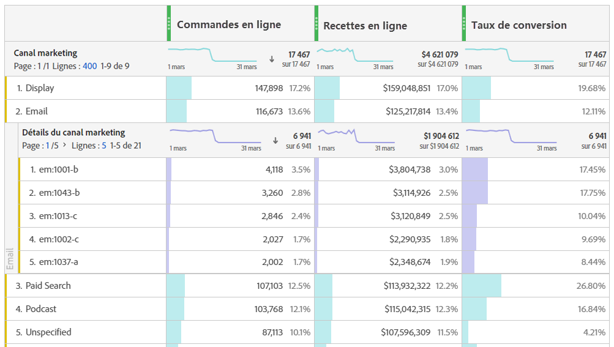
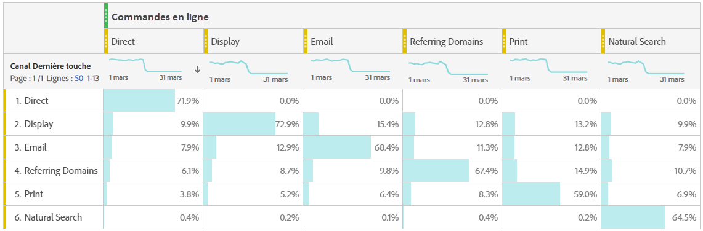

# Analyse des canaux marketing

>[!NOTE]
>
>Afin d’optimiser l’efficacité des canaux marketing pour l’attribution et Adobe Analytics, nous avons publié quelques [bonnes pratiques révisées](/help/components/c-marketing-channels/mchannel-best-practices.md).
>
>Les administrateurs et administratrices d’Analytics peuvent gérer les canaux marketing pour leurs organisations, comme décrit dans la section [Gestion des canaux marketing](/help/admin/tools/manage-rs/edit-settings/marketing-channels/c-channels.md).

Vous souhaitez probablement savoir lequel de vos canaux marketing est le plus efficace et avec qui, afin de mieux cibler vos efforts et de bénéficier d’un meilleur retour sur votre investissement en marketing. Dans Adobe Analytics, les dimensions et les mesures des canaux marketing de Workspace sont l’un des outils qui peuvent vous aider à suivre l’influence de différents canaux sur vos commandes, recettes, etc. et vous donner des informations utiles sur les canaux. Voici les dimensions et les mesures que vous pouvez utiliser en lien avec les canaux marketing :

| Dimension/Mesure | Définition |
| --- | --- |
| Canal marketing | Il s’agit de la dimension Canaux marketing recommandée. Les modèles d’attribution peuvent lui être appliqués au moment de l’exécution. Cette dimension se comporte de la même manière que la dimension Canal Dernière touche, mais elle est étiquetée différemment pour éviter toute confusion lors de son utilisation avec un modèle d’attribution différent. |
| Canal Dernière touche | Dimension héritée, avec modèle d’attribution Dernière touche préappliqué et non modifiable. |
| Canal Première touche | Dimension héritée, avec modèle d’attribution Première touche préappliqué et non modifiable. |
| Instances de canaux marketing | Cette mesure calcule le nombre de fois où un canal marketing a été défini dans une demande d’image, y compris les pages vues standards et les appels de liens personnalisés. N’inclut pas les valeurs persistantes. |
| Nouveaux engagements | Cette mesure est similaire aux instances, mais elle n’est incrémentée que lorsque le canal marketing Première touche est défini dans une demande d’image. |

## Analyse de base

Ce tableau à structure libre présente les mesures Commandes en ligne, Recettes en ligne et Taux de conversion pour chacun des Canaux marketing :

Vous voyez ici chaque mesure Commandes en ligne et Recettes en ligne par Canal marketing dans un graphique en anneau :

Ce graphique en courbes présente les tendances des Commandes en ligne pour divers canaux au fil du temps :

## Analyse avancée

Détail des canaux marketing permet d’approfondir les analyses de chaque canal pour vous montrer des campagnes ou des emplacements spécifiques par exemple. Vous pouvez ventiler chaque Canal marketing en détails :

## Application des modèles d’attribution

Vous pouvez utiliser [Attribution](/help/analyze/analysis-workspace/attribution/overview.md) pour appliquer instantanément différents modèles d’attribution :

Notez comment une même mesure (Commandes en ligne) génère des résultats différents lorsque vous appliquez différents modèles d’attribution.

## Analyse marketing entre onglets

En utilisant le Canal Première touche et le Canal Dernière touche hérités, vous pouvez obtenir des informations utiles sur les interactions de canal :

Pour en savoir plus sur l’analyse marketing entre onglets, consultez cette vidéo : [Utilisation de l’analyse croisée pour explorer l’attribution marketing de base dans Analysis Workspace](https://experienceleague.adobe.com/docs/analytics-learn/tutorials/analysis-workspace/attribution-iq/using-cross-tab-analysis-to-explore-basic-marketing-attribution-in-analysis-workspace.html?lang=fr).
