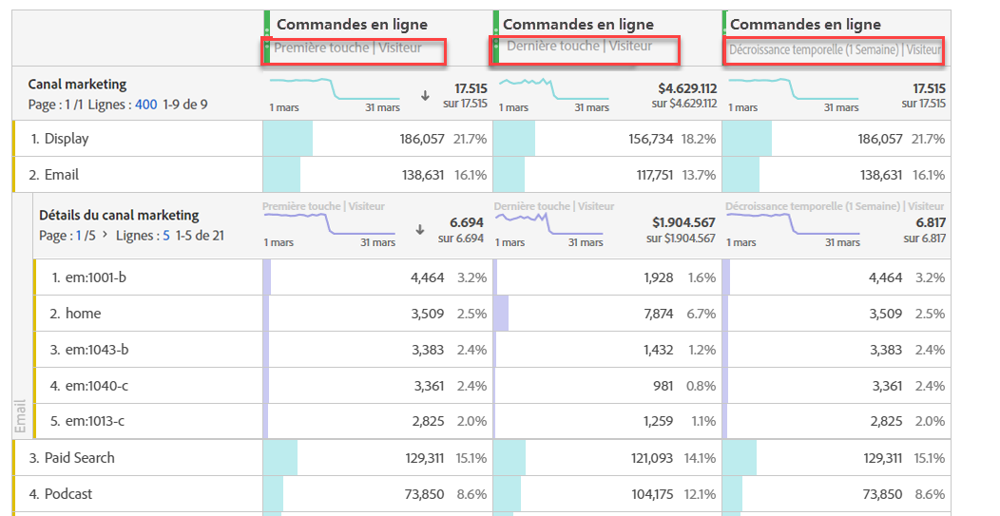

# Analyser les Canaux marketing

Vous souhaitez probablement savoir lequel de vos canaux marketing est le plus efficace et avec qui, afin de mieux cible vos efforts et de bénéficier d’un meilleur retour sur investissement marketing. Dans Adobe Analytics, les dimensions et les mesures des Canaux marketing de Workspace sont l’un des outils qui peuvent vous aider à suivre l’influence de différents canaux sur vos commandes, recettes, etc. et vous donner des informations utiles sur les canaux. Vous pouvez utiliser les dimensions et les mesures liées aux Canaux marketing :

| Dimension/Mesure | Définition |
|---|---|
| Canal marketing | Il s’agit de la dimension Canaux marketing recommandée à utiliser. Les modèles de QI d’attribution peuvent être appliqués à celui-ci au moment de l’exécution. Cette dimension se comporte de manière identique à la dimension Canal Dernière touche, mais elle est étiquetée différemment pour éviter toute confusion lors de son utilisation avec un modèle d’attribution différent. |
| Canal Dernière touche | Dimension héritée, avec modèle d’attribution Dernière touche préappliqué et non modifiable. |
| Canal Première touche | Dimension héritée, avec modèle d’attribution Première touche préappliqué et non modifiable. |
| Instances de canaux marketing | Cette mesure mesure mesure le nombre de fois où un canal marketing a été défini dans une demande d’image, y compris les vues de page standard et les appels de lien personnalisés. N’inclut pas les valeurs conservées. |
| Nouveaux engagements | Cette mesure est similaire aux instances, mais elle n’est incrémentée que lorsque le canal marketing Première touche est défini dans une demande d’image. |

## Analyse de base

Ce tableau à structure libre présente les mesures Commandes en ligne, Recettes en ligne et Taux de conversion pour chacun des Canaux marketing :

Vous voyez ici chaque Canal marketing Commandes en ligne et Recettes en ligne dans un graphique en anneau :

Ce graphique en courbes présente les tendances des commandes en ligne pour divers canaux au fil du temps :

## analyse avancée

Détails des Canaux marketing approfondissent les analyses de chaque canal pour vous montrer des campagnes, des emplacements, etc. spécifiques. Vous pouvez ventiler chaque Canal marketing en détails :

## Appliquer des modèles d’attribution

Vous pouvez utiliser le QI  d’attribution pour appliquer instantanément différents modèles d’attribution :

Notez comment une même mesure (Commandes en ligne) génère des résultats différents lorsque vous appliquez différents modèles d’attribution.

Voici quelques vidéos expliquant en détail l’identification de l’attribution : [Liste de lecture](https://www.youtube.com/playlist?list=PL2tCx83mn7GuDzYEZ8jQlaScruZr3tBTR)d’identification d’attribution.

## analyse marketing par onglets croisés

En utilisant l’ancien Canal Première touche et le Canal Dernière touche, vous pouvez obtenir une vue utile dans les interactions de canal :

Pour en savoir plus sur l’analyse marketing par onglets croisés, consultez [cette vidéo](https://www.youtube.com/watch?v=M3EOdONa-3E).
