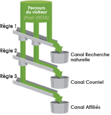

# Gestion des canaux marketing

Ajoutez ou activez des canaux marketing dans le Gestionnaire de canaux marketing. Dans le cas des suites de rapports sans canaux marketing, une configuration automatique vous permet de créer plusieurs canaux, ainsi que leurs règles. Vous pouvez modifier les canaux prédéfinis en fonction de vos besoins, ou créer vos propres canaux (avec un maximum de 25 canaux).

Voici quelques consignes concernant la création de canaux :

* Planifiez en dressant la liste de tous vos canaux afin que tous les accès des visiteurs soient classés dans le canal approprié.
* Incluez toujours les catégories d’accès [Interne](/help/components/c-marketing-channels/c-faq.md) et [Direct](/help/components/c-marketing-channels/c-faq.md).

Adding channels to the [!UICONTROL Marketing Channels] page is done independently of creating rules on the [Marketing Channel Processing Rules](/help/components/c-marketing-channels/c-rules.md) page. Vous associez des règles aux canaux lors de la création de règles.

## Ajout de canaux marketing {#add-mktg-channels}

Ajoutez des canaux marketing dans le Gestionnaire de canaux marketing.

> [!NOTE] Il est impossible de supprimer un canal. Si vous ne souhaitez pas utiliser un canal, vous pouvez le désactiver ou le renommer, et le conserver pour une utilisation ultérieure.

1. Cliquez sur **[!UICONTROL Analytics]** > **[!UICONTROL Admin]** > **[!UICONTROL Report Suites]**.
1. Sur la [!UICONTROL Report Suite Manager] page, sélectionnez une suite de rapports.

   Si vous sélectionnez plusieurs suites de rapports, choisissez un modèle à partir duquel copier les paramètres vers les suites de rapports sélectionnées.

   Reportez-vous à la section [Application des paramètres d’une suite de rapports modèle à plusieurs suites de rapports](/help/components/c-marketing-channels/c-getting-started-mchannel.md).

1. Cliquez sur **[!UICONTROL Edit Settings]** > **[!UICONTROL Marketing Channels]** > **[!UICONTROL Marketing Channel Manager]**.

   La page [Configuration automatique](/help/components/c-marketing-channels/c-getting-started-mchannel.md) s’affiche si aucun canal n’est défini dans votre suite de rapports.

1. Sur la [!UICONTROL Marketing Channel Manager] page, cliquez sur **[!UICONTROL Add Channel]**.

   Cette option n’est pas disponible lorsque 25 canaux ont été définis.

1. Cliquez sur **[!UICONTROL Save.]**
1. Pour configurer des règles pour le canal, cliquez sur **[!UICONTROL Marketing Channel Processing Rules]**.

   Reportez-vous à la section [Création de règles de traitement des canaux marketing](/help/components/c-marketing-channels/c-rules.md).

## Gestionnaire de canaux marketing - Définitions de l’interface {#mktg-channel-mgr}

Définition des champs de la [!UICONTROL Marketing Channel Manager] page.

| Champ | Définition |
|--- |--- |
| Activé | Active ou désactive ce canal marketing. |
| Nom du canal | Nom convivial du canal marketing. |
| Remplacer le canal Dernière touche | Cette option vous permet d’indiquer si un canal Dernière touche persistant doit être remplacé ou non par le canal sélectionné. Si vous activez cette case à cocher, un canal quelconque (y compris Direct et Interne) remplacera un canal Dernière touche existant. Cela se traduit par l’attribution d’une conversion à un canal qui ne doit peut-être pas bénéficier de crédit. Par exemple, cette option peut garantir que le canal Direct n’a pas reçu de crédit pour la conversion si l’utilisateur provenait précédemment du canal Recherche naturelle. |
| Ventilation de canal | Permet de ventiler un canal en fonction de cette valeur. You can add possible channel breakdowns (subchannels) when creating [marketing channel classifications](/help/components/c-marketing-channels/classifictions-mchannel.md). |
| Type | Indique comment l’utilisateur est parvenu sur votre site. Vous pouvez sélectionner En ligne ou Hors ligne. Utilisez des canaux en ligne pour les visiteurs qui viennent par l’intermédiaire d’un moteur de recherche ou d’une campagne par courriel. Les canaux hors connexion s’appliquent aux visiteurs qui ont trouvé le site par l’intermédiaire de bons dans les journaux ou de publicités dans des magazines. Les canaux hors connexion incluent habituellement les données importées depuis les Sources de données des rapports. Voir [Sources de données](https://docs.adobe.com/content/help/en/analytics/import/data-sources/datasrc-home.html). Voir [ Ajout de données hors ligne](/help/components/c-marketing-channels/c-getting-started-mchannel.md). |
| Couleur | La couleur associée à ce canal marketing. Cette couleur représente le canal sur le rapport Canal marketing. |

## Définir des canaux

Avant de pouvoir afficher les canaux et leurs données dans le rapport, créez les canaux et les règles sous-jacentes qui traitent les données. Vous pouvez également créer des montants de coûts et de budget pour les canaux associés, et spécifier la durée souhaitée d’engagement du visiteur. Les tâches de configuration du rapport sont effectuées dans les Outils d’administration.

Vous devez concevoir un canal comme un conteneur pour les visites. Les règles affectent des visites au conteneur approprié.

Adobe fournit plusieurs canaux prédéfinis au cours d’une [configuration automatique](/help/components/c-marketing-channels/c-getting-started-mchannel.md), que vous pouvez modifier en fonction de vos besoins.

>[!NOTE]
>
>Adobe conseille de définir le rapport dans une suite de rapports à utiliser comme modèle pour les tests. Le modèle sera ensuite utilisé pour appliquer les ensembles de canaux et de règles globalement à une ou plusieurs suites de rapports de production.
>
>Reportez-vous à la section [Application des paramètres d’une suite de rapports modèle à plusieurs suites de rapports](/help/components/c-marketing-channels/c-getting-started-mchannel.md).

### Conditions préalables {#prereqs}

En cas de besoin, contactez l’assistance clientèle pour obtenir de l’aide au sujet des conditions préalables :

* In the Administration Console (General Account Settings), enable the **[!UICONTROL Conversion Level]** (e-commerce) option for the report suite.

   Pour plus d’informations, consultez la section [Paramètres généraux du compte](https://docs.adobe.com/content/help/en/analytics/admin/admin-tools/general-acct-settings-admin.html) dans l’aide d’Analytics.

* Configurez l’accès aux dimensions Canal marketing.

   See [Marketing Channels permissions](/help/components/c-marketing-channels/c-channel-report-access.md).

* Ensure that your account manager has enabled **[!UICONTROL Channel Reports]** for your report suite.

### Remarques importantes concernant le traitement {#important-proc-rules}

* Le système traite les règles dans l’ordre spécifié ; lorsqu’une règle est vérifiée, le système cesse le traitement des règles restantes.
* Les règles peuvent accéder aux variables que VISTA a définies, mais pas aux données que VISTA a supprimées.
* Les canaux n’enregistrent que les mesures de conversion. Les mesures de trafic ne sont pas disponibles.
* Un même événement (tel qu’un achat ou un clic) n’est jamais porté au crédit de deux canaux marketing. En cela, les canaux marketing diffèrent des eVars (car deux eVars peuvent recevoir le crédit d’un seul et même événement).
* Le rapport peut traiter jusqu’à 25 canaux simultanément.

