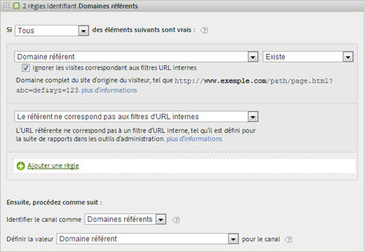
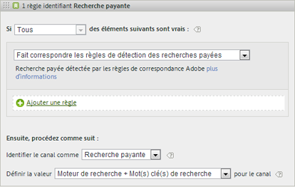
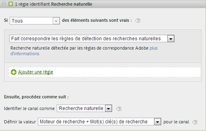
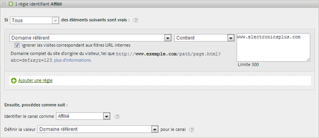
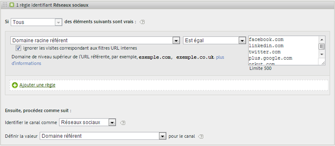
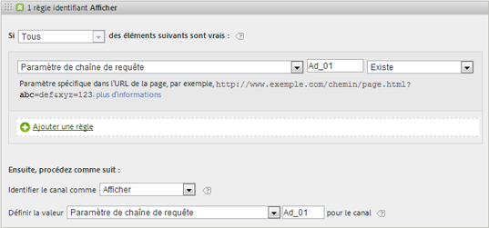
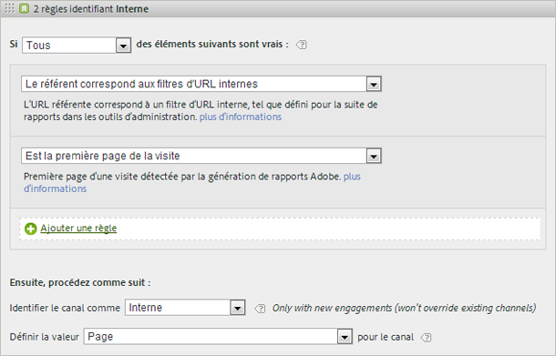
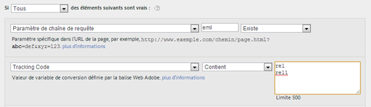
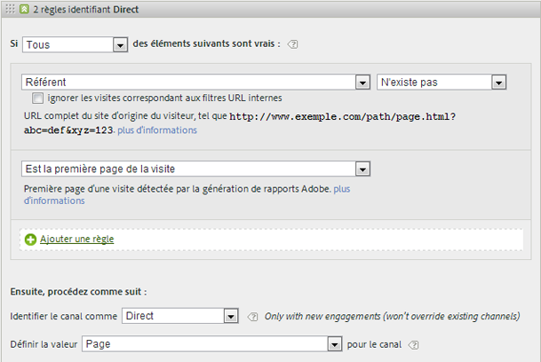

# Questions fréquentes et exemples

<!--
Read about best practices and examples of how to populate various rules you can set up for your marketing channels.

* [Frequently Asked Questions](/help/components/c-marketing-channels/c-faq.md#section_E490CEAF0E76422C91D34D8A80A0C573) 
* [No Channel Identified](/help/components/c-marketing-channels/c-faq.md##no-channel-identified) 
* [Paid Search](/help/components/c-marketing-channels/c-faq.md#section_E934BFE182E4404A93FE07AFEAE64DC1) 
* [Natural Search](/help/components/c-marketing-channels/c-faq.md#section_A4C6B8F0360449BE94F0128FF7C71386) 
* [Affiliates](/help/components/c-marketing-channels/c-faq.md#section_8D142C7074CD4DEC87DF55B691107622) 
* [Social Networks](/help/components/c-marketing-channels/c-faq.md#section_492B72A3B261479D9C84F631E90C03D8) 
* [Display](/help/components/c-marketing-channels/c-faq.md#section_4FD846B89FCE4ECFB7781BD02874A1AB) 
* [Internal](/help/components/c-marketing-channels/c-faq.md#section_179A2BE5C8E24719A9E5C0DC09AF0947) 
* [Email](/help/components/c-marketing-channels/c-faq.md#section_4A927BE947B748E39595F4525B7280DE) 
* [Direct](/help/components/c-marketing-channels/c-faq.md#section_D0A1DD9D5EEF4A05A1CC81F9EADC074A)
-->

Reportez-vous à la section [Création de règles de traitement des canaux marketing](/help/components/c-marketing-channels/t-rules.md) pour connaître la définition des champs affichés sur la page [!UICONTROL Règles de traitement des canaux marketing].

## Questions fréquentes {#faq}

Chaque implémentation des règles de traitement des canaux marketing peut être différente en fonction des codes de suivi. La configuration de règles renvoyant les résultats souhaités peut exiger un peu d’imagination pour résoudre les problèmes.

**Question** : Mes codes de suivi ne suivent pas de schéma et j’en ai des milliers à spécifier pour mon canal Affilié.

*  Procédez par élimination. Si les canaux Courriel et Affilié utilisent le même paramètre de chaîne de requête, mais que vous n’avez que quelques codes de suivi, vous pouvez spécifier les codes de suivi par courriel dans un ensemble de règles définissant le courriel. Vous classez ensuite tous les autres codes de suivi avec *`affiliates.`*
* Dans votre système de messagerie, ajoutez un paramètre de chaîne de requête à toutes les URL de page d’accueil, comme par exemple *`&ch=eml`*. Créez un ensemble de règles qui détectera si le paramètre de requête ch est égal à *`eml`*. S’il ne contient pas *`eml`*, il s’agit d’un affilié.

**Question** : les domaines référents contiennent plus de données que prévu.

* Les domaines référents peuvent se trouver trop haut dans la liste des règles de traitement. Il doit s’agit de l’un des derniers ensembles de règles (ou du dernier), parce que l’ordre de traitement est important.

**Question** : J’ai créé une règle correspondant à un paramètre de chaîne de requête, mais elle ne fonctionne pas.

* Assurez-vous que le nom du paramètre est spécifié dans les champs de paramètre de chaîne de requête (généralement sous la forme d’une valeur alphanumérique). Vérifiez également que la valeur du paramètre est spécifiée après l’opérateur, comme indiqué dans l’exemple suivant illustrant une règle de courriel.

   

**Question** : Pourquoi la totalité du trafic Dernière touche est-elle attribuée à un domaine interne ?

*  Vous avez une règle qui correspond au trafic interne. N’oubliez pas que ces règles traitent chaque accès d’un visiteur à votre site, et pas seulement sa première visite. Dans le cas d’une règle telle que *`Page URL exists`* sans aucun autre critère, une correspondance est établie avec ce canal lors de chaque visite successive sur votre site, car il existe toujours une URL de page.

**Question** : Comment déboguer le trafic qui s’affiche dans « Aucun canal identifié » sur le rapport ?

*  Les règles sont traitées dans l’ordre. Si aucun critère spécifique n’a de correspondance, les visites sont incluses dans l’une de trois catégories :

1. Aucun référent (visite directe).

2. Référent interne, sur la première page de la visite.

3. Défaut de traitement sur la page.

Vérifiez que vous disposez d’un canal pour ces trois possibilités. Créez, par exemple, des règles indiquant ce qui suit :

1. **[!UICONTROL Référent]** et **[!UICONTROL N’existe pas]** et **[!UICONTROL Est la première page de la visite]**. (Voir [Direct.](/help/components/c-marketing-channels/c-faq.md))

2. **[!UICONTROL Le référent correspond aux filtres d’URL internes]** et **[!UICONTROL Est la première page de la visite]**. (Voir [Interne](/help/components/c-marketing-channels/c-faq.md).)

3. **[!UICONTROL Domaine référent]** et **[!UICONTROL Existe]** et **[!UICONTROL Le référent ne correspond pas aux filtres d’URL internes]**.

Enfin, créez un canal *Other* qui capture les autres accès, comme indiqué dans la section [Aucun canal identifié](/help/components/c-marketing-channels/c-faq.md#no-channel-identified).

## Aucun canal identifié {#no-channel-identified}

Lorsque les règles ne capturent pas de données, ou si les règles ne sont pas configurées correctement, le rapport affiche les données sur la ligne [!UICONTROL Aucun canal identifié] du rapport. Vous pouvez créer un ensemble de règles nommé *Autre*, par exemple, à la fin de l’ordre de traitement, pour identifier également le trafic interne.

Ce type de règle « fourre-tout » permet de s’assurer que le trafic des canaux corresponde toujours au trafic externe et ne figure pas dans la catégorie **[!UICONTROL Aucun canal identifié]**. Veillez à ne pas créer de règles identifiant également le trafic interne. La définition de la valeur du canal comme **[!UICONTROL Domaine référent]** ou **[!UICONTROL URL de la page]** est le moyen le plus courant et le plus utile de créer une règle « Other » efficace.

> [!NOTE] Il est possible qu’une certaine partie du trafic de canaux soit classée dans la catégorie Aucun canal identifié. Par exemple : un visiteur sur le site marque une page comme favori puis, au cours de la même visite, revient sur cette page en passant par les favoris. Puisqu’il ne s’agit pas de la première page de la visite, le trafic ne sera pas inclus dans la catégorie des canaux directs ni dans celle des autres canaux, puisqu’il n’y a aucun domaine référent.

## Recherche payante {#paid-search}

Une recherche payante est un mot ou une expression pour lequel (laquelle) vous payez un certain montant à un moteur de recherche en vue de son positionnement dans les résultats de la recherche. Pour créer une correspondance avec les règles de détection de recherche payante, le canal marketing utilise les paramètres configurés sur la page [!UICONTROL Détection de recherche payante]. ( **[!UICONTROL Admin]** &gt; **[!UICONTROL Suites de rapports]** &gt; **[!UICONTROL Modifier les paramètres]** &gt; **[!UICONTROL Général]** &gt; **[!UICONTROL Détection de recherche payante]**). L’URL de destination correspond à la règle de détection de la recherche payante existante pour ce moteur de recherche.

Pour la règle du canal marketing, les paramètres de la [!UICONTROL recherche payante] sont les suivants :

Pour plus d’informations, reportez-vous à la section [Détection de recherche payante](https://marketing.adobe.com/resources/help/en_US/reference/paid_search_detection.html) dans l’aide destinée à l’administration.

## Recherche naturelle {#natural-search}

Une recherche naturelle est comptabilisée quand les visiteurs trouvent votre site Internet à la suite d’une recherche sur le Web, où le moteur de recherche a classé votre site sans que vous ayez eu à payer pour figurer dans la liste. Vous pouvez contrôler l’URL de destination utilisée par le moteur de recherche pour le lien vers votre site, ce qui permet à Analytics de déterminer si une recherche est naturelle.

La détection de recherche naturelle n’existe pas dans Analytics. Lorsque vous avez configuré la détection de recherche payante, le système sait que si le référent de recherche n’était pas un référent de recherche payante, il doit s’agir d’un référent de recherche naturelle. Pour une recherche naturelle, l’URL de destination ne correspond pas à la règle de détection de recherche payante existante pour ce moteur de recherche.

Pour la règle du canal marketing, les paramètres de la recherche naturelle sont les suivants :

Pour plus d’informations, reportez-vous à la section [Détection de recherche payante](https://marketing.adobe.com/resources/help/en_US/reference/paid_search_detection.html) dans l’aide destinée à l’administration.

## Affilié {#afilliates}

Une règle d’affilié identifie les visiteurs envoyés par un ensemble donné de domaines référents. Faites figurer dans la règle la liste des domaines d’affiliés dont vous souhaitez effectuer le suivi, de la manière suivante :

## Réseaux sociaux {#social-networks}

Cette règle identifie les visiteurs provenant d’un réseau social, tel que Facebook*. Les paramètres peuvent être les suivants :

## Afficher {#display}

Cette règle identifie les visiteurs provenant de bannières publicitaires. Elle est identifiée par un paramètre de chaîne de requête dans l’URL de destination, dans ce cas *`Ad_01`*.

## Interne {#internal}

Cette règle identifie les visiteurs renvoyés par un référent qui correspond aux filtres d’URL internes de la suite de rapports.

## Courriel {#email}

Pour configurer cette règle, indiquez le paramètre de chaîne de requête de votre campagne par courriel. Dans cet exemple, le paramètre est *`eml`*

Si votre règle contient Codes de suivi, entrez une valeur par ligne, comme illustré ici :

## Direct {#direct}

Cette règle identifie les visiteurs sans domaine référent. Elle inclut les visiteurs venus sur votre site directement, depuis un lien Favoris ou en collant un lien dans leur navigateur, par exemple.

