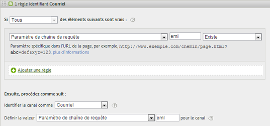

# FAQ sur les Canaux marketing

Reportez-vous à la section [Création de règles de traitement des canaux marketing](/help/components/c-marketing-channels/c-rules.md) pour connaître la définition des champs affichés sur la page [!UICONTROL Règles de traitement des canaux marketing].

## Questions fréquentes {#faq}

Chaque implémentation des règles de traitement des canaux marketing peut être différente en fonction des codes de suivi. La configuration de règles renvoyant les résultats souhaités peut exiger un peu d’imagination pour résoudre les problèmes.

**Question** : Mes codes de suivi ne suivent pas de schéma et j’en ai des milliers à spécifier pour mon canal Affilié.

*  Procédez par élimination. Si les canaux Courriel et Affilié utilisent le même paramètre de chaîne de requête, mais que vous n’avez que quelques codes de suivi, vous pouvez spécifier les codes de suivi par courriel dans un ensemble de règles définissant le courriel. Vous classez ensuite tous les autres codes de suivi avec  *`affiliates.`*
* Dans votre système de messagerie, ajoutez un paramètre de chaîne de requête à toutes les URL de page d’accueil, comme *`&ch=eml`*. Créez un ensemble de règles qui détectera si le paramètre de requête ch est égal à *`eml`*. S’il ne contient pas *`eml`*, il s’agit d’un affilié.

**Question** : les domaines référents contiennent plus de données que prévu.

* Les domaines référents peuvent se trouver trop haut dans la liste des règles de traitement. Il doit s’agit de l’un des derniers ensembles de règles (ou du dernier), parce que l’ordre de traitement est important.

**Question** : J’ai créé une règle correspondant à un paramètre de chaîne de requête, mais elle ne fonctionne pas.

* Assurez-vous que le nom du paramètre est spécifié dans les champs de paramètre de chaîne de requête (généralement sous la forme d’une valeur alphanumérique). Vérifiez également que la valeur du paramètre est spécifiée après l’opérateur, comme indiqué dans l’exemple suivant illustrant une règle de courriel.

   

**Question** : Pourquoi la totalité du trafic Dernière touche est-elle attribuée à un domaine interne ?

*  Vous avez une règle qui correspond au trafic interne. N’oubliez pas que ces règles traitent chaque accès d’un visiteur à votre site, et pas seulement sa première visite. Dans le cas d’une règle telle que  *`Page URL exists`* sans aucun autre critère, une correspondance est établie avec ce canal lors de chaque visite successive sur votre site, car il existe toujours une URL de page.

**Question** : Comment déboguer le trafic qui s’affiche dans « Aucun canal identifié » sur le rapport ?

*  Les règles sont traitées dans l’ordre. Si aucun critère spécifique n’a de correspondance, les visites sont incluses dans l’une de trois catégories :

1. Aucun référent (visite directe).

2. Référent interne, sur la première page de la visite.

3. Défaut de traitement sur la page.

Vérifiez que vous disposez d’un canal pour ces trois possibilités. Créez, par exemple, des règles indiquant ce qui suit :

1. **[!UICONTROL Référent]** et **[!UICONTROL N’existe pas]** et **[!UICONTROL Est la première page de la visite]**. (Voir [Direct.](/help/components/c-marketing-channels/c-faq.md))

2. **[!UICONTROL Le référent correspond aux filtres d’URL internes]** et **[!UICONTROL Est la première page de la visite]**. (Voir [Interne](/help/components/c-marketing-channels/c-faq.md).)

3. **[!UICONTROL Domaine référent]** et **[!UICONTROL Existe]** et **[!UICONTROL Le référent ne correspond pas aux filtres d’URL internes]**.

Enfin, créez un canal *Other* qui capture les autres accès, comme indiqué dans la section [Aucun canal identifié](/help/components/c-marketing-channels/c-faq.md#no-channel-identified).

## Relation entre Première touche et Dernière touche

Pour comprendre l’interaction entre les dimensions Première touche et Dernière touche héritées et confirmer que les remplacements fonctionnent comme prévu, vous pouvez extraire un rapport canal Première touche, sous-lié à un rapport canal Dernière touche, avec votre mesure de réussite clé ajoutée dans (voir l’exemple ci-dessous). Cet exemple illustre l’interaction entre les canaux Première touche et Dernière touche.

L’intersection où first est égal à last touch est la diagonale du tableau. Direct et Session Refresh n&#39;obtiennent le crédit Dernière touche que s&#39;ils étaient également le canal Première touche, car ils ne peuvent pas prendre le crédit d&#39;autres canaux persistants (lignes surlignées).

## Raisons pour lesquelles aucun Canal n&#39;a été identifié {#no-channel-identified}

Lorsque les règles ne capturent pas de données, ou si les règles ne sont pas configurées correctement, le rapport affiche les données sur la ligne [!UICONTROL Aucun canal identifié] du rapport. Vous pouvez créer un ensemble de règles nommé *Autre*, par exemple, à la fin de l’ordre de traitement, pour identifier également le trafic interne.

Ce type de règle « fourre-tout » permet de s’assurer que le trafic des canaux corresponde toujours au trafic externe et ne figure pas dans la catégorie **[!UICONTROL Aucun canal identifié]**. Veillez à ne pas créer de règles identifiant également le trafic interne. La définition de la valeur du canal comme **[!UICONTROL Domaine référent]** ou **[!UICONTROL URL de la page]** est le moyen le plus courant et le plus utile de créer une règle « Other » efficace.

>[!NOTE] Il est possible qu’une certaine partie du trafic de canaux soit classée dans la catégorie Aucun canal identifié. Par exemple : un visiteur sur le site marque une page comme favori puis, au cours de la même visite, revient sur cette page en passant par les favoris. Puisqu’il ne s’agit pas de la première page de la visite, le trafic ne sera pas inclus dans la catégorie des canaux directs ni dans celle des autres canaux, puisqu’il n’y a aucun domaine référent.

## Raisons de l’interne (actualisation de session) {#internal}

L’actualisation de la session Dernière touche ne peut avoir lieu que si elle a également été la première touche - voir &quot;Relation entre la première et la dernière touche&quot; ci-dessus. Les scénarios ci-dessous expliquent comment l’actualisation de session peut être un canal Première touche.

**Scénario 1 : délai d’expiration de la session**

Un visiteur se rend sur un site Web, puis laisse l’onglet ouvert dans son navigateur pour y retourner ultérieurement. La période d’engagement du visiteur expire (ou bien il supprime volontairement ses cookies) et il utilise l’onglet ouvert pour se rendre à nouveau sur le site Web. L’URL de référence étant un domaine interne, la visite est classée comme Actualisation de session.

**Scénario 2 : les pages d’un site ne sont pas toutes balisées**

Un visiteur arrive sur la page A qui n’est pas balisée, puis passe à la page B qui est balisée. La page A serait considérée comme le référent interne et la visite serait classée comme Actualisation de session.

**Scénario 3 : redirections**

Si une redirection n’est pas configurée pour transmettre les données du référent à la nouvelle page d’entrée, les données d’entrée réelle du référent sont perdues et la page de redirection (probablement une page interne) apparaît désormais comme domaine référent. La visite sera classée comme Actualisation de session.

**Scénario 4 : trafic inter-domaines**

Un visiteur passe d’un domaine qui se déclenche vers la suite A à un autre domaine qui se déclenche vers la suite B. Si, dans la suite B, les filtres d’URL internes incluent le premier domaine, la visite dans la suite B est enregistrée comme Interne, puisque les canaux marketing la considèrent comme une nouvelle visite dans la deuxième suite. La visite sera classée comme Actualisation de session.

**Scénario 5 : temps de chargement long de la page d’entrée**

Un visiteur accède à la page A, qui contient beaucoup de contenu, et le code Adobe Analytics se trouve au bas de la page. Avant que tout le contenu (y compris la demande d’images Adobe Analytics) puisse être chargé, le visiteur clique sur la page B. La page B déclenche sa demande d’images Adobe Analytics. Comme la demande d’images de la page A n’a jamais abouti, la deuxième page apparaît comme le premier accès de la visite dans Adobe Analytics, avec la page A comme référent. La visite est classée comme Actualisation de session.

**Scénario 6 : effacement des cookies durant la visite**

Un visiteur se rend sur le site et efface ses cookies durant la visite. Les canaux Première touche et Dernière touche seront réinitialisés et la visite sera classée comme Actualisation de session (car le référent est interne).

