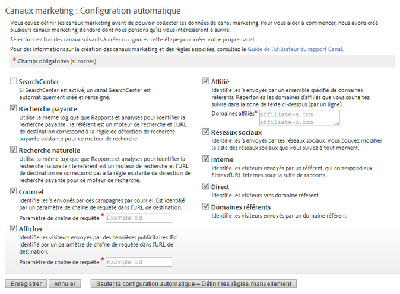

# Commencer avec les canaux marketing

Les canaux marketing sont généralement utilisés pour savoir comment les visiteurs sont parvenus sur votre site. Vous pouvez personnaliser des règles de traitement de canaux marketing en fonction des canaux dont vous souhaitez effectuer le suivi et de la méthode de suivi à appliquer.

Les canaux marketing sont axés sur les mesures Première touche et Dernière touche qui sont des composants des mesures de conversion standard.

## Flux de travaux Canaux marketing

 Définir chaque canal en fonction de vos besoins.

La définition des canaux que vous utilisez constitue l’une des tâches les plus importantes. Elle peut demander un travail de collaboration avec plusieurs personnes de votre entreprise. Voici quelques questions que vous devez vous poser :

* Utilisez-vous une recherche payante ?
* Utilisez-vous des campagnes par courrier électronique ? Utilisez-vous plusieurs campagnes par courrier électronique dont vous souhaitez effectuer le suivi séparément ?
* Des affiliés redirigent-ils le trafic vers votre site ? Souhaitez-vous effectuer le suivi de certains affiliés séparément ?
* Tireriez-vous avantage de suivre certaines campagnes externes de manière séparée ?
* Voulez-vous regrouper tous les sites de réseau social ou souhaitez-vous en suivre certains séparément ?
* Existe-t-il d’autres canaux pouvant avoir un impact sur les conversions dont vous souhaitez effectuer le suivi ?

Vous trouverez une liste des canaux recommandés dans la section [Questions fréquentes et exemples](/help/components/c-marketing-channels/c-faq.md). Établissez une liste des canaux que vous souhaitez utiliser pour simplifier leur définition lors de leur création.

 Ajoutez des canaux marketing sur la [!UICONTROL Marketing Channel Manager] page.

After defining what channels to track, you enable them in **[!UICONTROL Admin]** > **[!UICONTROL Report Suites]**.

Voir [Canaux et règles](/help/components/c-marketing-channels/c-channels.md) pour consulter des informations importantes sur les concepts et les conditions préalables requises.

Voir [Ajout de canaux marketing](/help/components/c-marketing-channels/c-channels.md) pour la procédure.

>[!NOTE]
>
>Si les canaux marketing n’ont pas été configurés précédemment, la [configuration automatique](/help/components/c-marketing-channels/c-getting-started-mchannel.md) s’affiche. Elle propose plusieurs canaux préconfigurés que vous pouvez personnaliser. Adobe recommande d’utiliser ces règles en tant que modèle. Si vous disposez toutefois de définitions de canaux fiables, vous pouvez ignorer la configuration automatique.

 Configurez ou affinez les règles de chaque canal sur la [!UICONTROL Marketing Channel Processing Rules] page.

After you create channels on the [!UICONTROL Marketing Channel Manager] page, you configure the rules so that channels can retrieve and report data.

Voir [Règles de traitement des canaux marketing](/help/components/c-marketing-channels/c-rules.md).

Si les canaux ont été créés lors de la configuration automatique, les règles de ceux-ci sont définies. Vous pouvez les modifier afin qu’elles répondent à vos besoins.

## Configuration automatique des canaux marketing {#run-auto-setup}

Le rapport Canal marketing comporte une page de configuration unique pour vous aider à démarrer. Il fournit plusieurs canaux marketing que vous pouvez utiliser dans le cadre du suivi. Vous pouvez ignorer cette configuration si vous vous sentez à l’aise avec la création des canaux et des règles. Adobe vous conseille toutefois d’autoriser l’assistant à créer des canaux à votre place. La configuration automatique vous permet de voir le mode de construction des règles ou encore de les modifier en fonction de vos besoins. Vous pouvez, à tout moment, désactiver ou supprimer les canaux prédéfinis.

Comment exécuter la configuration automatique des canaux marketing.

1. Cliquez sur **[!UICONTROL Analytics]** > **[!UICONTROL Admin]** > **[!UICONTROL Report Suites]**.
1. Sur la [!UICONTROL Report Suite Manager]page, sélectionnez une suite de rapports.
1. Cliquez sur **[!UICONTROL Edit Settings]** > **[!UICONTROL Marketing Channels]** > **[!UICONTROL Marketing Channel Manager]**.

   

   >[!NOTE]
   >
   >The [!UICONTROL Marketing Channels: Auto Setup] page displays automatically when you access channel configuration applications in Admin Tools. (Voir [Gestionnaire de canaux marketing](/help/components/c-marketing-channels/c-channels.md).) Cette page ne s’affiche pas si la suite de rapports contient un ou plusieurs canaux marketing. Elle ne s’affichera plus, sauf si vous sélectionnez une autre suite de rapports ne contenant aucun canal marketing.

1. Vérifiez que les canaux à créer sont sélectionnés.

   Lorsque cette option est sélectionnée, **[!UICONTROL Email]**, **[!UICONTROL Display]** et **[!UICONTROL Affiliate]** sont des champs obligatoires.

1. Cliquez sur **[!UICONTROL Save]**.

## Application des paramètres d’une suite de rapports modèle à plusieurs suites de rapports

Comment utiliser une suite de rapports principale (maître) comme modèle pour tester la configuration de vos canaux marketing. Pour gagner du temps, vous pouvez appliquer ce modèle à une ou plusieurs suites de rapports de production lors d’une mise à jour par lot. Cette tâche doit être effectuée séparément pour les ensembles de canaux et de règles.

> [!NOTE] Appliquez les canaux à partir d’un modèle avant d’appliquer des ensembles de règles. Les canaux doivent être identiques pour toutes les suites de rapports lors de cette procédure.

1. Assurez-vous que l’option Rapport Canal marketing est activée pour les suites de rapports sélectionnées. Cette étape est effectuée par votre gestionnaire de compte.
1. Cliquez sur **[!UICONTROL Analytics]** > **[!UICONTROL Admin]** > **[!UICONTROL Report Suites]**.
1. On the **[!UICONTROL Report Suite Manager]** page, select the template report suite, as well as one or more target report suites.
1. Cliquez sur **[!UICONTROL Edit Settings]** > **[!UICONTROL Marketing Channels]** > **[!UICONTROL Marketing Channel Manager]**.
1. Sur la **[!UICONTROL Select Master Report Suites]** page, sélectionnez une suite de rapports modèle.
1. Cliquez sur **[!UICONTROL Save All]**.
1. Appliquez les règles d’un modèle à plusieurs suites de rapports :
   1. Revenez à la [!UICONTROL Report Suite Manager] page.
   1. Sélectionnez la suite de rapports modèle, ainsi qu’une ou plusieurs suites de rapports cibles.
   1. Cliquez sur **[!UICONTROL Edit Settings]** > **[!UICONTROL Marketing Channels]** > **[!UICONTROL Marketing Channel Processing Rules]**.
   1. Cliquez sur **[!UICONTROL Save]**. Si le bouton Enregistrer est désactivé au cours de cette étape, activez-le en développant l’une des règles.

