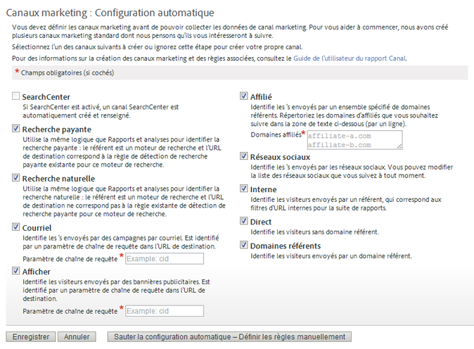

# Prise en main des canaux marketing

>[!NOTE]
>
>Afin d’optimiser l’efficacité des canaux marketing pour Attribution et Customer Journey Analytics, nous avons publié quelques [bonnes pratiques révisées](/help/components/c-marketing-channels/mchannel-best-practices.md).
>
>Les administrateurs et administratrices d’Analytics peuvent gérer les canaux marketing pour leurs organisations, comme décrit dans la section [Gestion des canaux marketing](/help/admin/tools/manage-rs/edit-settings/marketing-channels/c-channels.md).

Les canaux marketing sont généralement utilisés pour fournir des informations sur la façon dont les visiteurs arrivent sur votre site. Vous pouvez personnaliser des règles de traitement de canaux marketing en fonction des canaux dont vous souhaitez effectuer le suivi et de la méthode de suivi à appliquer.

Les canaux marketing sont axés sur les mesures Première touche et Dernière touche qui sont des composants des mesures de conversion standard.

## Processus des canaux marketing

 Définir chaque canal en fonction de vos besoins.

La définition des canaux utilisés constitue l’un des composants les plus importants des canaux marketing. Elle peut demander un travail de collaboration avec plusieurs personnes de votre entreprise. Voici quelques questions que vous devez vous poser :

* Utilisez-vous un référencement payant ?
* Utilisez-vous des campagnes par e-mail ? Utilisez-vous plusieurs campagnes par e-mail que vous souhaitez suivre séparément ?
* Avez-vous des affiliés qui redirigent le trafic vers votre site ? Souhaitez-vous suivre certains affiliés de manière individuelle ?
* Y a-t-il des campagnes externes qu’il serait avantageux de suivre séparément ?
* Souhaitez-vous agréger tous les sites de réseaux sociaux ou en suivre certains individuellement ?
* Existe-t-il d’autres canaux pouvant impacter la conversion que vous aimeriez suivre ?

Vous trouverez une liste des canaux recommandés dans la section [Questions fréquentes et exemples](/help/components/c-marketing-channels/c-faq.md). Établissez une liste des canaux que vous souhaitez utiliser pour simplifier leur définition lors de leur création.

 Ajoutez des canaux marketing dans la page [!UICONTROL Gestionnaire de canaux marketing].

Après avoir défini les canaux à suivre, vous devez les activer dans **[!UICONTROL Admin]** > **[!UICONTROL Suites de rapports]**.

Voir [Canaux et règles](/help/admin/tools/manage-rs/edit-settings/marketing-channels/c-channels.md) pour consulter des informations importantes sur les concepts et les conditions préalables requises.

Voir [Ajout de canaux marketing](/help/admin/tools/manage-rs/edit-settings/marketing-channels/c-channels.md) pour la procédure.

>[!NOTE]
>
>Si les canaux marketing n’ont pas été configurés précédemment, la [configuration automatique](/help/components/c-marketing-channels/c-getting-started-mchannel.md) s’affiche. Elle propose plusieurs canaux préconfigurés que vous pouvez personnaliser. Adobe recommande d’utiliser ces règles en tant que modèle. Si vous disposez toutefois de définitions de canaux fiables, vous pouvez ignorer la configuration automatique.

 Configurer ou affiner les règles de chaque canal sur la page [!UICONTROL Règles de traitement des canaux marketing].

Une fois les canaux créés sur la page [!UICONTROL Gestionnaire de canaux marketing], vous pouvez configurer les règles pour qu’ils puissent extraire les données en vue de créer des rapports.

Voir [Règles de traitement des canaux marketing](/help/admin/tools/manage-rs/edit-settings/marketing-channels/mc-proc-rules.md).

Si les canaux ont été créés lors de la configuration automatique, les règles de ceux-ci sont définies. Vous pouvez les modifier afin qu’elles répondent à vos besoins.

## Configuration automatique pour les canaux marketing {#run-auto-setup}

Le rapport Canal marketing comporte une page de configuration unique pour vous aider à démarrer. Il fournit plusieurs canaux marketing que vous pouvez utiliser dans le cadre du suivi. Vous pouvez ignorer cette configuration si vous vous sentez à l’aise avec la création des canaux et des règles. Adobe vous conseille toutefois d’autoriser l’assistant à créer des canaux à votre place. La configuration automatique vous permet de voir le mode de construction des règles ou encore de les modifier en fonction de vos besoins. Vous pouvez, à tout moment, désactiver ou supprimer les canaux prédéfinis.

Comment exécuter la configuration automatique des canaux marketing.

1. Cliquez sur **[!UICONTROL Analytics]** > **[!UICONTROL Admin]** > **[!UICONTROL Suites de rapports]**.
1. Sur la page [!UICONTROL Gestionnaire de Report Suites], sélectionnez une suite de rapports.
1. Cliquez sur **[!UICONTROL Modifier les paramètres]** > **[!UICONTROL Canaux marketing]** > **[!UICONTROL Gestionnaire de canaux marketing]**.

   

   >[!NOTE]
   >
   >La page [!UICONTROL Canaux marketing : Configuration automatique] s’affiche automatiquement lorsque vous accédez aux applications de configuration des canaux dans les outils d’administration. (Voir [Gestionnaire de canaux marketing](/help/admin/tools/manage-rs/edit-settings/marketing-channels/c-channels.md).) Cette page ne s’affiche pas si votre suite de rapports contient un ou plusieurs canaux marketing. Elle ne s’affichera plus, sauf si vous sélectionnez une autre suite de rapports ne contenant aucun canal marketing.

1. Vérifiez que les canaux à créer sont sélectionnés.

   Lorsqu’ils sont sélectionnés, **[!UICONTROL Courriel]**, **[!UICONTROL Afficher]** et **[!UICONTROL Affilié]** sont des champs obligatoires.

1. Cliquez sur **[!UICONTROL Enregistrer]**.

## Application des paramètres d’une suite de rapports modèle à plusieurs suites de rapports

Comment utiliser une suite de rapports principale (maître) comme modèle pour tester la configuration de vos canaux marketing. Pour gagner du temps, vous pouvez appliquer ce modèle à une ou plusieurs suites de rapports de production dans le cadre d’une mise à jour en masse. Cette tâche doit être effectuée séparément pour les ensembles de canaux et de règles.

>[!NOTE]
>
>Appliquez les canaux à partir d’un modèle avant d’appliquer des ensembles de règles. Les canaux doivent être identiques pour toutes les suites de rapports lors de cette procédure.

1. Cliquez sur **[!UICONTROL Analytics]** > **[!UICONTROL Admin]** > **[!UICONTROL Suites de rapports]**.
1. Sur la page **[!UICONTROL Gestionnaire de Report Suites]**, sélectionnez la suite de rapports modèle, ainsi qu’une ou plusieurs suites de rapports cibles.
1. Cliquez sur **[!UICONTROL Modifier les paramètres]** > **[!UICONTROL Canaux marketing]** > **[!UICONTROL Gestionnaire de canaux marketing]**.
1. Sur la page **[!UICONTROL Sélectionner une Report Suite principale]**, sélectionnez une suite de rapports modèle.
1. Cliquez sur **[!UICONTROL Tout enregistrer]**.
1. Appliquez les règles d’un modèle à plusieurs suites de rapports :
   1. Revenez à la page [!UICONTROL Gestionnaire de Report Suites].
   1. Sélectionnez la suite de rapports modèle, ainsi qu’une ou plusieurs suites de rapports cibles.
   1. Cliquez sur **[!UICONTROL Modifier les paramètres]** > **[!UICONTROL Canaux marketing]** > **[!UICONTROL Règles de traitement des canaux marketing]**.
   1. Cliquez sur **[!UICONTROL Enregistrer]**. Si le bouton Enregistrer est désactivé au cours de cette étape, vous pouvez l’activer en développant l’une des règles.
