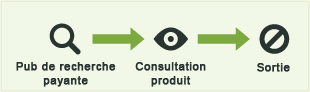
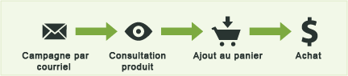
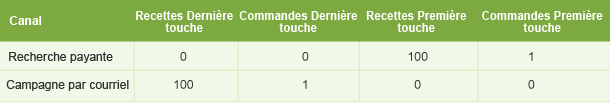
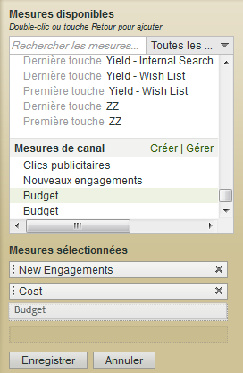

# Mesures utilisées dans les rapports sur les canaux marketing

Utilisation des mesures dans les rapports sur les canaux marketing.

Ajouter (ou modifier) des mesures.

Ajouter une colonne au rapport.

## Mesures Première touche et Dernière touche {#first-and-last-touch}

Première touche et Dernière touche sont des attributs d’un canal. Ils permettent de déterminer le nombre d’engagements (ou de données de mesure comme les vues des produits, les recettes et les commandes) consécutifs à l’activité d’un visiteur dans le canal.

Lorsqu’un événement de succès se produit, Analytics examine l’intégralité de l’activité et de l’historique de l’utilisateur (à partir de [l’expiration de l’engagement du visiteur](/help/components/c-marketing-channels/visitor-engagement.md)). Il note le premier canal emprunté par l’utilisateur, ainsi que le canal le plus récent. Il crédite ensuite l’événement de succès à chaque canal adéquat.

<!-- 

<note>
  A first-touch value has a rolling expiration based on the frequency of a visitor returning to the site. This first-touch expiration resets whenever a visitor returns to the site. This effects reporting by causing first-touch values to persist longer than you might expect. For example, this can occur if an instance of an first-touch channel was created a year ago. Remove the values on the eVar in the admin console to reset.
</note>

 -->

**Exemple**

Supposons que vous configuriez deux canaux marketing : Recherche payante et Campagne par courriel.

Recherche payante est une annonce pour un produit. Elle capture l’intérêt du visiteur et génère une consultation de produit, mais ne parvient pas à générer un événement de conversion.

Un mois plus tard, vous lancez une campagne par courriel pour le même produit. Cette campagne déclenche un achat de 100 euros (ou tout autre événement de conversion souhaité).

Dans le rapport Canal marketing, le résultat peut être affiché comme suit :

Le canal Recherche payante est crédité de 100 euros comme canal Première touche pour les recettes, avec 1 commande Première touche. Le canal Campagne par courriel est crédité de 100 euros en tant que canal de recettes Dernière touche (le canal atteint en dernier par l’utilisateur avant l’événement de conversion), avec une commande Dernière touche. En d’autres termes, l’un des principaux objectifs du rapport est de savoir en quoi la ventilation des recettes sur les canaux Première touche est différente de celle sur les canaux Dernière touche.

Chaque instance d’événement de succès comporte exactement un canal Première touche et un canal Dernière touche. Cela signifie que si vous additionnez une colonne de mesure donnée pour n’importe quel événement de succès, le total sera toujours égal à celui d’une même période. Ce total sera également égal au nombre total d’événements dans le rapport [!UICONTROL Mesures du site] &gt; [!UICONTROL Evénements personnalisés] adéquat. Les mesures d’événement autre que de succès, telles que les visites et les visiteurs, ne correspondront pas 1 à 1 dans la mesure où plusieurs canaux peuvent se déclencher dans une même visite.

> [!NOTE] Ce rapport utilise la version Première touche ou Dernière touche de chaque mesure. Il est donc possible que les données affichées dans un rapport [!UICONTROL Canal marketing] ne correspondent pas à celles présentées dans d’autres rapports.

## Définitions des mesures {#metric-defs}

| Mesure | Définition |
|--- |--- |
| Canal Première touche | Premier canal marketing à engager un visiteur. D’un point de vue technique, le canal Première touche est une variable eVar avec une allocation initiale. |
| Visiteur Première touche | Dans le cadre de la création de rapports de canal, un visiteur Première touche est un visiteur unique quotidien en provenance d’un canal. L’engagement du visiteur est stocké pendant la période d’engagement auprès du site, laquelle peut s’étendre sur plusieurs visites. |
| Canal Dernière touche | Canal de conversion, à savoir le dernier canal marketing à engager le visiteur et à déboucher sur une conversion. Un seul canal est défini comme canal Première touche. Le canal Dernière touche peut changer avec chaque visite de retour sur le site. Chaque visite comporte un canal Première touche et Dernière touche. Cependant, la valeur du canal Première touche n’est pas affectée par les visites suivantes. |

## Clic publicitaire {#click-through}

Un clic publicitaire est une instance sur le canal Dernière touche. Il s’agit de la variable eVar présentant l’allocation la plus récente.

Supposons, par exemple, qu’un visiteur vienne sur votre site Web une fois par jour et que chaque visite provienne d’un canal marketing différent :

* Jour 1 : Recherche payante
* Jour 2 : Afficher
* Jour 3 : Recherche naturelle
* Jour 4 : Afficher
* Jour 5 : Recherche payante
* Jour 6 : Afficher
* Jour 7 : Recherche naturelle

Le rapport Canal Première touche montre 1 nouvel engagement pour Recherche payante. Les autres canaux afficheront 0 nouvel engagement. Le rapport Canal Dernière touche affichera 2 clics publicitaires pour Recherche payante, 3 pour Afficher et 2 pour Recherche naturelle.

## Ajout de mesures à un rapport Canal marketing {#add-metrics-to-mktg-channel-rpt}

Ajoutez des mesures à un rapport Canal marketing. Vous pouvez ajouter jusqu’à quatre mesures à chaque colonne du rapport, et autant de colonnes que vous le souhaitez.

1. Ouvrez le [!UICONTROL rapport Canal marketing].
1. Cliquez sur Ajouter des mesures.

   

1. Sous [!UICONTROL Mesures disponibles], faites glisser les mesures depuis la section [!UICONTROL Mesures disponibles] vers la section [!UICONTROL Mesures sélectionnées].

   

1. Pour créer des mesures calculées, faites défiler le menu jusqu’à [!UICONTROL Mesures calculées]**, puis cliquez sur[!UICONTROL Créer]**.
1. Cliquez sur **[!UICONTROL Enregistrer.]**
