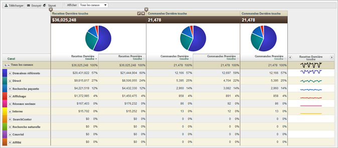

# À propos des rapports sur les canaux marketing

La création de rapports Canal marketing vous permet de connaître les recettes générées par vos canaux marketing. Ces rapports fournissent un aperçu de l’allocation des canaux Première touche et Dernière touche, avec des mesures critiques standard, telles que les recettes, les commandes et les coûts.

Configurez les règles de définition de canal dans les Outils d’administration ; des API spécifiques aux rapports de canal sont disponibles. Aucune modification externe de l’implémentation n’est nécessaire pour exécuter le rapport [!UICONTROL Canal marketing].

* [Exemple de rapport](/help/components/c-marketing-channels/c-overview.md)
* [Rapports disponibles](/help/components/c-marketing-channels/c-overview.md)

## Exemple de rapport {#example-rpt}

Les données de canal sont prises en charge dans les tableaux de bord, les API, le Report Builder (pour Excel), les analyses ad hoc, l’entrepôt de données et l’extraction de données.

Ajouter (ou modifier) des mesures.

Ajouter une colonne au rapport.

## Rapports disponibles {#available-rpts}

Les rapports [!UICONTROL Canal marketing] suivants sont disponibles dans Experience Cloud.

| Rapport | Description |
|--- |--- |
| Présentation des canaux | Le rapport Présentation est un rapport résumé qui affiche des diagrammes circulaires et des graphiques décrivant les tendances au cours de la période sélectionnée. Pour ce rapport, vous pouvez ajouter les mesures Première touche et Dernière touche ou créer des mesures calculées. Vous pouvez également analyser les rapports Première touche, Dernière touche et détaillés à partir du tableau de présentation. D’autres rapports Canal marketing offrent des vues plus approfondies des données résumées dans ce rapport.  Lorsque vous développez un canal du rapport, vous pouvez consulter des rapports ventilés pour les valeurs du canal. Les valeurs de canal sont des valeurs non classifiées dans le détail du canal. |
| Canal Première touche ou Dernière touche | Affiche les mesures montrant les données d’un canal Première touche ou Dernière touche spécifique. Dans ces rapports, vous pouvez décomposer un canal et en afficher les détails. |
| Détails du canal Première touche ou Dernière touche | Affiche des détails comme les noms et les référents de page, qui proviennent des valeurs de canal définies sous l’option Définir la valeur du canal lors de la configuration des règles. Les rapports Canal détaillés vous permettent de mieux examiner les valeurs détaillées de canal du rapport Présentation. |
