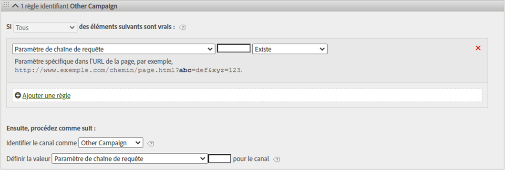
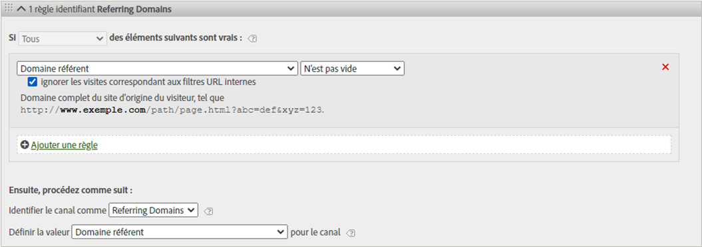

# Règles de traitement des canaux marketing

Les règles de traitement du Canal marketing déterminent si un accès visiteur satisfait aux critères affectés à un canal en traitant chaque accès d’un visiteur sur votre site. Les règles sont traitées dans l’ordre indiqué et lorsqu’une règle est respectée, le système arrête de traiter les règles restantes.

Remarques supplémentaires sur le traitement :
* Les données collectées à l’aide de ces règles sont permanentes. De plus, les règles modifiées après la collecte des données ne sont pas rétroactives. Il est donc vivement conseillé d’étudier tous les cas et de les prendre en compte avant d’enregistrer les [!UICONTROL règles de traitement des canaux marketing] afin de limiter la collecte de données dans des canaux incorrects.
* Le rapport peut traiter jusqu’à 25 canaux simultanément.
* Les règles peuvent accéder aux variables que VISTA a définies, mais pas aux données que VISTA a supprimées.
* Un même événement (tel qu’un achat ou un clic) n’est jamais porté au crédit de deux canaux marketing. En cela, les canaux marketing diffèrent des eVars (car deux eVars peuvent recevoir le crédit d’un seul et même événement).
* S’il existe une couverture d’écart de vos règles, vous pouvez voir [Aucun Canal identifié.](/help/components/c-marketing-channels/c-faq.md)

## Conditions préalables

* Consultez les informations conceptuelles de la section [Prise en main des Canaux](/help/components/c-marketing-channels/c-getting-started-mchannel.md)marketing.
* Créez un ou plusieurs canaux auxquels attribuer des règles. Reportez-vous à la section [Ajout de canaux marketing.](/help/components/c-marketing-channels/c-channels.md)

## Création de règles de traitement des canaux marketing

Créez des règles de traitement des canaux marketing qui déterminent si l’accès d’un visiteur satisfait aux critères affectés à un canal.

Elle utilise une règle de courriel comme exemple. Cet exemple part du principe que vous avez ajouté un canal de courriel à votre liste de canaux sur la page Gestionnaire de canaux marketing.

1. Cliquez sur **[!UICONTROL Analytics]** > **[!UICONTROL Admin]** > **[!UICONTROL Suites de rapports]**.
2. Sélectionnez une suite de rapports.

   La page [!UICONTROL Canaux marketing : Configuration automatique] s’affiche si aucun canal n’est défini dans votre suite de rapports.

   Reportez-vous à la section [Exécution de la configuration automatique](/help/components/c-marketing-channels/c-getting-started-mchannel.md).

3. Cliquez sur **[!UICONTROL Modifier les paramètres]** > **[!UICONTROL Canaux marketing]** > **[!UICONTROL Règles de traitement des canaux marketing]**.

   

4. Dans le menu **[!UICONTROL Ajouter un nouveau jeu de règles]**, sélectionnez **[!UICONTROL Courriel]**.

   Dans le cas présent, vous ne sélectionnez pas le canal, mais le modèle qui renseigne quelques-uns des paramètres nécessaires de la règle. Vous pouvez modifier ce modèle si nécessaire.

   

5. Pour continuer à créer des règles, cliquez sur **[!UICONTROL Ajouter une règle]**.
6. Pour classer les règles par priorité, faites-les glisser à l’emplacement souhaité.
7. Cliquez sur **[!UICONTROL Enregistrer.]**

Continuez sur cette page pour afficher des recommandations concernant l’ordre des règles de canal ainsi que d’autres exemples de définition.

### Définir la valeur du canal marketing

**[!UICONTROL Ajouter une ]**règleDéfinissez la valeur du canal]**définit la dimension détaillée du canal marketing disponible pour ce canal. Vous pouvez ainsi ventiler les dimensions du canal marketing et afficher des informations plus détaillées sur le canal.

Il est recommandé de définir la valeur du canal selon les mêmes critères que ceux utilisés pour définir le canal lui-même. Par exemple, si le paramètre de chaîne de requête est utilisé pour définir le canal, définissez également le paramètre de chaîne de requête comme valeur de canal.

### Critères de règle

Ce tableau de référence définit les champs, options et attributs d’accès que vous pouvez utiliser pour définir les règles de traitement du Canal marketing.

| Terme | Définition |
|--- |--- |
| Tous | N’active ce canal que lorsque toutes les règles de la règle numérotée sont vraies. |
| Quelconque | Active ce canal lorsque l’une des règles de l’ensemble de règles est vraie. Cette option n’est disponible que s’il existe plusieurs règles dans la règle numérotée. |
| ID AMO | Code de suivi principal utilisé par les intégrations Advertising Cloud et Advertising Analytics. Lorsque l’une de ces intégrations est activée, le préfixe du code de suivi peut être utilisé pour identifier les canaux spécifiques à Advertising Cloud. Utilisez « AMO ID » en commençant par « AL » pour Rechercher, « AC » pour Afficher ou « AO » pour Social. Lorsque l’AMO ID est utilisé dans les canaux marketing, les mesures de clic/coût/impression peuvent être attribuées au canal approprié (lorsqu’elles ne sont pas configurées, elles sont alors associées à Direct ou Aucun). |
| AMO ED ID | Code de suivi secondaire utilisé par Advertising Cloud. Le principal objectif de ce code de suivi est de servir de clé pour renvoyer les données vers Advertising Cloud. Il peut toutefois également être utilisé pour identifier les clics publicitaires par rapport aux affichages publicitaires si vous souhaitez les voir comme deux canaux marketing distincts. Pour ce faire, définissez la logique du canal marketing pour « AMO EF ID » se terminant par « :d » pour les clics publicitaires ou « AMO EF ID » se terminant par « :i » pour les affichages publicitaires. Si vous ne souhaitez pas diviser Affichage en deux canaux, utilisez plutôt la dimension AMO ID. |
| Variables de conversion | Comprend des variables eVar activées pour cette suite de rapports et ne s’applique que lorsque ces variables sont définies au moyen du code Adobe sur la page.  Consultez le Guide d’implémentation . |
| Existe | Plusieurs sélections sont disponibles, notamment :<ul><li>**N’existe pas** : indique que l’attribut de visite n’existe pas pour la demande. Dans un domaine référent par exemple, si l’utilisateur saisit une URL ou clique sur un signet, l’attribut de domaine référent n’existe pas.</li><li>**Est vide** : indique que l’attribut de visite existe, généralement sous la forme d’un paramètre de chaîne de requête ou eVar, mais qu’aucune valeur associée à l’attribut de visite n’est attribuée.</li><li>**Ne contient pas** : permet d’indiquer, par exemple, qu’un domaine référent ne contient pas de valeur spécifique (contrairement à l’utilisation de l’option &quot;Contient&quot;.)</li></ul> |
| Identifier le canal comme | Associe la règle à un canal marketing ajouté à la page Gestionnaire de canaux marketing.  Reportez-vous à la section Ajout de canaux marketing . |
| Fait correspondre les règles de détection des recherches payées | Une recherche payante détectée par Adobe. Lors des recherches payantes, les sociétés paient une somme au moteur de recherche pour répertorier leur site. Les recherches payantes figurent habituellement en haut ou à droite des résultats de la recherche. |
| Fait correspondre les règles de détection des recherches naturelles | Une recherche non payante détectée par Adobe. |
| Le référent correspond aux filtres d’URL internes | Une visite dont l’URL de page correspond à un filtre d’URL interne, tel qu’il est défini pour la suite de rapports dans les Outils d’administration. |
| Le référent ne correspond pas aux filtres d’URL internes | L’URL référente ne correspond pas à un filtre d’URL interne, tel qu’il est défini pour la suite de rapports dans les Outils d’administration. Vous pouvez utiliser ce paramètre avec  URL de la page  et  Existe  afin de configurer une règle fourre-tout, de telle sorte qu’aucune visite ne figure dans la section  Aucun canal identifié  du rapport. |
| Ignorer les visites correspondant aux filtres URL internes | (Pour les référents) Effectue uniquement le suivi des visites provenant de sites externes. En règle générale, ce paramètre doit rester activé, à moins que vous ne souhaitiez inclure le trafic interne. |
| Est la première page de la visite | La première page d’une visite détectée par Adobe. |
| Page | Le nom d’une page web du site qui contient une balise web d’Adobe. Cette valeur équivaut à  s.pageName . Examples include `Home Page` and `About Us`. |
| Domaine de page | The domain of the page on which the visitor lands, such as `products.example.co.uk`. |
| Domaine et chemin de page | The domain and path, such as `products.example.co.uk/mens/pants/overview.html` . |
| Domaine racine de page (TLD+1) | Domaine racine de la page à laquelle accède le visiteur, tel que exemple.co.uk . |
| URL de la page | L’URL d’une page Web de votre site. |
| Domaine référent | Le domaine d’où proviennent les visiteurs avant de visiter votre site ; par exemple, les référents provenant de `abcsite.com` par rapport à `xyzsite.com`. |
| Paramètre de chaîne de requête | If a page URL on your site looks like `https://example.com/?page=12345&cat=1`, then page and cat are both query string parameters. (Reportez-vous à la section `https://en.wikipedia.org/wiki/Query_string`.)  Vous ne pouvez spécifier qu’un seul paramètre de chaîne de requête par ensemble de règles. To add additional query string parameters, use `ANY` as your operator, then add new query string parameters to the rule. |
| Referrer (Référent) | L’emplacement de la page Web (adresse URL complète) sur laquelle vos visiteurs se trouvaient avant de consulter votre site. Il existe un référent en dehors de votre domaine défini. |
| Domaine et chemin référents | Une concaténation de « Domaine référent » et « Chemin d’accès à l’URL ». Voici quelques exemples :    `www.example.com/products/id/12345` ou `ad.example.com/foo` |
| Paramètre de référent | Un paramètre de chaîne de requête sur l’URL de renvoi. For example, if your visitors come from `example.com/?page=12345&cat=1`, then page and cat are the referring parameters. |
| Domaine racine référent | Le domaine racine du référent. Il existe un référent en dehors de votre domaine défini. |
| Moteur de recherche | Moteur de recherche, tel que Google ou Yahoo!, qui a dirigé les visiteurs sur votre site. |
| Mots-clés de recherche | Mot utilisé dans une recherche en utilisant un moteur de recherche. |
| Moteur de recherche - Mots-clés | Une concaténation de « Mot-clé de recherche » et de « Moteur de recherche » pour identifier avec exactitude le moteur de recherche. Par exemple, si vous cherchez le mot « ordinateur », le moteur de recherche et le mot-clé sont identifiés comme suit : `Search Tracking Code = "<search_type>:<search engine>:<search keyword>" where    search_type = "n" or "p", search_engine = "Google", and search_keyword = "computer"`**Remarque ** : n = naturelle ; p = payante |
| Définir la valeur du canal comme | Outre le fait de savoir quel canal marketing dirige un visiteur sur le site, vous pouvez connaître la bannière publicitaire, le mot-clé ou la campagne par courrier électronique du canal qui reçoit le crédit de l’activité d’un visiteur sur le site. Cet identifiant est une valeur de canal enregistrée avec le canal. Cette valeur correspond le plus souvent à un identifiant de campagne intégré dans la page d’entrée ou dans l’URL de renvoi ; dans d’autres cas, c’est la combinaison du moteur de recherche et du mot-clé de recherche, ou encore l’URL de renvoi, qui identifient avec le plus de précision le visiteur en provenance d’un canal donné. |

## Ordre et définitions des règles du Canal marketing {#channel-rules}

Les règles de Canal sont traitées dans l’ordre indiqué. Il est recommandé de placer les canaux payants ou gérés en premier lieu (recherche payée, recherche naturelle, affichage, courrier électronique, par exemple) afin qu’ils reçoivent du crédit, suivi de canaux organiques (par exemple, domaines directs, internes, référents).

Vous trouverez ci-dessous l’ordre recommandé pour les règles de canal ainsi que des exemples de définitions :

### Recherche payante {#paid-search}

La recherche payante est un mot ou une expression que vous payez à un moteur de recherche pour son placement dans les résultats de la recherche. Ce canal est généralement défini en fonction du paramètre de chaîne de requête (voir l’exemple de canal d’affichage) ou des règles de détection de recherche payante. La décision dépend des détails du canal marketing que vous souhaitez enregistrer.

#### Détection de recherche payante

Pour créer une correspondance avec les règles de détection de recherche payante, le canal marketing utilise les paramètres configurés sur la page [!UICONTROL Détection de recherche payante]. ( **[!UICONTROL Admin]** > **[!UICONTROL Suites de rapports]** > **[!UICONTROL Modifier les paramètres]** > **[!UICONTROL Général]** > **[!UICONTROL Détection de recherche payée]**). L’URL de destination correspond à la règle de détection de la recherche payante existante pour ce moteur de recherche.

Pour la règle du canal marketing, les paramètres de la [!UICONTROL recherche payante] sont les suivants :

Pour plus d’informations, reportez-vous à la section [Détection de recherche payante](https://docs.adobe.com/content/help/en/analytics/admin/admin-tools/paid-search-detection/paid-search-detection.html) dans l’aide destinée à l’administration.

### Recherche naturelle  {#natural-search}

Une recherche naturelle est comptabilisée quand les visiteurs trouvent votre site Internet à la suite d’une recherche sur le Web, où le moteur de recherche a classé votre site sans que vous ayez eu à payer pour figurer dans la liste.

La détection de recherche naturelle n’existe pas dans Analytics. Lorsque vous avez configuré la détection de recherche payante, le système sait que si le référent de recherche n’était pas un référent de recherche payante, il doit s’agir d’un référent de recherche naturelle. Pour plus d’informations, reportez-vous à la section [Détection de recherche payante](https://docs.adobe.com/content/help/en/analytics/admin/admin-tools/paid-search-detection/paid-search-detection.html) dans l’aide destinée à l’administration.

Pour la règle du canal marketing, les paramètres de la recherche naturelle sont les suivants :

### Afficher  {#display}

Cette règle identifie les visiteurs provenant de bannières publicitaires. Elle est identifiée par un paramètre de chaîne de requête dans l’URL de destination, dans ce cas  *`Ad_01`*.

### Courriel  {#email}

Cette règle identifie les visiteurs provenant de campagnes par courrier électronique. Elle est identifiée par un paramètre de chaîne de requête dans l’URL de destination, dans ce cas *`eml`*:

### Affilié  {#afilliates}

Cette règle identifie les visiteurs qui proviennent d’un ensemble spécifié de domaines référents. Faites figurer dans la règle la liste des domaines d’affiliés dont vous souhaitez effectuer le suivi, de la manière suivante :

### Autres campagnes {#other-campaigns}

Une bonne pratique consiste à inclure un canal &quot;Autres campagnes&quot; qui suit toutes les règles de canal payé. Ce canal sert de fourre-tout pour le trafic payant non classé.

### Réseaux sociaux  {#social-networks}

Cette règle identifie les visiteurs provenant d’un réseau social, tel que Facebook*. Le canal est souvent renommé Organique Social. Les paramètres peuvent être les suivants :

### Canal interne (actualisation de session){#internal}

Cette règle s’applique aux visiteurs dont l’URL de référence correspond aux Filtres d’URL internes configurés dans la Console d’administration, ce qui signifie que le visiteur est venu du site pour y début. Ce canal est souvent renommé Actualisation de la session.

Pour plus d’informations sur les raisons [de ce canal, reportez-vous à la section Raisons de l’actualisation de la session](https://docs.adobe.com/content/help/en/analytics/components/marketing-channels/c-faq.html) interne.

### Direct  {#direct}

Cette règle identifie les visiteurs qui n’ont aucun domaine référent, ce qui inclut les visiteurs qui se rendent directement sur votre site, par exemple à partir d’un lien Favoris ou en collant un lien dans leur navigateur. Ce canal est souvent renommé Direct Tapé/Signet.

### canal Domaines référents {#referring-domains}

Le canal Domaines référents identifie les visiteurs qui ont un domaine référent. Ensemble, les canaux de domaines internes, directs et référents agissent comme un fourre-tout pour tous les accès restants qui n’ont pas encore été classés en canal.

