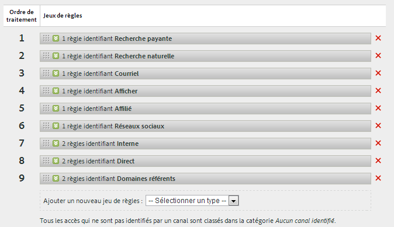
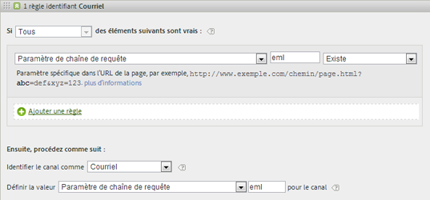
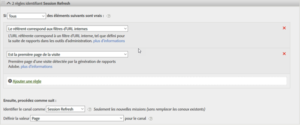
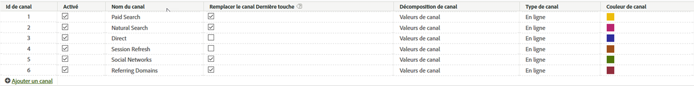

# Règles de traitement des canaux marketing

Les règles de traitement des canaux marketing déterminent si l’accès d’un visiteur satisfait aux critères affectés à un canal. Les règles traitent tous les accès qu’un visiteur effectue sur votre site. Si une règle ne satisfait pas les critères d’un canal, ou si les règles ne sont pas configurées correctement, le système affecte l’accès à « Aucun canal identifié ».

Voici quelques consignes importantes pour la création des règles :

* Triez les règles dans l’ordre où elles doivent être appliquées.
*  Insérez une règle fourre-tout en fin de liste, telle que « Autre ». Cette règle identifie uniquement le trafic externe.

   Consultez la section [Aucun canal identifié.](/help/components/c-marketing-channels/c-faq.md)

> [!NOTE] Bien que ces règles n’affectent pas les rapports en dehors des canaux marketing, elles ont un impact sur la collecte de données des canaux marketing. Les données collectées à l’aide de ces règles sont permanentes. De plus, les règles modifiées après la collecte des données ne sont pas rétroactives. It is strongly recommended to review and consider all circumstances before saving [!UICONTROL Marketing Channel Processing Rules] to mitigate data being collected in incorrect channels.

## Conditions préalables

* Consultez les informations conceptuelles de la section [Prise en main des canaux](/help/components/c-marketing-channels/c-getting-started-mchannel.md)marketing.
* Créez un ou plusieurs canaux auxquels attribuer des règles. Reportez-vous à la section [Ajout de canaux marketing.](/help/components/c-marketing-channels/c-channels.md)

## Création de règles de traitement des canaux marketing

Créez des règles de traitement des canaux marketing qui déterminent si l’accès d’un visiteur satisfait aux critères affectés à un canal.

Elle utilise une règle de courriel comme exemple. Cet exemple part du principe que vous avez ajouté un canal de courriel à votre liste de canaux sur la page Gestionnaire de canaux marketing.

1. Cliquez sur **[!UICONTROL Analytics]** > **[!UICONTROL Admin]** > **[!UICONTROL Report Suites]**.
1. Sélectionnez une suite de rapports.

   If your report suite does not have channels defined, the [!UICONTROL Marketing Channels: Auto Setup] page displays.

   See [Run the Automatic Setup](/help/components/c-marketing-channels/c-getting-started-mchannel.md).

1. Cliquez sur **[!UICONTROL Edit Settings]** > **[!UICONTROL Marketing Channels]** > **[!UICONTROL Marketing Channel Processing Rules]**.

   

1. Dans le **[!UICONTROL Add New Rule Set]** menu, sélectionnez **[!UICONTROL Email]**.

   Dans le cas présent, vous ne sélectionnez pas le canal, mais le modèle qui renseigne quelques-uns des paramètres nécessaires de la règle.

   

   Utilisez la logique booléenne (instructions si / alors) pour configurer une règle. Par exemple, dans une règle de canal de courriel, indiquez les paramètres ou les informations mis en évidence dans l’instruction de règle suivante :

   `"If **[!UICONTROL All]** or **[!UICONTROL Any]** of the following are true:  **[!UICONTROL Query String Parameter]** *<value>* **[!UICONTROL exists]**...`

   `"Then identify the channel as **[!UICONTROL Email]**...`

   `"Then set the channel's value to **[!UICONTROL Query String Parameter]** *<value>*."`

   Dans cet exemple, *`<value>`* est le paramètre de chaîne de requête utilisé pour votre campagne par courrier électronique, tel que *`eml`*,
1. Pour continuer à créer des règles, cliquez sur **[!UICONTROL Add Rule]**.
1. Pour classer les règles par priorité, faites-les glisser à l’emplacement souhaité.
1. Cliquez sur **[!UICONTROL Save.]**

>[!MORELIKETHIS]
>
>* [Questions fréquentes et exemples](/help/components/c-marketing-channels/c-faq.md)

## Critères de règle Canal marketing

Ce tableau de référence définit les champs, options et attributs de visite que vous pouvez sélectionner sur la page Règles de traitement des canaux marketing.

| Terme | Définition |
|--- |--- |
| Tous | N’active ce canal que lorsque toutes les règles de la règle numérotée sont vraies. |
| Quelconque | Active ce canal lorsque l’une des règles de l’ensemble de règles est vraie. Cette option n’est disponible que s’il existe plusieurs règles dans la règle numérotée. |
| ID AMO | Code de suivi principal utilisé par les intégrations Advertising Cloud et Advertising Analytics. Lorsque l’une de ces intégrations est activée, le préfixe du code de suivi peut être utilisé pour identifier les canaux spécifiques à Advertising Cloud. Utilisez « AMO ID » en commençant par « AL » pour Rechercher, « AC » pour Afficher ou « AO » pour Social. Lorsque l’AMO ID est utilisé dans les canaux marketing, les mesures de clic/coût/impression peuvent être attribuées au canal approprié (lorsqu’elles ne sont pas configurées, elles sont alors associées à Direct ou Aucun). |
| AMO ED ID | Code de suivi secondaire utilisé par Advertising Cloud. Le principal objectif de ce code de suivi est de servir de clé pour renvoyer les données vers Advertising Cloud. Il peut toutefois également être utilisé pour identifier les clics publicitaires par rapport aux affichages publicitaires si vous souhaitez les voir comme deux canaux marketing distincts. Pour ce faire, définissez la logique du canal marketing pour « AMO EF ID » se terminant par « :d » pour les clics publicitaires ou « AMO EF ID » se terminant par « :i » pour les affichages publicitaires. Si vous ne souhaitez pas diviser Affichage en deux canaux, utilisez plutôt la dimension AMO ID. |
| Variables de conversion | Comprend des variables eVar activées pour cette suite de rapports et ne s’applique que lorsque ces variables sont définies au moyen du code Adobe sur la page.  Consultez le Guide d’implémentation . |
| Existe | Plusieurs sélections sont disponibles, notamment :<ul><li>**N’existe pas** : indique que l’attribut de visite n’existe pas pour la demande. Dans un domaine référent par exemple, si l’utilisateur saisit une URL ou clique sur un signet, l’attribut de domaine référent n’existe pas.</li><li>**Est vide** : indique que l’attribut de visite existe, généralement sous la forme d’un paramètre de chaîne de requête ou eVar, mais qu’aucune valeur associée à l’attribut de visite n’est attribuée.</li><li>**Ne contient pas** : permet d’indiquer, par exemple, qu’un domaine référent ne contient pas de valeur spécifique (contrairement à l’utilisation de l’option &quot;Contient&quot;.)</li></ul> |
| Identifier le canal comme | Associe la règle à un canal marketing ajouté à la page Gestionnaire de canaux marketing.  Reportez-vous à la section Ajout de canaux marketing . |
| Fait correspondre les règles de détection des recherches payées | Une recherche payante détectée par Adobe. Lors des recherches payantes, les sociétés paient une somme au moteur de recherche pour répertorier leur site. Les recherches payantes figurent habituellement en haut ou à droite des résultats de la recherche. |
| Fait correspondre les règles de détection des recherches naturelles | Une recherche non payante détectée par Adobe. |
| Le référent correspond aux filtres d’URL internes | Une visite dont l’URL de page correspond à un filtre d’URL interne, tel qu’il est défini pour la suite de rapports dans les Outils d’administration. |
| Le référent ne correspond pas aux filtres d’URL internes | L’URL référente ne correspond pas à un filtre d’URL interne, tel qu’il est défini pour la suite de rapports dans les Outils d’administration. Vous pouvez utiliser ce paramètre avec  URL de la page  et  Existe  afin de configurer une règle fourre-tout, de telle sorte qu’aucune visite ne figure dans la section  Aucun canal identifié  du rapport. |
| Ignorer les visites correspondant aux filtres URL internes | (Pour les référents) Effectue uniquement le suivi des visites provenant de sites externes. En règle générale, ce paramètre doit rester activé, à moins que vous ne souhaitiez inclure le trafic interne. |
| Est la première page de la visite | La première page d’une visite détectée par Adobe. |
| Activity Map | Le nom d’une page web du site qui contient une balise web d’Adobe. Cette valeur équivaut à  s.pageName . Par exemple, `Home Page` et `About Us`. |
| Domaine de page | The domain of the page on which the visitor lands, such as `products.example.co.uk`. |
| Domaine et chemin de page | The domain and path, such as `products.example.co.uk/mens/pants/overview.html` . |
| Domaine racine de page (TLD+1) | Domaine racine de la page à laquelle accède le visiteur, tel que exemple.co.uk . |
| URL de la page | L’URL d’une page Web de votre site. |
| Domaine référent | Le domaine d’où proviennent les visiteurs avant de visiter votre site ; par exemple, les référents provenant de `abcsite.com` par rapport à `xyzsite.com`. |
| Paramètre de chaîne de requête | If a page URL on your site looks like `https://example.com/?page=12345&cat=1`, then page and cat are both query string parameters. (Reportez-vous à la section `https://en.wikipedia.org/wiki/Query_string`.)  Vous ne pouvez spécifier qu’un seul paramètre de chaîne de requête par ensemble de règles. To add additional query string parameters, use `ANY` as your operator, then add new query string parameters to the rule. |
| Référent | L’emplacement de la page Web (adresse URL complète) sur laquelle vos visiteurs se trouvaient avant de consulter votre site. Il existe un référent en dehors de votre domaine défini. |
| Domaine et chemin référents | Une concaténation de « Domaine référent » et « Chemin d’accès à l’URL ». Par exemple :    `www.example.com/products/id/12345` ou `ad.example.com/foo` |
| Paramètre de référent | Un paramètre de chaîne de requête sur l’URL de renvoi. For example, if your visitors come from `example.com/?page=12345&cat=1`, then page and cat are the referring parameters. |
| Domaine racine référent | Le domaine racine du référent. Il existe un référent en dehors de votre domaine défini. |
| Moteur de recherche | Moteur de recherche, tel que Google ou Yahoo!, qui a dirigé les visiteurs sur votre site. |
| Mots-clés de recherche | Mot utilisé dans une recherche en utilisant un moteur de recherche. |
| Moteur de recherche - Mots-clés | Une concaténation de « Mot-clé de recherche » et de « Moteur de recherche » pour identifier avec exactitude le moteur de recherche. Par exemple, si vous cherchez le mot « ordinateur », le moteur de recherche et le mot-clé sont identifiés comme suit : `Search Tracking Code = "<search_type>:<search engine>:<search keyword>" where    search_type = "n" or "p", search_engine = "Google", and search_keyword = "computer"`**Remarque ** : n = naturelle ; p = payante |
| Définir la valeur du canal comme | Outre le fait de savoir quel canal marketing dirige un visiteur sur le site, vous pouvez connaître la bannière publicitaire, le mot-clé ou la campagne par courrier électronique du canal qui reçoit le crédit de l’activité d’un visiteur sur le site. Cet identifiant est une valeur de canal enregistrée avec le canal. Cette valeur correspond le plus souvent à un identifiant de campagne intégré dans la page d’entrée ou dans l’URL de renvoi ; dans d’autres cas, c’est la combinaison du moteur de recherche et du mot-clé de recherche, ou encore l’URL de renvoi, qui identifient avec le plus de précision le visiteur en provenance d’un canal donné. |

## Canal interne (actualisation de session)

Le canal interne (souvent renommé Actualisation de la session) consiste en des visites sur le site où l’URL de référence correspond aux filtres d’URL internes configurés dans la Console d’administration, ce qui signifie que le visiteur est venu du site pour commencer sa visite.

### Remplacer les meilleures pratiques

Il est recommandé de désélectionner l’option de remplacement Dernière touche pour les canaux Direct et Interne, afin qu’ils ne puissent pas prendre le crédit d’autres canaux Dernière touche (ou les uns des autres) persistants.

>[!NOTE]Ce document suppose que les paramètres de remplacement de Direct et Session Refresh sont désactivés.

### Période d’engagement

Les canaux Première touche et Dernière touche d’un visiteur sont réinitialisés après 30 jours d’inactivité sur ce navigateur.

>[!NOTE] 30 jours est la valeur par défaut et peut être modifiée selon les besoins via les paramètres d’administration.

Si le visiteur utilise fréquemment le site, la fenêtre d’engagement s’affiche avec eux. Ils doivent être inactifs pendant 30 jours pour que la période arrive à expiration et que les canaux soient réinitialisés.
Exemple :

* Jour 1 : L’utilisateur accède au site sur Display. Les canaux Première touche et Dernière touche seront définis sur Affichage.

* Jour 2 : L&#39;utilisateur se rend sur le site de la Recherche naturelle. La première touche reste affichée et la dernière touche est définie sur Recherche naturelle.

* Jour 35 : L&#39;utilisateur n&#39;est pas allé sur le site depuis 33 jours et revient en utilisant l&#39;onglet qu&#39;il avait ouvert dans son navigateur. En supposant qu’une fenêtre d’engagement de 30 jours soit fermée, la fenêtre aurait été fermée et les cookies de canal marketing auraient expiré. Le canal Première touche et Dernière touche sera réinitialisé et sera défini sur Actualisation de la session puisque l’utilisateur est venu d’une URL interne.

### Relation entre Première touche et Dernière touche

Pour comprendre l’interaction entre la première et la dernière touche et confirmer que les remplacements fonctionnent comme prévu, vous pouvez extraire un rapport Canal Première touche, sous-lié à un rapport Canal Dernière touche, avec votre mesure de réussite clé ajoutée dans (voir l’exemple ci-dessous). Cet exemple illustre l’interaction entre les canaux Première touche et Dernière touche.

L’intersection où first est égal à last touch est surlignée en orange. Direct et Session Refresh n’obtiennent le crédit Dernière touche que s’ils étaient également le canal Première touche, car ils ne peuvent pas obtenir le crédit d’autres canaux persistants (lignes en surbrillance en gris).

### Pourquoi l’actualisation de session se produit-elle ?

Comme nous savons que l’actualisation de session Dernière touche ne peut avoir lieu que si elle était également la première touche, les scénarios ci-dessous expliquent comment l’actualisation de session peut être un canal Première touche.

**Scénario 1 : Délai de session**

Un visiteur se rend sur le site Web, puis laisse l’onglet ouvert dans son navigateur pour l’utiliser ultérieurement. La période d’engagement du visiteur expire (ou bien il supprime volontairement ses cookies) et il utilise l’onglet ouvert pour se rendre à nouveau sur le site Web. L’URL de référence étant un domaine interne, la visite est classée comme Actualisation de la session.

**Scénario 2 : Toutes les pages du site ne sont pas balisées**

Un visiteur arrive sur la page A qui n’est pas balisée, puis passe à la page B qui est balisée. La page A serait considérée comme le référent interne et la visite serait classée comme Actualisation de la session.

**Scénario 3 : Redirections**

Si une redirection n’est pas configurée pour transmettre les données du référent à la nouvelle page d’entrée, les données du référent d’entrée réelle sont perdues et la page de redirection (probablement une page interne) apparaît désormais comme domaine référent. La visite sera classée comme Actualisation de la session.

**Scénario 4 : Trafic inter-domaines**

Un visiteur passe d’un domaine qui se déclenche vers la suite A à un autre domaine qui se déclenche vers la suite B. Si, dans la suite B, les filtres d’URL internes incluent le premier domaine, la visite dans la suite B est enregistrée comme interne, puisque les canaux marketing la considèrent comme une nouvelle visite dans la deuxième suite. La visite sera classée comme Actualisation de la session.

**Scénario 5 : Temps de chargement long de la page d’entrée**

Un visiteur accède à la page A, qui contient beaucoup de contenu, et le code Adobe Analytics se trouve au bas de la page. Avant que tout le contenu (y compris la demande d’image Adobe Analytics) puisse être chargé, le visiteur clique sur la page B. La page B déclenche sa demande d’image Adobe Analytics. Comme la demande d’image de la page A n’a jamais été chargée, la deuxième page apparaît comme le premier accès de la visite dans Adobe Analytics, avec la page A comme référent. La visite est classée comme actualisation de session.

**Scénario 6 : Effacement des cookies au milieu du site**

Un visiteur se rend sur le site et efface ses cookies en milieu de session. Les canaux Première touche et Dernière touche sont réinitialisés et la visite est classée comme Actualisation de la session (car le référent est interne).
