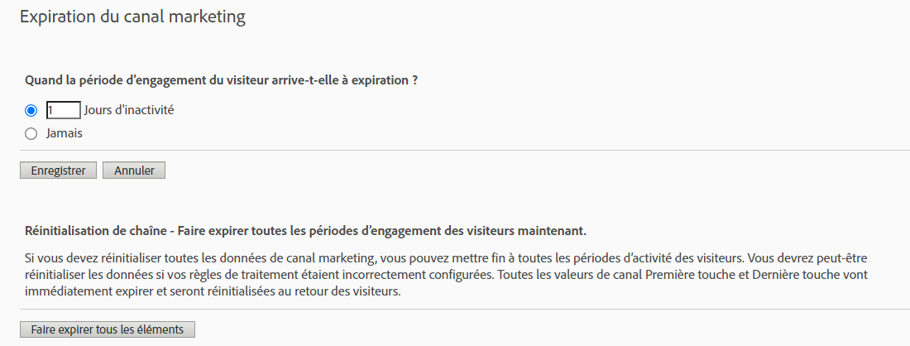

# Attribution IQ avec les canaux marketing - Les bonnes pratiques

[Les canaux marketing](/help/components/c-marketing-channels/c-getting-started-mchannel.md) sont une fonctionnalité très utile et puissante d’Adobe Analytics. Les conseils actuels concernant la mise en œuvre des canaux marketing ont été prodigués à un moment où il n’existait ni [Attribution IQ](https://experienceleague.adobe.com/docs/analytics/analyze/analysis-workspace/attribution/overview.html#analysis-workspace) ni [Customer Journey Analytics](https://experienceleague.adobe.com/docs/analytics-platform/using/cja-usecases/marketing-channels.html?lang=fr#cja-usecases).

Afin de garantir une mise en œuvre durable de vos canaux marketing et une cohérence en matière de rapports avec Attribution IQ et avec Customer Journey Analytics, nous vous proposons une mise à jour de nos bonnes pratiques. Si vous utilisez déjà des canaux marketing, vous pouvez choisir les meilleures options parmi ces nouveaux conseils. Si vous découvrez les canaux marketing, nous vous conseillons de respecter toutes les nouvelles bonnes pratiques.

Lorsque les canaux marketing ont été introduits pour la première fois, ils ne disposaient que des dimensions Première touche et Dernière touche. Les dimensions Première touche/Dernière touche explicites ne sont plus nécessaires avec la version actuelle de l’attribution. Adobe fournit des dimensions « Canal marketing » et « Détails sur les canaux marketing » génériques afin que vous puissiez les utiliser avec le modèle d’attribution de votre choix. Ces dimensions génériques se comportent de la même manière que les dimensions Canal Dernière touche, mais sont étiquetées différemment pour éviter toute confusion lors de l’utilisation de canaux marketing avec un modèle d’attribution différent.

Étant donné que les dimensions Canal marketing dépendent d’une définition de visite traditionnelle (définie par leurs règles de traitement), la définition de visite ne peut pas être modifiée à l’aide de suites de rapports virtuelles. Ces nouvelles pratiques permettent d’obtenir des intervalles de recherche en amont clairs et contrôlés avec Attribution IQ et avec Customer Journey Analytics.

## Bonne pratique n° 1 : utiliser Attribution IQ pour une analyse contrôlée

Nous vous recommandons d’utiliser [Attribution IQ](https://experienceleague.adobe.com/docs/analytics/analyze/analysis-workspace/attribution/overview.html#analysis-workspace) au lieu de l’attribution de canal marketing existante pour affiner votre analyse de ce dernier. Suivez les autres bonnes pratiques pour garantir la cohérence et la fiabilité des contrôles de vos analyses avec Attribution IQ.

* La configuration des dimensions Canal marketing et Détails du canal marketing établit les points de contact à évaluer, en fonction de chaque instance du canal marketing.
* Pour l’analyse des mesures, votre organisation doit s’aligner sur un ou plusieurs modèles d’attribution. Enregistrez les mesures personnalisées avec ce modèle pour une réutilisation facile.
* Par défaut, les données sont attribuées à l’aide de la Dernière touche et du paramètre de la période d’engagement des visiteurs. Les modèles de mesure Attribution IQ offrent un meilleur contrôle sur les intervalles de recherche en amont et une plus grande variété, y compris [l’attribution algorithmique](https://experienceleague.adobe.com/docs/analytics/analyze/analysis-workspace/attribution/algorithmic.html#analysis-workspace).

## Bonne pratique n° 2 : aucune définition des canaux Direct et Actualisation de session

Les canaux Direct et Interne/Actualisation de session ne sont pas recommandés pour une utilisation avec des modèles d’attribution personnalisés (Attribution IQ).

Que se passe-t-il si Direct et Actualisation de session sont déjà configurés pour votre organisation ? Dans ce cas, nous vous recommandons de [créer une classification](/help/admin/admin/c-manage-report-suites/c-edit-report-suites/marketing-channels/classifications-mchannel.md) pour Première touche/Dernière touche et de ne pas classer les canaux Direct et Actualisation de session. La dimension classifiée produira les mêmes résultats Attribution IQ que si ces canaux n’avaient jamais été configurés.

## Bonne pratique n° 3 : activer Remplacer le canal Dernière touche pour tous les canaux.

Les modèles d’attribution personnalisés utilisés avec la dimension Canal marketing dans Workspace fonctionnent mieux lorsque ce paramètre est activé. Lorsque ce paramètre est activé, une instance de canal marketing est comptabilisée lorsqu’un nouveau canal/détail est rencontré. Vous devez l’activer pour tous les canaux, à l’exception des canaux Direct ou Interne/Actualisation de session. Nous ne recommandons plus l’utilisation de ces canaux avec les modèles d’attribution personnalisés (Attribution IQ).

## Bonne pratique n° 4 : réduire la période d’engagement des visiteurs

La définition de la période d’engagement des visiteurs sur &quot;1 jour&quot; au minimum réduit la probabilité de persistance des valeurs. Puisque les modèles d’attribution personnalisés (AIQ) permettent des intervalles de recherche en amont flexibles, nous vous recommandons de définir ce paramètre sur la valeur minimale afin d’en minimiser l’impact.

## Bonne pratique n° 5 : les règles de traitement des canaux marketing ne doivent exister que pour les canaux activés

Assurez-vous de supprimer toutes les règles de traitement des canaux marketing pour les canaux désactivés. Les règles ne doivent exister que pour les canaux marketing qui sont activés.
