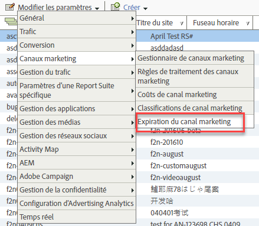

# Expiration de l’engagement des visiteurs

Découvrez comment définir l’expiration de l’engagement des visiteurs dans les canaux marketing.

L’engagement des visiteurs est le délai que vous souhaitez allouer pour que l’activité précédente du visiteur sur votre site soit attribuée au canal Première touche.

Par exemple, les visiteurs cliquent souvent sur une campagne de recherche payante et ajoutent des produits à un panier, mais mettent fin à la session avant l’événement de conversion. Si le visiteur revient ultérieurement pour faire un achat, vous pouvez indiquer si leur activité précédente et actuelle est comptabilisée comme un seul engagement. Le paramètre d’expiration par défaut est réglé sur 30 jours.

| Champ | Définition |
|--- |--- |
| Jours d’inactivité | Le nombre de jours qui doivent s’écouler avant l’expiration de l’engagement Première touche d’un visiteur. La valeur par défaut est 30. |
| Jamais | La période d’engagement du visiteur n’expire jamais. |
| Réinitialisation de canal | Fait expirer toutes les périodes d’engagement des visiteurs.  Si vous devez réinitialiser toutes les données de canal marketing, vous pouvez mettre fin à toutes les périodes d’activité des visiteurs. Vous devrez peut-être réinitialiser les données si vos règles de traitement étaient incorrectement configurées. Toutes les valeurs de canal Première touche et Dernière touche vont immédiatement expirer et seront réinitialisées au retour des visiteurs. |

## Définition de l’expiration de l’engagement des visiteurs {#specify-visitor-expire}

Spécifiez le délai d’expiration de l’engagement des visiteurs.

1. Cliquez sur **[!UICONTROL Analytics]** > **[!UICONTROL Admin]** > **[!UICONTROL Report Suites]**.
1. In the [!UICONTROL Report Suite Manager], click **[!UICONTROL Edit Settings]** > **[!UICONTROL Marketing Channels]** > **[!UICONTROL Marketing Channel Expiration]**.

   

1. Configurez les champs d’expiration de l’engagement des visiteurs.
1. Cliquez sur **[!UICONTROL Save.]**
