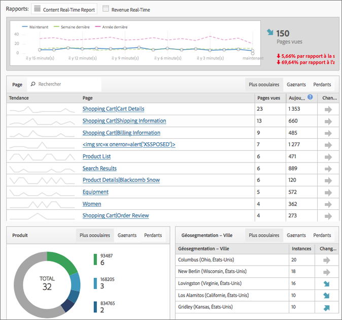

# Création de rapports en temps réel - Aperçu

Les rapports en temps réel affichent le trafic des pages web et classe les pages vues en temps réel. Fournit des données pratiques pour vos prises de décision professionnelles.

>[!NOTE]
>
>Les rapports en temps réel ne nécessitent aucune mise en œuvre ni aucun balisage supplémentaire. Elle repose sur le déploiement existant d’Adobe Analytics. Pour configurer les rapports en temps réel, voir  [Configuration des rapports en temps réel](/help/components/c-real-time-reporting/t-realtime-admin.md).

**[!UICONTROL Mesures du site]** > **[!UICONTROL Temps réel]**

Le rapport Temps réel répond aux questions suivantes : qu’est-ce qui est tendance sur mon site et pourquoi ? Il vous permet, en tant que marketeur, de réagir rapidement et de gérer de manière active les performances de vos contenus et campagnes marketing. Les données sont reportées en temps réel en moins de deux minutes et se mettent automatiquement à jour minute par minute.

Le tableau de bord comprend des mesures Adobe Analytics haute fréquence et des analyses de site pour rapporter visuellement les tendances de trafic et de pages vues des sites web d’informations et de vente au détail. Le rapport Temps réel identifie les tendances de vos données minute par minute, dans les secondes qui suivent la collecte. Il collecte et diffuse les données dans une interface automatiquement mise à jour, en utilisant la corrélation du temps réel et le suivi du contenu et de certaines conversions.

Deux des scénarios les plus fréquents concernent des éditeurs qui aimeraient promouvoir/rétrograder des articles au fur et à mesure que l’activité des utilisateurs change, ainsi que les marketeurs qui aimeraient effectuer un suivi sur le lancement d’une nouvelle gamme de produits.

En tant qu’administrateur, vous pouvez :

* Créer jusqu’à trois rapports en temps réel par suite de rapports, en utilisant les dimensions ou classifications et mesures existantes. Utiliser les dimensions secondaires pour établir une corrélation avec (ou une ventilation de) la dimension primaire.
* Ajouter trois dimensions (ou classifications) par rapport (une principale et deux secondaires), en sus d’une mesure à l’échelle du site.
* Utiliser tout événement personnalisé, événement de panier ou instance.
* Afficher jusqu’à 2 heures de données historiques de temps réel et modifier ce paramètre :

   * 15 dernières minutes : granularité d’une minute
   * 30 dernières minutes : granularité d’une minute
   * Dernière heure : granularité de deux minutes
   * 2 dernières heures : granularité de quatre minutes

* Comparer par exemple les valeurs de la semaine dernière à celles de l’année dernière (ainsi qu’au total d’aujourd’hui).

N’oubliez pas que les eVars (mesures de conversion) ne sont pas prises en charge, puisqu’il n’y a aucun concept de permanence. Même si vous pouvez sélectionner des mesures de conversion, elles fonctionnent uniquement si elles sont définies sur la même page que la ou les dimensions. Pour en savoir plus, voir le message d’avertissement capturé dans la  [Configuration de rapports en temps réel](/help/components/c-real-time-reporting/t-realtime-admin.md).

Seuls les administrateurs ou les utilisateurs des groupes d’autorisations Accès à tous les rapports et Création de rapports avancés peuvent configurer et afficher les rapports Temps réel. Toutefois, cette fonction respecte les autorisations. Si, par exemple, vous n’avez pas les droits permettant de consulter le revenu, vous ne pourrez pas consulter un rapport en temps réel qui inclut les données de revenu.

## Latence des données suite à la configuration d’A4T  {#section_806CE36354FC4C539A0DED9266A5C704}

Une fois l’intégration A4T activée dans Adobe [!DNL Target], vous remarquerez une latence supplémentaire de 5 à 10 minutes dans Adobe Analytics. Cette augmentation de la latence permet aux données provenant d’Analytics et de [!DNL Target] d’être stockées sur le même accès, permettant de ventiler les tests par page et par section de site.

Cette augmentation se reflète dans tous les services et outils d’Adobe Analytics, notamment la diffusion en continu active et la création de rapports en temps réel, et s’applique dans les scénarios suivants :

* Pour la diffusion en continu active, les rapports en temps réel, les requêtes d’API et les données actives pour les variables de trafic, seuls les accès avec un ID supplémentaire sont retardés.
* Pour les données actives sur les mesures de conversion, les données finalisées et les flux de données, tous les accès sont retardés de 5 à 7 minutes supplémentaires.

Gardez à l’esprit que l’augmentation de latence débute une fois que vous avez implémenté le service d’identité, même si vous n’avez pas entièrement implémenté cette intégration.
