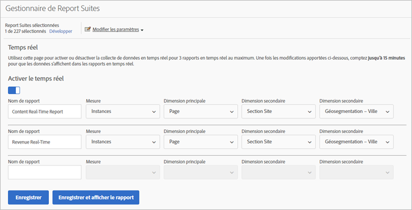
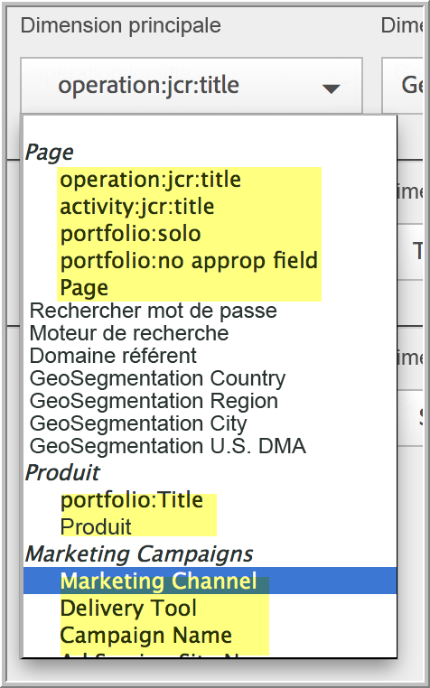

# Configuration de rapports en temps réel

Les informations suivantes contiennent les étapes administratives pour configurer des rapports en temps réel.

Elle consiste à sélectionner la suite de rapports et à configurer jusqu’à 3 rapports pour celle-ci.

1. Sélectionnez la suite de rapports pour laquelle activer les rapports en temps réel.

   1. Dans Analysis Workspace, sélectionnez l&#39;onglet [!UICONTROL **Workspace**], puis sélectionnez [!UICONTROL **Rapports**] > [!UICONTROL **Engagement**] > **[!UICONTROL Temps réel]**.

   1. Sélectionnez la suite de rapports dans le menu déroulant du haut :

      

      Si vous essayez d’afficher des rapports en temps réel pour une suite de rapports qui n’a pas été configurée pour la création de rapports en temps réel, un message s’affiche. Celui-ci vous permet de configurer la suite de rapports.

      

1. Sélectionnez **[!UICONTROL Configurer]** pour exécuter le [!UICONTROL Gestionnaire de suites de rapports].

   (Également disponible sous **[!UICONTROL Analytics]** > **[!UICONTROL Admin > Report Suites]** > **[!UICONTROL Modifier les paramètres]** > **[!UICONTROL Temps réel]**.)

1. Activez le paramètre **[!UICONTROL Activer le temps réel]**.
1. Configurez la collecte de données en temps réel pour trois rapports au maximum, avec une mesure et trois dimensions ou classifications par rapport.

   

   Pour plus d’informations sur les mesures et dimensions en temps réel prises en charge, voir [Mesures et dimensions prises en charge](/help/admin/tools/manage-rs/edit-settings/realtime/realtime-metrics.md).

   Si vous avez créé des classifications, elles apparaissent en retrait sous la dimension pour laquelle elles ont été définies :

   

   >[!NOTE]
   >
   >Pour un rapport Temps réel unique, les dimensions en double ne sont pour l’instant pas prises en charge, même si une autre classification est sélectionnée pour chaque dimension.

   >[!NOTE]
   >
   >Certaines dimensions (telles que « Mot-clé de recherche » ou « Produit ») ne persistent pas dans le rapport Temps réel comme elles le font ailleurs dans Adobe Analytics. Lorsque vous sélectionnez une mesure non permanente, cet avertissement s’affiche :

   

1. Sélectionnez **[!UICONTROL Enregistrer]** ou **[!UICONTROL Enregistrer et afficher le rapport]**.

   Après cette configuration initiale du rapport, comptez jusqu’à 20 minutes pour que les données commencent à se diffuser. À partir de là, les données sont immédiatement disponibles.

1. Par défaut, tous les utilisateurs ont accès aux rapports Temps réel.
